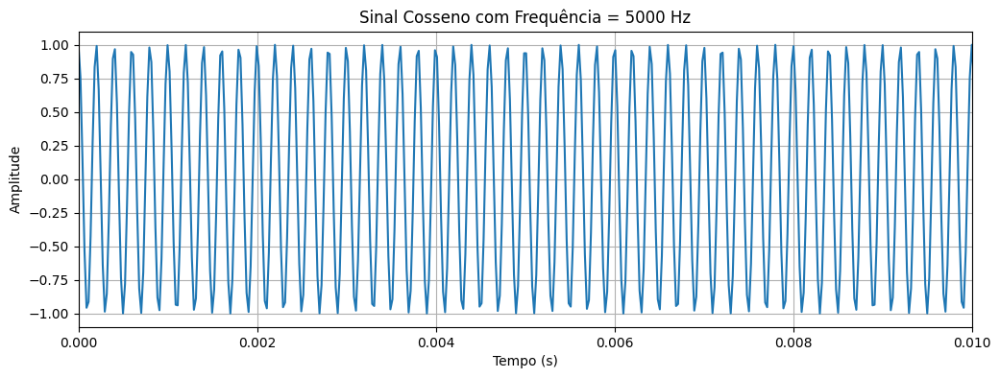
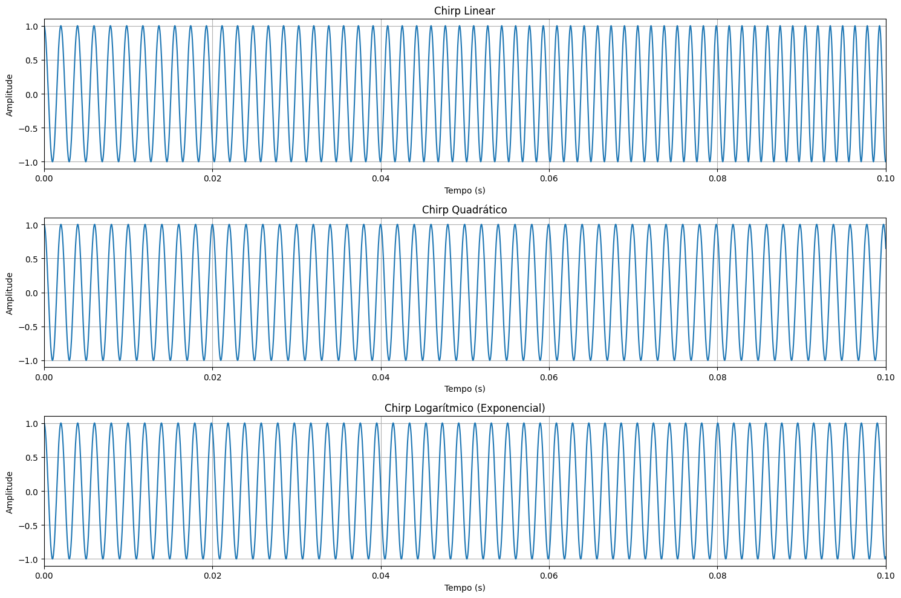
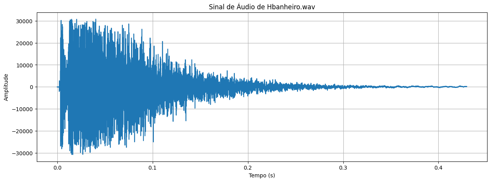
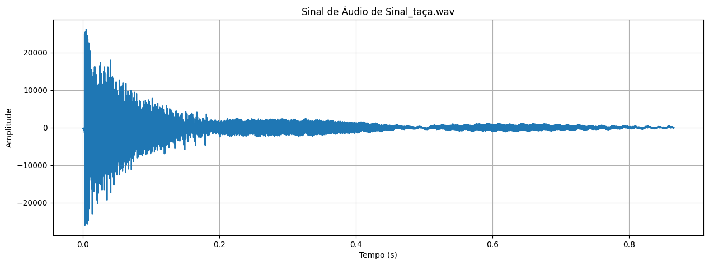

<p align="center">
  
</p>

<h1 align="center">PROSIN-I</h1>

<p align="center">
  
</p>

# PROSIN I — Processamento de Sinais I


- **Professor:** Rafael da Silva Chaves
- **Instituição:** Centro Federal de Educação Tecnológica Celso Suckow da Fonseca- CEFET/RJ
- **Dupla:** Lucas de Farias dos Santos e Luís Felipe Chaves de Oliveira
- **Semestre:** 2026.1

# Prática 1 — Sinais e sistemas

# Bibliotecas Utilizadas

```python
import numpy
import matplotlib.pyplot
from IPython.display import Audio, display
from scipy.signal import chirp, resample_poly
from scipy.io import wavfile
import pandas as pd
```

## Explicação

* `numpy` → utilizado para cálculos numéricos e manipulação vetorial.
* `matplotlib.pyplot` → utilizado para geração dos gráficos.
* `IPython.display.Audio` → utilizado para reproduzir os sinais em áudio.
* `scipy.signal.chirp` → utilizado para gerar sinais chirp.
* `wavfile` → utilizado para manipulação de arquivos `.wav`.
* `pandas` → utilizado para manipulação de dados.

---
# Questão 1

# Definição dos Parâmetros

```python
duracaox = 5
freq_amostragem = 44100
```

## Explicação

* `duracaox` define a duração do sinal em segundos.
* `freq_amostragem` define a frequência de amostragem do sinal.

---

# Criação do Eixo do Tempo

```python
t = numpy.linspace(0, duracaox, int(duracaox * freq_amostragem), endpoint=False)
```

## Explicação

O vetor `t` representa o eixo temporal utilizado para gerar os sinais.

A função `linspace()` cria amostras igualmente espaçadas no intervalo especificado.

---

Geração das Frequências

```python
frequencias = [500, 5000, 10000]
```

---

Geração das Ondas Cossenoidais

```python
cossine_waves = []

for freq in frequencias:
  wave = numpy.cos(2 * numpy.pi * freq * t)
  cossine_waves.append(wave)
```

## Explicação

A equação utilizada para gerar os sinais é:

$$
x(t) = cos(2\pi f t)
$$

Onde:

* `f` representa a frequência do sinal.
* `t` representa o tempo.

Cada onda gerada é armazenada na lista `cossine_waves`.

---

Plotagem dos Gráficos

```python
for i, wave in enumerate(cossine_waves) :
  matplotlib.pyplot.figure(figsize=(12, 4))
  matplotlib.pyplot.plot(t, wave)
  matplotlib.pyplot.title(f'Sinal Cosseno com Frequência = {frequencias[i]} Hz')
  matplotlib.pyplot.xlabel('Tempo (s)')
  matplotlib.pyplot.ylabel('Amplitude')
  matplotlib.pyplot.grid(True)
  matplotlib.pyplot.xlim(0, 0.01)
  matplotlib.pyplot.show()
```
<p align="center">
  
</p>


#Reprodução dos Áudios

```python
for i, wave in enumerate(cossine_waves):
    normalized_wave = wave / numpy.max(numpy.abs(wave))
    print(f"Audios da onda de {frequencias[i]} Hz...")
    display(Audio(data=normalized_wave, rate=freq_amostragem))
```

[▶ Áudio 500 Hz](assets1/500hz.wav)
[▶ Áudio 500 Hz](assets1/5000hz.wav)
[▶ Áudio 500 Hz](assets1/10000hz.wav)

---

# Questão 2

# 2) Definição dos Parâmetros Iniciais

```python
f0 = 500
f1 = 10000
```

## Explicação

Os parâmetros utilizados definem:

- `f0` → frequência inicial do sinal chirp.
- `f1` → frequência final do sinal chirp.

Neste experimento, o sinal varia de:

# 2A) Geração dos Sinais Chirp

```python
# Geração do sinal chirp linear
linear_chirp = chirp(t, f0=f0, f1=f1, t1=duracaox, method='linear')

# Geração do sinal chirp quadrático
quadratic_chirp = chirp(t, f0=f0, f1=f1, t1=duracaox, method='quadratic')

# Geração do sinal chirp logarítmico
logarithmic_chirp = chirp(t, f0=f0, f1=f1, t1=duracaox, method='logarithmic')
```

# Plotagem dos Gráficos

```python
matplotlib.pyplot.figure(figsize=(15, 10))

matplotlib.pyplot.subplot(3, 1, 1)
matplotlib.pyplot.plot(t, linear_chirp)
matplotlib.pyplot.title('Chirp Linear')
matplotlib.pyplot.xlabel('Tempo (s)')
matplotlib.pyplot.ylabel('Amplitude')
matplotlib.pyplot.xlim(0, 0.1)
matplotlib.pyplot.grid(True)

matplotlib.pyplot.subplot(3, 1, 2)
matplotlib.pyplot.plot(t, quadratic_chirp)
matplotlib.pyplot.title('Chirp Quadrático')
matplotlib.pyplot.xlabel('Tempo (s)')
matplotlib.pyplot.ylabel('Amplitude')
matplotlib.pyplot.xlim(0, 0.1)
matplotlib.pyplot.grid(True)

matplotlib.pyplot.subplot(3, 1, 3)
matplotlib.pyplot.plot(t, logarithmic_chirp)
matplotlib.pyplot.title('Chirp Logarítmico')
matplotlib.pyplot.xlabel('Tempo (s)')
matplotlib.pyplot.ylabel('Amplitude')
matplotlib.pyplot.xlim(0, 0.1)
matplotlib.pyplot.grid(True)

matplotlib.pyplot.tight_layout()
matplotlib.pyplot.show()
```

## Explicação

O comando:

```python
matplotlib.pyplot.xlim(0, 0.1)
```

limita a visualização para facilitar a observação da variação de frequência.

---

# Resultado dos Gráficos

<p align="center">
  
</p>

---

# 2B) Reprodução dos Áudios

```python
print("Áudios dos chirps:")

print("Chirp Linear...")
display(Audio(data=linear_chirp, rate=freq_amostragem))

print("Chirp Quadrático...")
display(Audio(data=quadratic_chirp, rate=freq_amostragem))

print("Chirp Logarítmico...")
display(Audio(data=logarithmic_chirp, rate=freq_amostragem))
```
# Áudios dos Chirps

[▶ Chirp Linear](assets1/chirp_linear.wav)

[▶ Chirp Quadrático](assets1/chirp_quadratico.wav)

[▶ Chirp Logarítmico](assets1/chirp_logaritmico.wav)

---

---

# Questão 3

# 3A) Carregamento do Arquivo de Áudio

```python
file_path = 'handel.wav'
fs, data = wavfile.read(file_path)
```

## Explicação

O arquivo de áudio `handel.wav` é carregado utilizando a função:

```python
wavfile.read()
```

Essa função retorna:

- `fs` → frequência de amostragem do áudio.
- `data` → vetor contendo as amostras do sinal.

---

# Criação do Eixo Temporal

```python
duracaohandel = len(data) / fs

t_audio = numpy.linspace(
    0,
    duracaohandel,
    len(data),
    endpoint=False
)
```

## Explicação

O vetor `t_audio` representa o eixo do tempo correspondente ao sinal de áudio.

A duração do áudio é calculada por:

$$
Duração = \frac{Número\ de\ Amostras}{Frequência\ de\ Amostragem}
$$

---

# Plotagem do Sinal de Áudio

```python
matplotlib.pyplot.figure(figsize=(15, 5))

matplotlib.pyplot.plot(t_audio, data)

matplotlib.pyplot.title('Sinal de Áudio de handel.wav')
matplotlib.pyplot.xlabel('Tempo (s)')
matplotlib.pyplot.ylabel('Amplitude')

matplotlib.pyplot.grid(True)

matplotlib.pyplot.show()
```
# Resultado do Gráfico

<p align="center">
  
</p>

---

# 3B) Reprodução dos Áudios

```python
normalized_data = data / numpy.max(numpy.abs(data))

print("Áudio Original:")
display(Audio(data=normalized_data, rate=fs))

print("Áudio com o dobro da frequência de amostragem:")
display(Audio(data=normalized_data, rate=2 * fs))

print("Áudio com o quádruplo da frequência de amostragem:")
display(Audio(data=normalized_data, rate=4 * fs))
```

## Explicação

O sinal é normalizado para evitar clipping e garantir melhor reprodução sonora.

---

# Áudios Gerados

## Áudio Original

[▶ Áudio Original](assets1/audio_original.wav)

## Áudio Dobrado

[▶ Áudio Dobrado](assets1/audio_2x.wav)

## Áudio Quadruplicado

[▶ Áudio Quadruplicado](assets1/audio_4x.wav)

---

---

# Questão 5

# 5A) Carregamento do Áudio de Resposta ao Impulso (Banheiro)

```python
hbanheiro = 'h_banheiro.wav'

fb, data = wavfile.read(hbanheiro)
```

## Explicação

A função:

```python
wavfile.read()
```

retorna:

- `fb` → frequência de amostragem.
- `data` → amostras do sinal de áudio.

---

# Criação do Eixo Temporal

```python
duracaobanheiro = len(data) / fb

t_audioB = numpy.linspace(
    0,
    duracaobanheiro,
    len(data),
    endpoint=False
)
```

## Explicação

O vetor `t_audioB` representa o eixo temporal correspondente ao sinal de áudio do banheiro.

---

# Plotagem do Sinal do Banheiro

```python
matplotlib.pyplot.figure(figsize=(15, 5))

matplotlib.pyplot.plot(t_audioB, data)

matplotlib.pyplot.title('Sinal de Áudio de Hbanheiro.wav')

matplotlib.pyplot.xlabel('Tempo (s)')
matplotlib.pyplot.ylabel('Amplitude')

matplotlib.pyplot.grid(True)

matplotlib.pyplot.show()
```
---

# Resultado do Gráfico

<p align="center">
  
</p>

---

# Reprodução do Áudio do Banheiro

```python
banheiro_normalizado = data / numpy.max(numpy.abs(data))

print("Áudio H_banheiro:")

display(Audio(data=banheiro_normalizado, rate=fb))
```

## Explicação

O áudio é normalizado para evitar distorções e permitir melhor reprodução sonora.

---

# Áudio do Banheiro

[▶ Áudio H_banheiro](assets1/h_banheiro.wav)

---

# 5B) Carregamento do Áudio da Taça

```python
sinaltaca = 'sinal_taca.wav'

ft, data = wavfile.read(sinaltaca)
```

## Explicação

O arquivo `sinal_taca.wav` contém o sinal acústico associado ao som de uma taça.

---

# Criação do Eixo Temporal

```python
duracaotaca = len(data) / ft

t_audioT = numpy.linspace(
    0,
    duracaotaca,
    len(data),
    endpoint=False
)
```

## Explicação

O vetor `t_audioT` representa o eixo temporal do áudio da taça.

---

# Plotagem do Sinal da Taça

```python
matplotlib.pyplot.figure(figsize=(15, 5))

matplotlib.pyplot.plot(t_audioT, data)

matplotlib.pyplot.title('Sinal de Áudio de Sinal_taca.wav')

matplotlib.pyplot.xlabel('Tempo (s)')
matplotlib.pyplot.ylabel('Amplitude')

matplotlib.pyplot.grid(True)

matplotlib.pyplot.show()
```
# Resultado do Gráfico

<p align="center">
  
</p>

---

# Reprodução do Áudio da Taça

```python
taca_normalizado = data / numpy.max(numpy.abs(data))

print("Áudio sinal_taca:")

display(Audio(data=taca_normalizado, rate=ft))
```

## Explicação

O sinal é normalizado para melhorar a reprodução do áudio.

---

# Áudio da Taça

[▶ Áudio sinal_taca](assets1/sinal_taca.wav)

---

# Questão 6

# Reamostragem do Áudio

```python
handel_reamostrado = resample_poly(
    normalized_data,
    fb,
    fs
)
```

## Explicação

Para realizar a convolução entre sinais, ambos devem possuir a mesma frequência de amostragem.

O sinal `handel.wav` é reamostrado utilizando:

```python
resample_poly()
```

---

# Convolução do Handel com o Banheiro

```python
handel_convoluido = numpy.convolve(
    handel_reamostrado,
    banheiro_normalizado,
    mode='full'
)
```
# Convolução da Taça com o Banheiro

```python
taca_convoluido = numpy.convolve(
    taca_normalizado,
    banheiro_normalizado,
    mode='full'
)
```

# Normalização dos Sinais

```python
handel_convoluido_normalizado = handel_convoluido / numpy.max(numpy.abs(handel_convoluido))

taca_convoluido_normalizado = taca_convoluido / numpy.max(numpy.abs(taca_convoluido))
```

## Explicação

Os sinais convoluídos são normalizados para evitar clipping durante a reprodução.

---

# Reprodução dos Áudios Convoluídos

```python
print("Áudio handel_convoluido:")

display(Audio(data=handel_convoluido_normalizado, rate=fb))

print("Áudio taca_convoluido:")

display(Audio(data=taca_convoluido_normalizado, rate=fb))
```

---

# Áudios Resultantes

## Handel Convoluído

[▶ Handel Convoluído](assets1/handel_convoluido.wav)

## Taça Convoluída

[▶ Taça Convoluída](assets1/taca_convoluido.wav)

---

---
