<p align="center">
  
</p>

<h1 align="center">PROSIN</h1>

<p align="center">
  
  Prática 02
  
</p>

# PROSIN — Processamento de Sinais


- **Professor:** Rafael da Silva Chaves
- **Instituição:** Centro Federal de Educação Tecnológica Celso Suckow da Fonseca- CEFET/RJ
- **Dupla:** Lucas de Farias dos Santos e Luís Felipe Chaves de Oliveira
- **Semestre:** 2026.1

# Prática 2 — Amostragem

# Bibliotecas Utilizadas

```python
import numpy as np
from scipy.fft import fft, fftfreq
import matplotlib.pyplot as plt
from IPython.display import Audio, display
from scipy.signal import chirp, resample_poly
from scipy.io import wavfile
import pandas as pd
```

## Explicação

* `numpy as np` → utilizado para cálculos numéricos, operações matemáticas vetoriais e manipulação de arrays.
* `scipy.fft.fft` → utilizado para calcular a Transformada Rápida de Fourier (FFT), permitindo analisar o conteúdo espectral dos sinais.
* `scipy.fft.fftfreq` → utilizado para gerar o eixo de frequências correspondente à FFT.
* `matplotlib.pyplot as plt` → utilizado para geração e visualização de gráficos.
* `IPython.display.Audio` → utilizado para reproduzir sinais de áudio diretamente no notebook.
* `IPython.display.display` → utilizado para exibir elementos multimídia, como players de áudio.
* `scipy.signal.chirp` → utilizado para gerar sinais chirp com frequência variável ao longo do tempo.
* `scipy.signal.resample_poly` → utilizado para realizar reamostragem de sinais, alterando a frequência de amostragem.
* `scipy.io.wavfile` → utilizado para leitura e manipulação de arquivos de áudio no formato `.wav`.
* `pandas as pd` → utilizado para manipulação e análise de dados em tabelas e estruturas organizadas.
---

# Questão 1

# Função para Cálculo do Espectro

```python
def calculate_spectrum(signal, sampling_frequency, single_sided=True):

    N = len(signal)
    T = 1.0 / sampling_frequency

    yf = fft(signal)

    if single_sided:
        xf = fftfreq(N, T)[:N//2]
        amplitudes = 1.0/N * np.abs(yf[0:N//2])

    else:
        xf = fftfreq(N, T)
        amplitudes = 1.0/N * np.abs(yf)

    return xf, amplitudes
```

## Explicação

Essa função calcula o espectro de frequência de um sinal utilizando a FFT (*Fast Fourier Transform*).

### Parâmetros da Função

- `signal` → sinal no domínio do tempo.
- `sampling_frequency` → frequência de amostragem do sinal.
- `single_sided` → define se será utilizado espectro unilateral.

---

# Número de Amostras

```python
N = len(signal)
```

## Explicação

Obtém a quantidade total de amostras do sinal.

---

# Espaçamento Temporal

```python
T = 1.0 / sampling_frequency
```

## Explicação

Calcula o intervalo entre amostras do sinal.

---

# Aplicação da FFT

```python
yf = fft(signal)
```

## Explicação

A FFT converte o sinal do domínio do tempo para o domínio da frequência.

---

# Cálculo do Eixo de Frequências

```python
xf = fftfreq(N, T)
```

## Explicação

A função `fftfreq()` gera o eixo correspondente às frequências presentes no espectro.

---

# Cálculo da Amplitude

```python
amplitudes = 1.0/N * np.abs(yf)
```

## Explicação

Calcula a magnitude das componentes espectrais do sinal.

---

# Definição dos Parâmetros do Sinal

```python
duracaox = 5
freq_amostragem = 44100
```

## Explicação

- `duracaox` → duração do sinal em segundos.
- `freq_amostragem` → frequência de amostragem utilizada.

A frequência de 44100 Hz é padrão em aplicações de áudio digital.

---

# Criação do Eixo Temporal

```python
t = np.linspace(
    0,
    duracaox,
    int(duracaox * freq_amostragem),
    endpoint=False
)
```

## Explicação

Cria o vetor temporal utilizado para gerar os sinais cossenoidais.

---

# Frequências Utilizadas

```python
frequencias = [500, 5000, 10000, 50000]
```

## Explicação

Foram gerados sinais com diferentes frequências para análise espectral:

- 500 Hz
- 5000 Hz
- 10000 Hz
- 50000 Hz

---

# Geração dos Sinais Cossenoidais

```python
cossine_waves = []

for freq in frequencias:
    wave = np.cos(2 * np.pi * freq * t)
    cossine_waves.append(wave)
```

## Explicação

Os sinais são gerados utilizando:

$$
x(t)=cos(2\pi f t)
$$

Onde:

- `f` → frequência do sinal.
- `t` → tempo.

---

# Plotagem dos Espectros

```python
fig, axs = plt.subplots(
    len(frequencias),
    1,
    figsize=(12, 4 * len(frequencias))
)

fig.suptitle(
    'Espectro de Sinais Cosseno',
    y=1.02,
    fontsize=16
)

for i, wave in enumerate(cossine_waves):

    frequencies_spec, amplitudes_spec = calculate_spectrum(
        wave,
        freq_amostragem
    )

    ax = axs[i]

    ax.plot(
        frequencies_spec,
        amplitudes_spec
    )

    ax.set_title(
        f'Espectro de Cosseno com Frequência = {frequencias[i]} Hz'
    )

    ax.set_xlabel('Frequência (Hz)')
    ax.set_ylabel('Amplitude')

    ax.grid(True)

    ax.set_xlim(0, frequencias[i] * 2)

plt.tight_layout()

plt.show()
```

## Explicação

Os gráficos mostram o espectro de frequência dos sinais gerados.

Cada pico observado no espectro corresponde à frequência dominante do sinal cossenoidal.

O comando:

```python
ax.set_xlim(0, frequencias[i] * 2)
```

limita a visualização do eixo de frequência para destacar os picos espectrais.

---

# Resultado Esperado

Ao executar o código, são obtidos:

- espectros de frequência dos sinais;
- identificação das componentes espectrais;
- visualização da FFT dos sinais cossenoidais;
- comparação entre diferentes frequências.

---

# Resultado dos Gráficos

<p align="center">
  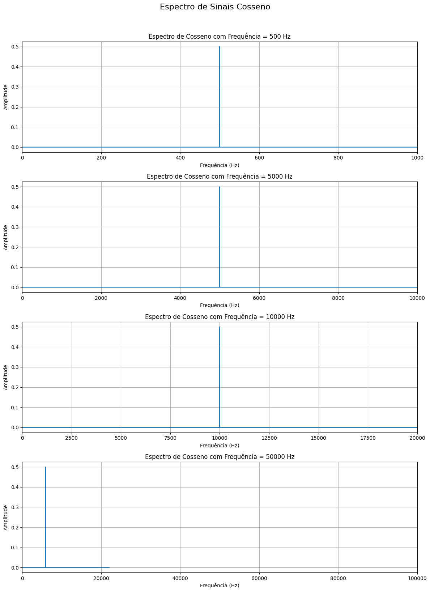
</p>

---

# Questão 2

# Geração e Análise Espectral de Chirps

## Definição dos Parâmetros

```python
f0 = 500
f1 = 10000

fs = 44100

duracaox = 5
```

## Explicação

Os parâmetros utilizados definem as características dos sinais chirp:

- `f0` → frequência inicial do sinal.
- `f1` → frequência final do sinal.
- `fs` → frequência de amostragem.
- `duracaox` → duração do sinal em segundos.

Neste experimento:

- frequência inicial = 500 Hz
- frequência final = 10000 Hz
- frequência de amostragem = 44100 Hz

---

# Criação do Vetor Temporal

```python
t_chirp = np.linspace(
    0,
    duracaox,
    int(duracaox * fs),
    endpoint=False
)
```

## Explicação

O vetor `t_chirp` representa o eixo temporal utilizado na geração dos sinais chirp.

A função:

```python
np.linspace()
```

gera amostras igualmente espaçadas ao longo do tempo.

---

# Geração dos Chirps

```python
linear_chirp = chirp(
    t_chirp,
    f0=f0,
    f1=f1,
    t1=duracaox,
    method='linear'
)

quadratic_chirp = chirp(
    t_chirp,
    f0=f0,
    f1=f1,
    t1=duracaox,
    method='quadratic'
)

logarithmic_chirp = chirp(
    t_chirp,
    f0=f0,
    f1=f1,
    t1=duracaox,
    method='logarithmic'
)
```

## Explicação

Foram gerados três tipos diferentes de sinais chirp.

### Chirp Linear

A frequência aumenta linearmente ao longo do tempo.

### Chirp Quadrático

A frequência varia de forma quadrática.

### Chirp Logarítmico

A frequência varia exponencialmente.

---

# Organização dos Sinais

```python
chirps = {
    'Linear Chirp': linear_chirp,
    'Quadratic Chirp': quadratic_chirp,
    'Logarithmic Chirp': logarithmic_chirp
}
```

## Explicação

Os sinais foram armazenados em um dicionário para facilitar o processamento e a geração dos gráficos.

---

# Plotagem dos Espectros

```python
fig, axs = plt.subplots(
    len(chirps),
    1,
    figsize=(12, 4 * len(chirps))
)

fig.suptitle(
    'Espectro de Chirps (Linear, Quadrático, Logarítmico)',
    y=1.02,
    fontsize=16
)

for i, (name, signal) in enumerate(chirps.items()):

    frequencies_spec, amplitudes_spec = calculate_spectrum(
        signal,
        fs
    )

    ax = axs[i]

    ax.plot(
        frequencies_spec,
        amplitudes_spec
    )

    ax.set_title(f'Espectro do {name}')

    ax.set_xlabel('Frequência (Hz)')
    ax.set_ylabel('Amplitude')

    ax.grid(True)

    ax.set_xlim(0, f1 * 1.5)

plt.tight_layout()

plt.show()
```

## Explicação

O código calcula e exibe o espectro de frequência dos sinais chirp utilizando FFT.

Cada gráfico apresenta:

- eixo horizontal → frequência;
- eixo vertical → amplitude espectral.

O comando:

```python
ax.set_xlim(0, f1 * 1.5)
```

limita a visualização do espectro para destacar a faixa de frequências de interesse.

---

# Resultado Esperado

Ao executar o código, são obtidos:

- espectros de frequência dos sinais chirp;
- comparação entre chirps lineares, quadráticos e logarítmicos;
- visualização da distribuição espectral dos sinais;
- análise da variação de frequência ao longo do tempo.

---

# Resultado dos Gráficos

<p align="center">
  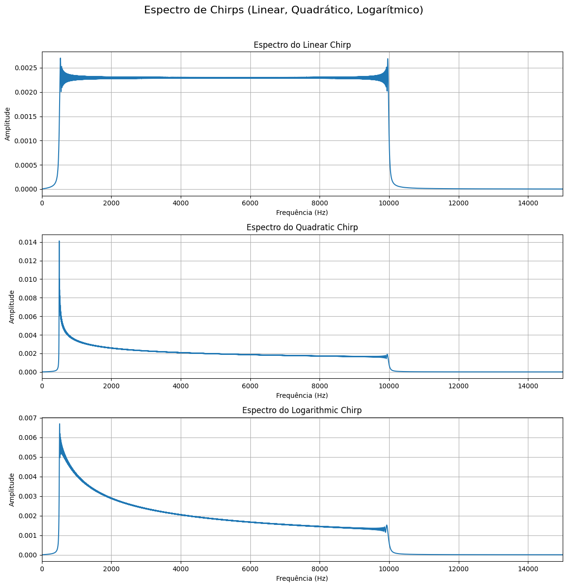
</p>

---

# Questão 3

# Análise Espectral do Arquivo `handel.wav`

## Leitura do Arquivo de Áudio

```python
fs_handel_original, data_handel_original = wavfile.read('/content/handel.wav')
```

## Explicação

O arquivo de áudio `handel.wav` é carregado utilizando:

```python
wavfile.read()
```

A função retorna:

- `fs_handel_original` → frequência de amostragem do áudio.
- `data_handel_original` → vetor contendo as amostras do sinal.

---

# Normalização do Áudio

```python
normalized_data_handel = data_handel_original / np.max(np.abs(data_handel_original))
```

## Explicação

O sinal é normalizado para que sua amplitude fique entre:

$$
-1 \leq x(t) \leq 1
$$

Isso evita:

- clipping;
- distorções;
- problemas de escala durante o processamento.

---

# Cálculo do Espectro

```python
frequencies_handel, amplitudes_handel = calculate_spectrum(
    normalized_data_handel,
    fs_handel_original
)
```

## Explicação

A função `calculate_spectrum()` aplica a FFT ao sinal de áudio.

O resultado obtido contém:

- `frequencies_handel` → eixo de frequências.
- `amplitudes_handel` → amplitudes espectrais.

---

# Plotagem do Espectro

```python
plt.figure(figsize=(12, 6))

plt.plot(
    frequencies_handel,
    amplitudes_handel
)

plt.title('Espectro do Sinal de Áudio Handel (Normalizado)')

plt.xlabel('Frequência (Hz)')
plt.ylabel('Amplitude')

plt.grid(True)

plt.xlim(0, fs_handel_original / 2)

plt.tight_layout()

plt.show()
```

## Explicação

O gráfico apresenta o conteúdo espectral do áudio.

Cada componente do espectro indica a presença de determinadas frequências no sinal musical.

O comando:

```python
plt.xlim(0, fs_handel_original / 2)
```

limita a visualização até a frequência de Nyquist:

:contentReference[oaicite:0]{index=0}

onde:

- \(f_N\) → frequência de Nyquist;
- \(f_s\) → frequência de amostragem.

---

# Resultado Esperado

Ao executar o código, são obtidos:

- espectro de frequência do áudio;
- identificação das componentes espectrais;
- análise do conteúdo harmônico do sinal musical.

---

# Resultado do Gráfico

<p align="center">
  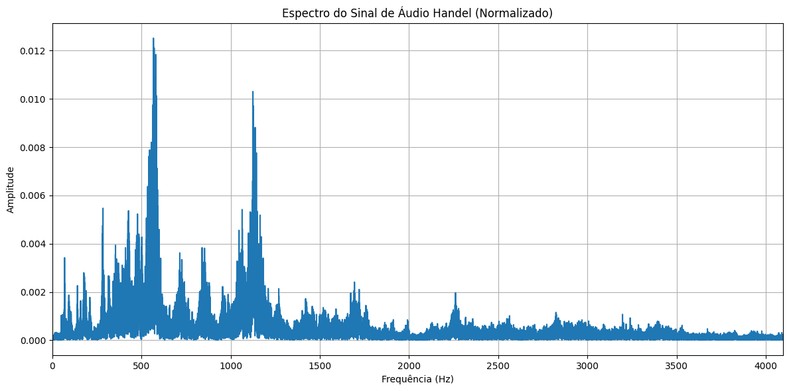
</p>

---

# Questão 4

# Subamostragem do Arquivo `handel.wav`

## a) Criação da Função de Subamostragem

```python
def downsample_signal(signal, M):

    return signal[::M]
```

## Explicação

A função `downsample_signal()` realiza a subamostragem de um sinal discreto utilizando um fator \(M\).

O comando:

```python
signal[::M]
```

seleciona apenas uma amostra a cada \(M\) amostras do sinal original.

---

# Conceito Matemático

A nova frequência de amostragem após a subamostragem é dada por:

:contentReference[oaicite:0]{index=0}

Onde:

- \(f_s\) → frequência de amostragem original;
- \(f_s'\) → nova frequência de amostragem;
- \(M\) → fator de subamostragem.

---

# Objetivos da Subamostragem

A técnica de subamostragem permite:

- reduzir quantidade de dados;
- diminuir custo computacional;
- estudar efeitos de aliasing;
- modificar resolução temporal do sinal.

---

# b) Definição dos Fatores de Subamostragem

```python
M_factors = [2, 4, 8]

downsampled_signals = {}

down_sampling_frequencies = {}
```

## Explicação

Foram utilizados três fatores de subamostragem:

- \(M = 2\)
- \(M = 4\)
- \(M = 8\)

Quanto maior o valor de \(M\), menor será a nova frequência de amostragem.

---

# Aplicação da Subamostragem

```python
for i, M in enumerate(M_factors):

    downsampled_signal = downsample_signal(
        normalized_data_handel,
        M
    )

    new_fs = fs_handel_original / M
```

## Explicação

Para cada fator \(M\):

- o sinal é subamostrado;
- a nova frequência de amostragem é calculada.

---

# Armazenamento dos Resultados

```python
downsampled_signals[f'M={M}'] = downsampled_signal

down_sampling_frequencies[f'M={M}'] = new_fs
```

## Explicação

Os sinais subamostrados e suas respectivas frequências de amostragem são armazenados em dicionários para facilitar o acesso posterior.

---

# Cálculo do Espectro

```python
frequencies_ds, amplitudes_ds = calculate_spectrum(
    downsampled_signal,
    new_fs
)
```

## Explicação

A FFT é aplicada aos sinais subamostrados para analisar os efeitos da redução da frequência de amostragem no espectro.

---

# Plotagem dos Espectros

```python
ax = plt.subplot(len(M_factors), 1, i + 1)

ax.plot(
    frequencies_ds,
    amplitudes_ds
)

ax.set_title(
    f'Espectro do Sinal de Handel Subamostrado (M={M}, Fs={new_fs:.2f} Hz)'
)

ax.set_xlabel('Frequência (Hz)')
ax.set_ylabel('Amplitude')

ax.grid(True)

ax.set_xlim(0, new_fs / 2)
```

## Explicação

Os gráficos apresentam os espectros dos sinais subamostrados.

O comando:

```python
ax.set_xlim(0, new_fs / 2)
```

limita o eixo de frequência até a nova frequência de Nyquist:

:contentReference[oaicite:1]{index=1}

---

# Resultado Esperado dos Espectros

Ao executar o código, observa-se:

- redução da largura espectral;
- alteração da resolução temporal;
- possíveis efeitos de aliasing;
- mudança da frequência máxima representável.

---

# Resultado dos Gráficos

<p align="center">
  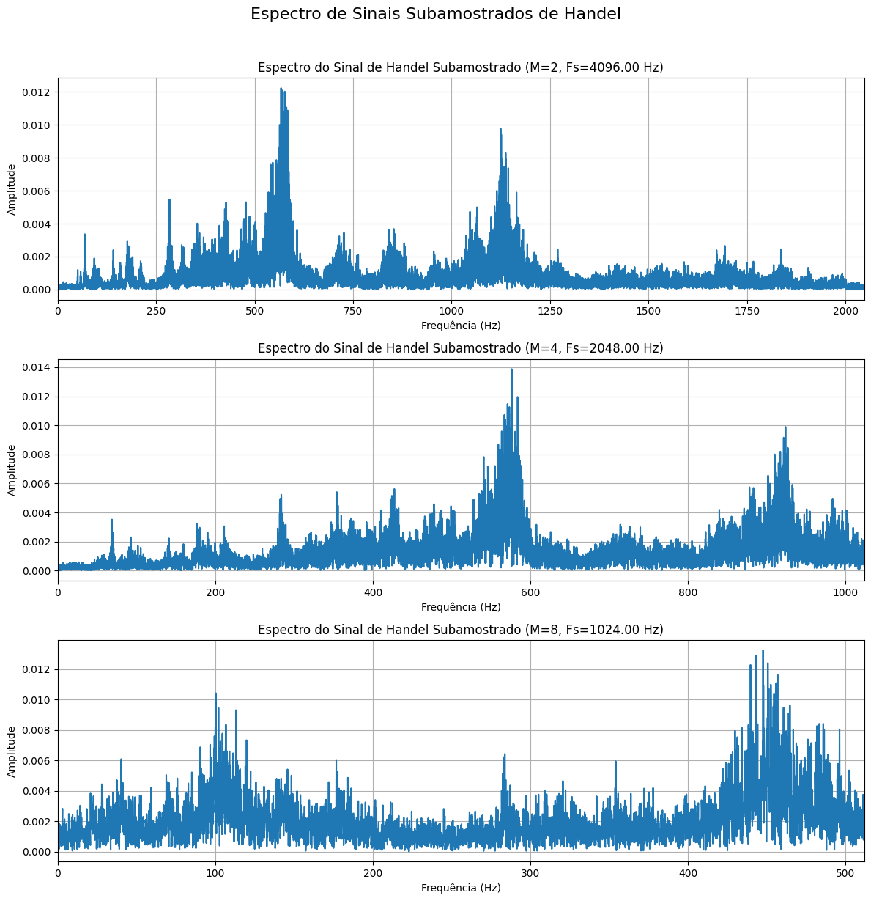
</p>

---

# c) Reprodução dos Sinais Subamostrados

```python
print("Sinal Original:")

display(
    Audio(
        data=normalized_data_handel,
        rate=fs_handel_original
    )
)

for M in M_factors:

    signal = downsampled_signals[f'M={M}']

    fs_ds = down_sampling_frequencies[f'M={M}']

    print(f"Sinal Subamostrado M={M} (Fs={fs_ds:.2f} Hz):")

    display(
        Audio(
            data=signal,
            rate=fs_ds
        )
    )
```

## Explicação

Os sinais subamostrados são reproduzidos para comparação auditiva com o sinal original.

A redução da frequência de amostragem pode causar:

- perda de qualidade;
- redução da faixa espectral;
- distorções;
- aliasing.

---

# Áudios Gerados

## Sinal Original

[▶ Handel Original](assets2/handel_original.wav)

---

## Subamostragem M = 2

[▶ Handel M=2](assets2/handel_M2.wav)

---

## Subamostragem M = 4

[▶ Handel M=4](assets2/handel_M4.wav)

---

## Subamostragem M = 8

[▶ Handel M=8](assets2/handel_M8.wav)

---

# Resultado Final

Ao executar o código, são obtidos:

- sinais subamostrados;
- espectros de frequência correspondentes;
- comparação auditiva entre diferentes taxas de amostragem;
- análise dos efeitos da subamostragem no domínio da frequência.

---

---

# Questão 5

# Subamostragem utilizando `resample_poly`

## Importação da Função

```python
from scipy.signal import resample_poly
```

## Explicação

A função `resample_poly()` realiza reamostragem utilizando filtragem polifásica.

Esse método é mais eficiente e produz melhores resultados quando comparado à subamostragem simples.

---

# Definição dos Fatores de Subamostragem

```python
M_factors_resample = [2, 4, 8]

resampled_poly_signals = {}

resampled_poly_sampling_frequencies = {}
```

## Explicação

Foram utilizados três fatores de subamostragem:

- \(M = 2\)
- \(M = 4\)
- \(M = 8\)

Cada fator reduz a frequência de amostragem do sinal original.

---

# Aplicação do `resample_poly`

```python
resampled_poly_signal = resample_poly(
    normalized_data_handel,
    1,
    M
)
```

## Explicação

A função:

```python
resample_poly(signal, up, down)
```

realiza:

- interpolação (`up`);
- decimação (`down`).

Neste caso:

- `up = 1`
- `down = M`

Portanto, o sinal é subamostrado por um fator \(M\).

---

# Nova Frequência de Amostragem

```python
new_fs_resample = fs_handel_original / M
```

## Explicação

A nova frequência de amostragem é calculada por:

:contentReference[oaicite:0]{index=0}

Onde:

- \(f_s\) → frequência original;
- \(M\) → fator de subamostragem.

---

# Armazenamento dos Resultados

```python
resampled_poly_signals[f'M={M}'] = resampled_poly_signal

resampled_poly_sampling_frequencies[f'M={M}'] = new_fs_resample
```

## Explicação

Os sinais subamostrados e suas frequências de amostragem são armazenados para posterior análise e reprodução.

---

# Cálculo do Espectro

```python
frequencies_rp, amplitudes_rp = calculate_spectrum(
    resampled_poly_signal,
    new_fs_resample
)
```

## Explicação

A FFT é aplicada aos sinais reamostrados para análise espectral.

---

# Plotagem dos Espectros

```python
ax = plt.subplot(
    len(M_factors_resample),
    1,
    i + 1
)

ax.plot(
    frequencies_rp,
    amplitudes_rp
)

ax.set_title(
    f'Espectro do Handel Subamostrado com resample_poly (M={M}, Fs={new_fs_resample:.2f} Hz)'
)

ax.set_xlabel('Frequência (Hz)')
ax.set_ylabel('Amplitude')

ax.grid(True)

ax.set_xlim(0, new_fs_resample / 2)
```

## Explicação

Os gráficos apresentam o espectro dos sinais subamostrados utilizando `resample_poly`.

O comando:

```python
ax.set_xlim(0, new_fs_resample / 2)
```

limita o eixo de frequência até a nova frequência de Nyquist:

:contentReference[oaicite:1]{index=1}

---

# Resultado Esperado dos Espectros

Ao executar o código, é possível observar:

- redução da largura espectral;
- preservação mais eficiente do sinal;
- menor ocorrência de aliasing;
- melhor qualidade espectral em comparação à subamostragem simples.

---

# Resultado dos Gráficos

<p align="center">
  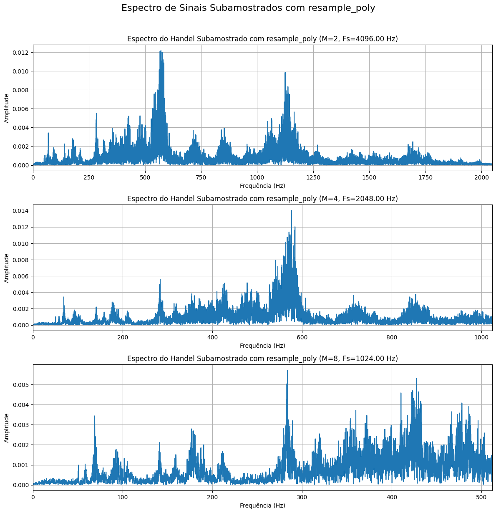
</p>

---

# Reprodução dos Áudios

```python
print("Sinal Original:")

display(
    Audio(
        data=normalized_data_handel,
        rate=fs_handel_original
    )
)

for M in M_factors_resample:

    signal_rp = resampled_poly_signals[f'M={M}']

    fs_rp = resampled_poly_sampling_frequencies[f'M={M}']

    print(
        f"Sinal Subamostrado com resample_poly M={M} (Fs={fs_rp:.2f} Hz):"
    )

    display(
        Audio(
            data=signal_rp,
            rate=fs_rp
        )
    )
```

## Explicação

Os sinais reamostrados são reproduzidos para comparação auditiva com o sinal original.

O método `resample_poly` preserva melhor o conteúdo espectral do áudio.

---

# Áudios Gerados

## Handel Original

[▶ Handel Original](assets2/handel_original.wav)

---

## Handel Reamostrado M = 2

[▶ Handel resample_poly M=2](assets2/handel_resample_M2.wav)

---

## Handel Reamostrado M = 4

[▶ Handel resample_poly M=4](assets2/handel_resample_M4.wav)

---

## Handel Reamostrado M = 8

[▶ Handel resample_poly M=8](assets2/handel_resample_M8.wav)

---

# Resultado Final

Ao executar o código, são obtidos:

- sinais reamostrados utilizando filtragem polifásica;
- espectros de frequência correspondentes;
- comparação auditiva entre diferentes taxas de amostragem;
- análise dos efeitos da reamostragem no domínio da frequência.

---

---

# Questão 6

# Sobreamostragem do Arquivo `handel.wav`

## 6A) Criação da Função de Sobreamostragem

```python
def upsample_signal_zero_insertion(signal, L):

    upsampled_signal = np.zeros(len(signal) * L)

    upsampled_signal[::L] = signal

    return upsampled_signal
```

## Explicação

A função `upsample_signal_zero_insertion()` realiza a sobreamostragem do sinal utilizando inserção de zeros.

O processo consiste em:

- aumentar a quantidade de amostras;
- inserir \(L-1\) zeros entre cada amostra original.

---

# Conceito Matemático

A nova frequência de amostragem após a sobreamostragem é dada por:

:contentReference[oaicite:0]{index=0}

Onde:

- \(f_s\) → frequência de amostragem original;
- \(L\) → fator de sobreamostragem;
- \(f_s'\) → nova frequência de amostragem.

---

# Inserção de Zeros

```python
upsampled_signal = np.zeros(len(signal) * L)
```

## Explicação

Cria um vetor preenchido com zeros com tamanho ampliado em \(L\) vezes.

---

# Inserção das Amostras Originais

```python
upsampled_signal[::L] = signal
```

## Explicação

As amostras originais são inseridas a cada \(L\) posições do vetor.

As posições intermediárias permanecem com valor zero.

---

# Objetivos da Sobreamostragem

A sobreamostragem é utilizada para:

- aumentar resolução temporal;
- facilitar processamento digital;
- preparar sinais para filtragem;
- alterar frequência de amostragem.

---

# 6B) Definição dos Fatores de Sobreamostragem

```python
L_factors = [2, 4, 8]

upsampled_signals_zero_insertion = {}

upsampled_sampling_frequencies_zero_insertion = {}
```

## Explicação

Foram utilizados três fatores de sobreamostragem:

- \(L = 2\)
- \(L = 4\)
- \(L = 8\)

Quanto maior o valor de \(L\), maior será a nova frequência de amostragem.

---

# Aplicação da Sobreamostragem

```python
for i, L in enumerate(L_factors):

    upsampled_signal = upsample_signal_zero_insertion(
        normalized_data_handel,
        L
    )

    new_fs = fs_handel_original * L
```

## Explicação

Para cada fator \(L\):

- o sinal é sobreamostrado;
- a nova frequência de amostragem é calculada.

---

# Armazenamento dos Resultados

```python
upsampled_signals_zero_insertion[f'L={L}'] = upsampled_signal

upsampled_sampling_frequencies_zero_insertion[f'L={L}'] = new_fs
```

## Explicação

Os sinais sobreamostrados e suas frequências de amostragem são armazenados para posterior análise.

---

# Cálculo do Espectro

```python
frequencies_us, amplitudes_us = calculate_spectrum(
    upsampled_signal,
    new_fs
)
```

## Explicação

A FFT é aplicada aos sinais sobreamostrados para análise espectral.

---

# Plotagem dos Espectros

```python
ax = plt.subplot(
    len(L_factors),
    1,
    i + 1
)

ax.plot(
    frequencies_us,
    amplitudes_us
)

ax.set_title(
    f'Espectro do Handel Sobreamostrado (L={L}, Fs={new_fs:.2f} Hz)'
)

ax.set_xlabel('Frequência (Hz)')
ax.set_ylabel('Amplitude')

ax.grid(True)

ax.set_xlim(
    0,
    fs_handel_original / 2 * (L + 0.5)
)
```

## Explicação

Os gráficos mostram o espectro dos sinais sobreamostrados.

A inserção de zeros provoca imagens espectrais (*spectral images*) no domínio da frequência.

O comando:

```python
ax.set_xlim(
    0,
    fs_handel_original / 2 * (L + 0.5)
)
```

amplia a visualização para destacar essas imagens espectrais.

---

# Frequência de Nyquist

A nova frequência de Nyquist é dada por:

:contentReference[oaicite:1]{index=1}

---

# Resultado Esperado dos Espectros

Ao executar o código, é possível observar:

- aumento da frequência de amostragem;
- replicações espectrais;
- imagens espectrais causadas pela inserção de zeros;
- alteração da representação espectral do sinal.

---

# Resultado dos Gráficos

<p align="center">
  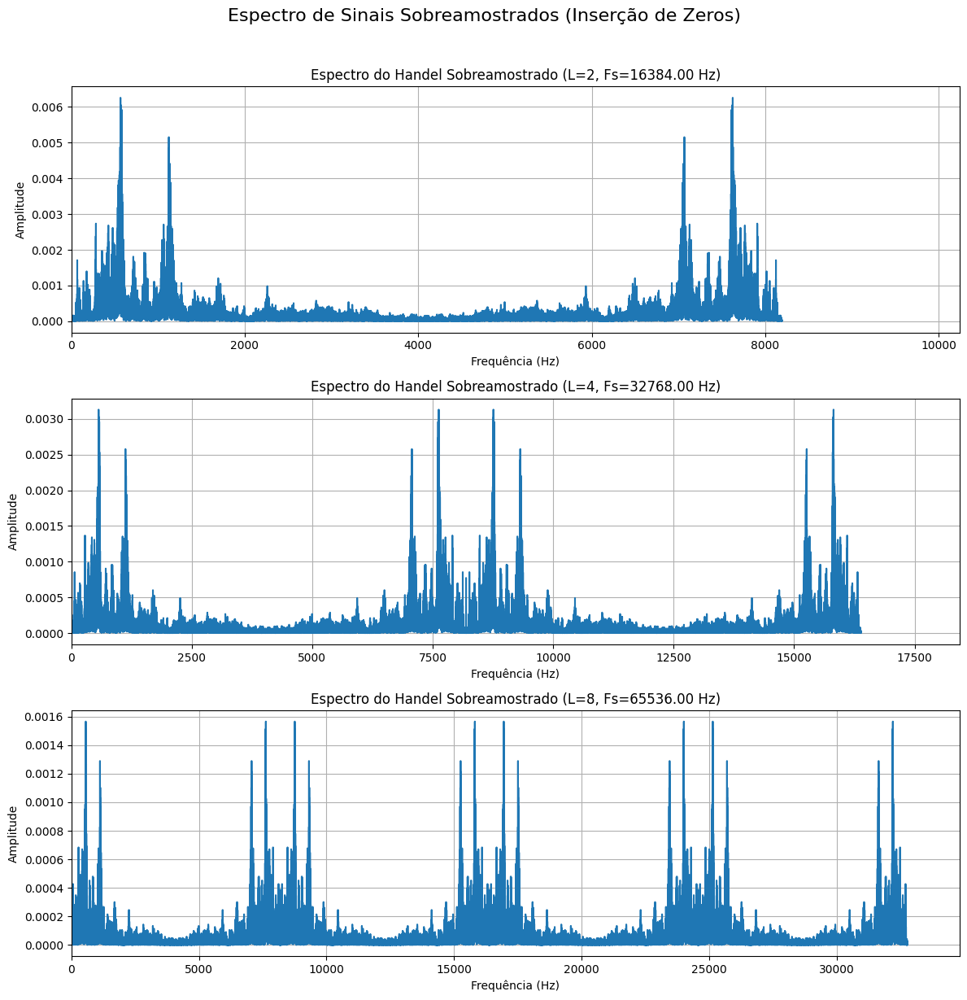
</p>

---

# Reprodução dos Áudios

```python
print("Sinal Original:")

display(
    Audio(
        data=normalized_data_handel,
        rate=fs_handel_original
    )
)

for L in L_factors:

    signal = upsampled_signals_zero_insertion[f'L={L}']

    fs_us = upsampled_sampling_frequencies_zero_insertion[f'L={L}']

    print(
        f"Sinal Sobreamostrado por L={L} (Fs={fs_us:.2f} Hz):"
    )

    display(
        Audio(
            data=signal,
            rate=fs_us
        )
    )
```

## Explicação

Os sinais sobreamostrados são reproduzidos para comparação auditiva com o sinal original.

A inserção de zeros altera o espectro do sinal, podendo introduzir componentes indesejadas caso não seja aplicado um filtro de interpolação.

---

# Áudios Gerados

## Handel Original

[▶ Handel Original](assets2/handel_original.wav)

---

## Sobreamostragem L = 2

[▶ Handel L=2](assets2/handel_L2.wav)

---

## Sobreamostragem L = 4

[▶ Handel L=4](assets2/handel_L4.wav)

---

## Sobreamostragem L = 8

[▶ Handel L=8](assets2/handel_L8.wav)

---

# Resultado Final

Ao executar o código, são obtidos:

- sinais sobreamostrados;
- espectros de frequência correspondentes;
- análise das imagens espectrais;
- comparação auditiva entre diferentes fatores de sobreamostragem.

---

---

# Prática 2 — Questão 7

# Sobreamostragem utilizando `scipy.signal.resample_poly`

## Importação da Função

```python
from scipy.signal import resample_poly
```

## Explicação

A função `resample_poly()` realiza reamostragem utilizando filtragem polifásica.

Esse método é mais eficiente e reduz a presença de imagens espectrais e aliasing quando comparado à inserção simples de zeros.

---

# Definição dos Fatores de Sobreamostragem

```python
L_factors_resample_poly = [2, 4, 8]

resampled_poly_upsampled_signals = {}

resampled_poly_upsampled_sampling_frequencies = {}
```

## Explicação

Foram utilizados três fatores de sobreamostragem:

- \(L = 2\)
- \(L = 4\)
- \(L = 8\)

Cada fator aumenta a frequência de amostragem do sinal original.

---

# Aplicação da Sobreamostragem com `resample_poly`

```python
resampled_poly_upsampled_signal = resample_poly(
    normalized_data_handel,
    L,
    1
)
```

## Explicação

A função:

```python
resample_poly(signal, up, down)
```

realiza:

- interpolação (`up`);
- decimação (`down`).

Neste caso:

- `up = L`
- `down = 1`

Portanto, o sinal é sobreamostrado por um fator \(L\).

---

# Nova Frequência de Amostragem

```python
new_fs_upsample = fs_handel_original * L
```

## Explicação

A nova frequência de amostragem é dada por:

:contentReference[oaicite:0]{index=0}

Onde:

- \(f_s\) → frequência original;
- \(L\) → fator de sobreamostragem;
- \(f_s'\) → nova frequência de amostragem.

---

# Armazenamento dos Resultados

```python
resampled_poly_upsampled_signals[f'L={L}'] = resampled_poly_upsampled_signal

resampled_poly_upsampled_sampling_frequencies[f'L={L}'] = new_fs_upsample
```

## Explicação

Os sinais sobreamostrados e suas respectivas frequências de amostragem são armazenados para posterior análise.

---

# Cálculo do Espectro

```python
frequencies_rp_us, amplitudes_rp_us = calculate_spectrum(
    resampled_poly_upsampled_signal,
    new_fs_upsample
)
```

## Explicação

A FFT é aplicada aos sinais sobreamostrados para análise espectral.

---

# Plotagem dos Espectros

```python
ax = plt.subplot(
    len(L_factors_resample_poly),
    1,
    i + 1
)

ax.plot(
    frequencies_rp_us,
    amplitudes_rp_us
)

ax.set_title(
    f'Espectro do Handel Sobreamostrado com resample_poly (L={L}, Fs={new_fs_upsample:.2f} Hz)'
)

ax.set_xlabel('Frequência (Hz)')
ax.set_ylabel('Amplitude')

ax.grid(True)

ax.set_xlim(
    0,
    fs_handel_original / 2 + 1000
)
```

## Explicação

Os gráficos mostram os espectros dos sinais sobreamostrados utilizando filtragem polifásica.

Diferentemente da inserção simples de zeros, o método `resample_poly` reduz significativamente:

- imagens espectrais;
- distorções;
- componentes indesejadas.

O comando:

```python
ax.set_xlim(
    0,
    fs_handel_original / 2 + 1000
)
```

limita a visualização para destacar a banda espectral original do sinal.

---

# Frequência de Nyquist

A nova frequência de Nyquist é dada por:

:contentReference[oaicite:1]{index=1}

---

# Resultado Esperado dos Espectros

Ao executar o código, observa-se:

- preservação mais eficiente do espectro original;
- redução das imagens espectrais;
- melhoria na qualidade da sobreamostragem;
- espectros mais suaves e contínuos.

---

# Resultado dos Gráficos

<p align="center">
  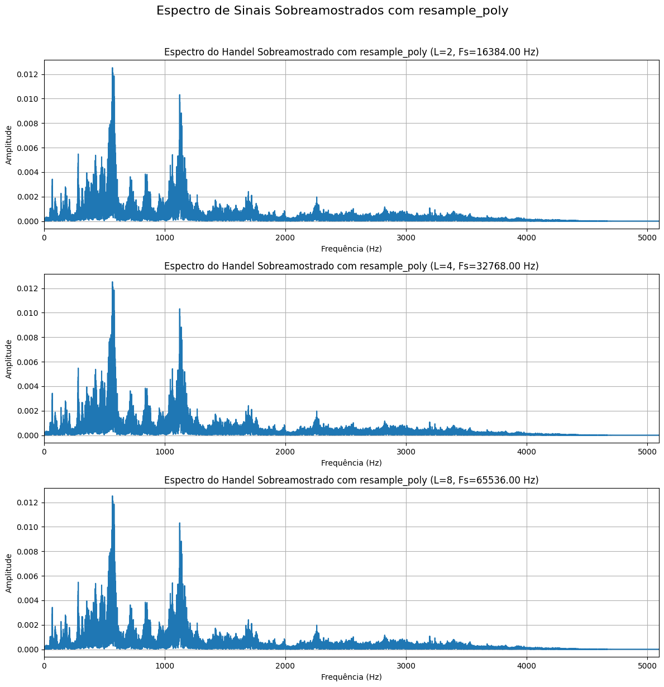
</p>

---

# Reprodução dos Áudios

```python
print("Sinal Original:")

display(
    Audio(
        data=normalized_data_handel,
        rate=fs_handel_original
    )
)

for L in L_factors_resample_poly:

    signal_rp_us = resampled_poly_upsampled_signals[f'L={L}']

    fs_rp_us = resampled_poly_upsampled_sampling_frequencies[f'L={L}']

    print(
        f"Sinal Sobreamostrado com resample_poly L={L} (Fs={fs_rp_us:.2f} Hz):"
    )

    display(
        Audio(
            data=signal_rp_us,
            rate=fs_rp_us
        )
    )
```

## Explicação

Os sinais sobreamostrados são reproduzidos para comparação auditiva com o sinal original.

O método `resample_poly` preserva melhor a qualidade sonora quando comparado à sobreamostragem por inserção de zeros.

---

# Áudios Gerados

## Handel Original

[▶ Handel Original](assets2/handel_original.wav)

---

## Sobreamostragem com resample_poly L = 2

[▶ Handel resample_poly L=2](assets2/handel_resamplepoly_L2.wav)

---

## Sobreamostragem com resample_poly L = 4

[▶ Handel resample_poly L=4](assets2/handel_resamplepoly_L4.wav)

---

## Sobreamostragem com resample_poly L = 8

[▶ Handel resample_poly L=8](assets2/handel_resamplepoly_L8.wav)

---

# Resultado Final

Ao executar o código, são obtidos:

- sinais sobreamostrados utilizando filtragem polifásica;
- espectros de frequência correspondentes;
- comparação auditiva entre diferentes fatores de sobreamostragem;
- análise da preservação espectral do sinal.

---

---

# Prática 2 — Questão 8

# Análise e Reconstrução de Sinal Contínuo

O sinal analisado é dado por:

:contentReference[oaicite:0]{index=0}

Para aproximar um sinal contínuo, foi utilizada uma frequência de amostragem muito elevada:

:contentReference[oaicite:1]{index=1}

---

# 8A) Geração do Sinal no Domínio do Tempo

## Definição dos Parâmetros

```python
fs_cont = 10e6

duration = 10e-3

t_cont = np.linspace(
    0,
    duration,
    int(duration * fs_cont),
    endpoint=False
)
```

## Explicação

Os parâmetros utilizados definem:

- frequência de amostragem contínua aproximada;
- duração do sinal;
- vetor temporal.

Neste caso:

- \(f_s = 10\text{ MHz}\)
- duração = \(10\text{ ms}\)

---

# Geração do Sinal

```python
x_t = np.cos(2000 * t_cont) + np.sin(5000 * t_cont)
```

## Explicação

O sinal é composto pela soma de:

- uma componente cossenoidal;
- uma componente senoidal.

---

# Plotagem do Sinal

```python
plt.figure(figsize=(12, 4))

plt.plot(t_cont * 1000, x_t)

plt.title('x(t) no Domínio do Tempo (10 ms)')

plt.xlabel('Tempo (ms)')
plt.ylabel('Amplitude')

plt.grid(True)

plt.tight_layout()

plt.show()
```

## Explicação

O gráfico apresenta o sinal no domínio do tempo.

O eixo temporal foi convertido para milissegundos:

```python
t_cont * 1000
```

---

# Resultado do Gráfico

<p align="center">
  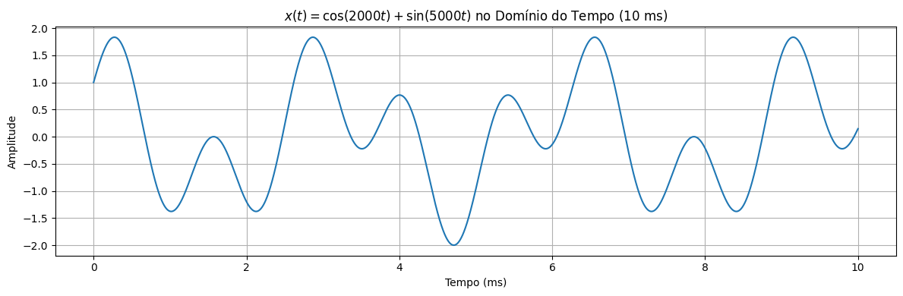
</p>

---

# 8B) Cálculo do Espectro de x(t)

## Aplicação da FFT

```python
frequencies_xt, amplitudes_xt = calculate_spectrum(
    x_t,
    fs_cont
)
```

## Explicação

A FFT é utilizada para calcular o espectro de frequência do sinal contínuo aproximado.

---

# Plotagem do Espectro

```python
plt.figure(figsize=(12, 6))

plt.plot(
    frequencies_xt,
    amplitudes_xt
)

plt.title('Espectro de x(t)')

plt.xlabel('Frequência (Hz)')
plt.ylabel('Amplitude')

plt.grid(True)

plt.xlim(0, 1000)

plt.tight_layout()

plt.show()
```

## Explicação

As frequências angulares presentes no sinal são:

- \(2000\ \text{rad/s}\)
- \(5000\ \text{rad/s}\)

Convertendo para Hz:


::contentReference[oaicite:2]{index=2}


obtém-se aproximadamente:

- \(318.3\ \text{Hz}\)
- \(795.8\ \text{Hz}\)

---

# Resultado do Gráfico

<p align="center">
  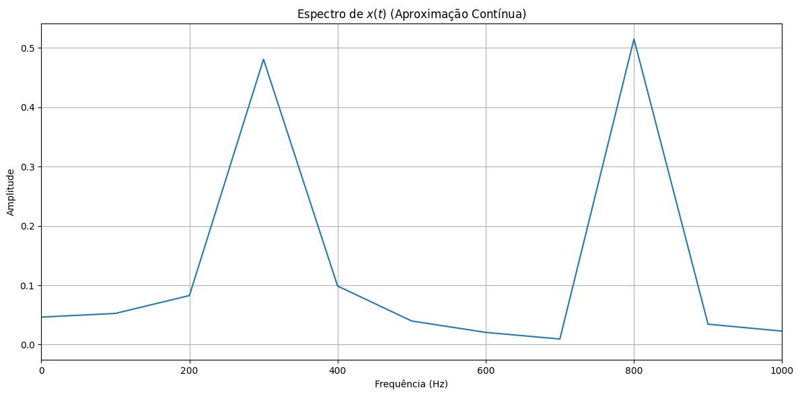
</p>

---

# 8C) Amostragem na Frequência de Nyquist

## Cálculo da Frequência Máxima

```python
f_max_component_hz = 5000 / (2 * np.pi)
```

## Explicação

A maior frequência do sinal é aproximadamente:

```python
795.8 Hz
```

---

# Frequência de Nyquist

A frequência mínima de Nyquist é dada por:

:contentReference[oaicite:3]{index=3}

---

# Definição da Frequência de Amostragem

```python
fs_sampled = fs_nyquist_min * 1.05
```

## Explicação

Foi utilizada uma frequência ligeiramente superior à frequência mínima de Nyquist para garantir reconstrução adequada.

---

# Vetor Temporal do Sinal Amostrado

```python
t_sampled = np.linspace(
    0,
    duration,
    int(duration * fs_sampled),
    endpoint=False
)
```

---

# Amostragem do Sinal

```python
x_n = np.cos(2000 * t_sampled) + np.sin(5000 * t_sampled)
```

## Explicação

O sinal contínuo foi amostrado utilizando a nova frequência de amostragem.

---

# Plotagem do Sinal Amostrado

```python
plt.figure(figsize=(12, 4))

plt.stem(
    t_sampled * 1000,
    x_n,
    linefmt='b-',
    markerfmt='bo',
    basefmt='r-'
)

plt.plot(
    t_cont * 1000,
    x_t,
    'g--',
    alpha=0.7,
    label='Sinal Original'
)

plt.title('Sinal x[n] Amostrado')

plt.xlabel('Tempo (ms)')
plt.ylabel('Amplitude')

plt.legend()

plt.grid(True)

plt.tight_layout()

plt.show()
```

## Explicação

O gráfico compara:

- sinal contínuo original;
- amostras discretas obtidas.

---

# Resultado do Gráfico

<p align="center">
  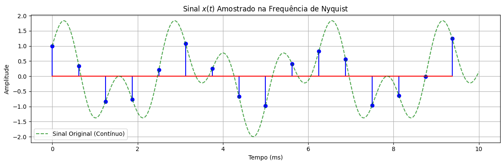
</p>

---

# 8D) Espectro do Sinal Amostrado

## Cálculo do Espectro

```python
frequencies_xn, amplitudes_xn = calculate_spectrum(
    x_n,
    fs_sampled
)
```

## Explicação

A FFT é aplicada ao sinal discreto \(x[n]\).

---

# Plotagem do Espectro

```python
plt.figure(figsize=(12, 6))

plt.plot(
    frequencies_xn,
    amplitudes_xn
)

plt.title('Espectro de x[n]')

plt.xlabel('Frequência (Hz)')
plt.ylabel('Amplitude')

plt.grid(True)

plt.xlim(0, fs_sampled / 2 + 100)

plt.tight_layout()

plt.show()
```

## Explicação

O espectro apresenta as componentes do sinal discreto limitadas pela nova frequência de Nyquist.

---

# Resultado do Gráfico

<p align="center">
  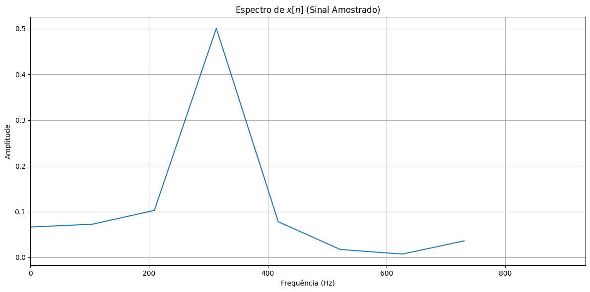
</p>

---

# 8E) Reconstrução do Sinal

## Reconstrução utilizando Interpolação Sinc

```python
x_reconstructed_sinc = resample(
    x_n,
    num_points_reconstructed
)
```

## Explicação

A função `resample()` realiza reconstrução utilizando interpolação sinc.

Esse método aproxima a reconstrução ideal do sinal contínuo.

---

# Reconstrução utilizando ZOH

## Interpolação de Ordem Zero

```python
f_zoh = interp1d(
    t_sampled,
    x_n,
    kind='previous',
    fill_value="extrapolate"
)
```

## Explicação

O método ZOH (*Zero-Order Hold*) mantém o valor de cada amostra constante até a próxima amostra.

---

# Geração do Sinal Reconstruído

```python
x_reconstructed_zoh = f_zoh(t_cont)
```

---

# Plotagem Final

```python
plt.figure(figsize=(12, 6))

plt.plot(
    t_cont * 1000,
    x_t,
    'g-',
    label='Sinal Original'
)

plt.plot(
    t_cont * 1000,
    x_reconstructed_sinc,
    'r--',
    alpha=0.8,
    label='Reconstruído com Sinc'
)

plt.plot(
    t_cont * 1000,
    x_reconstructed_zoh,
    'b:',
    alpha=0.6,
    label='Reconstruído com ZOH'
)

plt.stem(
    t_sampled * 1000,
    x_n,
    linefmt='k:',
    markerfmt='ko',
    basefmt=' ',
    label='Amostras'
)

plt.title('Reconstrução de x(t)')

plt.xlabel('Tempo (ms)')
plt.ylabel('Amplitude')

plt.legend()

plt.grid(True)

plt.xlim(0, 5)

plt.tight_layout()

plt.show()
```

## Explicação

O gráfico final compara:

- sinal original;
- reconstrução sinc;
- reconstrução ZOH;
- amostras discretas.

A interpolação sinc produz reconstrução mais próxima do sinal original.

---

# Resultado do Gráfico

<p align="center">
  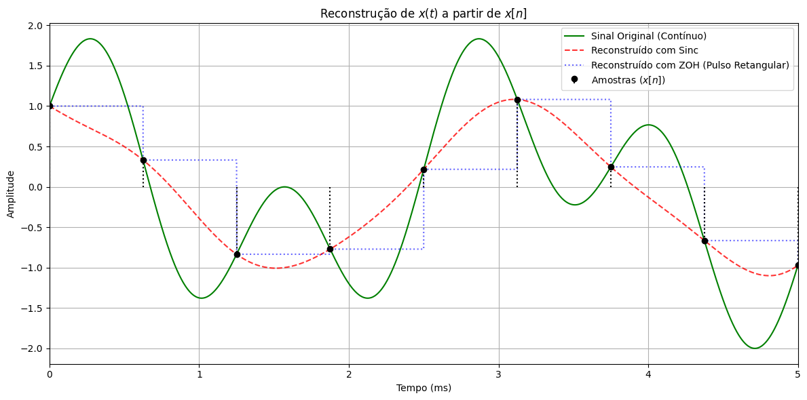
</p>

---

# Resultado Final

Ao executar o código, são obtidos:

- sinal contínuo aproximado;
- espectro do sinal;
- sinal discretizado;
- espectro do sinal amostrado;
- reconstrução utilizando sinc;
- reconstrução utilizando ZOH;
- comparação entre os métodos de reconstrução.

---

---

# Prática 2 — Questão 9

# Análise dos Sinais de Áudio `h_banheiro.wav` e `sinal_taca.wav`

## 9A) Leitura dos Arquivos de Áudio

```python
fs_banheiro, data_banheiro = wavfile.read(
    '/content/h_banheiro.wav'
)

fs_taca, data_taca = wavfile.read(
    '/content/sinal_taca.wav'
)
```

## Explicação

Os arquivos de áudio são carregados utilizando:

```python
wavfile.read()
```

A função retorna:

- frequência de amostragem do áudio;
- vetor contendo as amostras do sinal.

Neste caso:

- `fs_banheiro` → frequência de amostragem do sinal `h_banheiro.wav`;
- `data_banheiro` → amostras do sinal do banheiro;
- `fs_taca` → frequência de amostragem do sinal `sinal_taca.wav`;
- `data_taca` → amostras do sinal da taça.

---

# Normalização dos Sinais

```python
normalized_data_banheiro = (
    data_banheiro /
    np.max(np.abs(data_banheiro))
)

normalized_data_taca = (
    data_taca /
    np.max(np.abs(data_taca))
)
```

## Explicação

Os sinais são normalizados para que suas amplitudes permaneçam entre:

:contentReference[oaicite:0]{index=0}

A normalização evita:

- clipping;
- saturação;
- distorções durante o processamento.

---

# Cálculo do Espectro do Sinal `h_banheiro.wav`

```python
frequencies_banheiro, amplitudes_banheiro = calculate_spectrum(
    normalized_data_banheiro,
    fs_banheiro
)
```

## Explicação

A FFT é aplicada ao sinal `h_banheiro.wav` para obtenção do espectro de frequência.

O resultado contém:

- frequências do sinal;
- amplitudes espectrais correspondentes.

---

# Cálculo do Espectro do Sinal `sinal_taca.wav`

```python
frequencies_taca, amplitudes_taca = calculate_spectrum(
    normalized_data_taca,
    fs_taca
)
```

## Explicação

A FFT é aplicada ao sinal `sinal_taca.wav`.

O espectro obtido permite identificar as frequências presentes no sinal da taça.

---

# Plotagem dos Espectros

```python
plt.figure(figsize=(12, 10))
```

## Explicação

A figura é criada para exibir os dois espectros em subgráficos separados.

---

# Espectro de `h_banheiro.wav`

```python
plt.subplot(2, 1, 1)

plt.plot(
    frequencies_banheiro,
    amplitudes_banheiro
)

plt.title(
    'Espectro do Sinal de Áudio h_banheiro.wav (Normalizado)'
)

plt.xlabel('Frequência (Hz)')
plt.ylabel('Amplitude')

plt.grid(True)

plt.xlim(0, fs_banheiro / 2)
```

## Explicação

O gráfico apresenta o espectro do sinal do banheiro.

O eixo de frequência é limitado até a frequência de Nyquist:

:contentReference[oaicite:1]{index=1}

---

# Espectro de `sinal_taca.wav`

```python
plt.subplot(2, 1, 2)

plt.plot(
    frequencies_taca,
    amplitudes_taca
)

plt.title(
    'Espectro do Sinal de Áudio sinal_taca.wav (Normalizado)'
)

plt.xlabel('Frequência (Hz)')
plt.ylabel('Amplitude')

plt.grid(True)

plt.xlim(0, fs_taca / 2)
```

## Explicação

O gráfico apresenta o espectro do sinal da taça.

A FFT permite visualizar:

- componentes harmônicas;
- frequências predominantes;
- distribuição espectral do áudio.

---

# Exibição Final dos Gráficos

```python
plt.tight_layout()

plt.show()
```

## Explicação

O comando:

```python
plt.tight_layout()
```

ajusta automaticamente os espaçamentos da figura para melhorar a visualização.

---

# Resultado Esperado

Ao executar o código, são obtidos:

- espectro do sinal `h_banheiro.wav`;
- espectro do sinal `sinal_taca.wav`;
- análise das componentes espectrais dos áudios;
- comparação entre os conteúdos harmônicos dos sinais.

---

# Resultado dos Gráficos

## Espectro de `h_banheiro.wav` e `sinal_taca.wav`

<p align="center">
  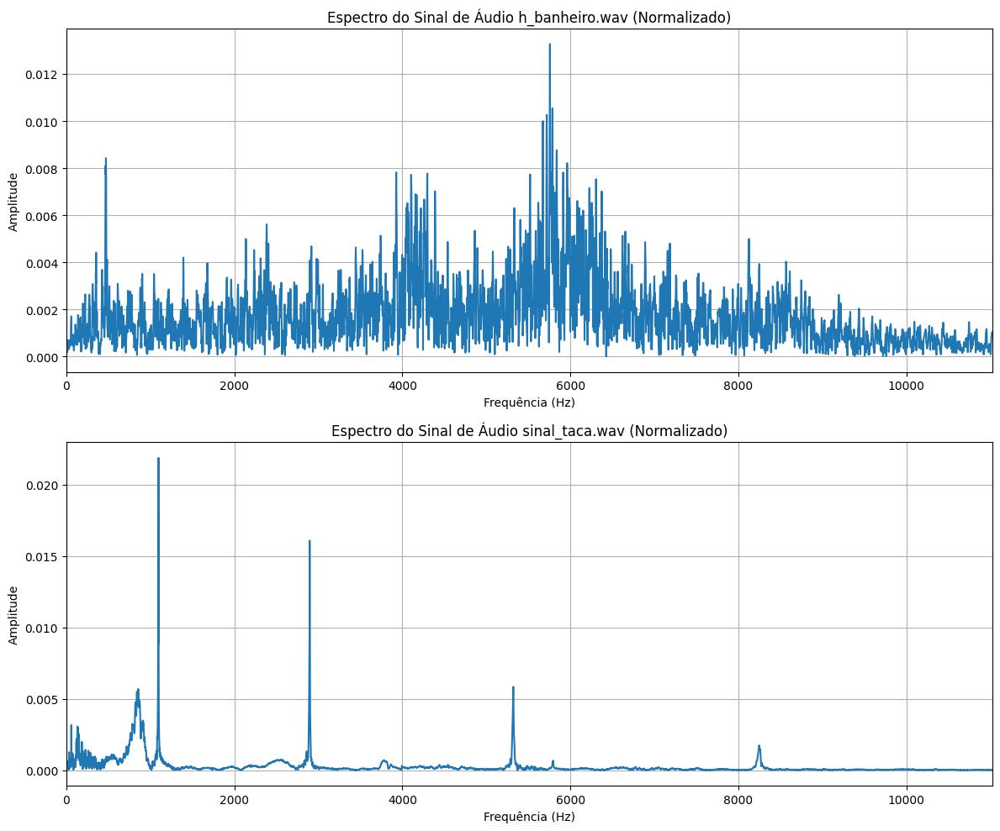
</p>

---

# Prática 2 — Questão 10

# Convolução dos Sinais de Áudio

Nesta etapa, foi realizada a convolução entre:

- `handel.wav`
- `h_banheiro.wav`
- `sinal_taca.wav`

A convolução permite simular o efeito de resposta impulsiva de um ambiente acústico.

---

# Igualando as Frequências de Amostragem

## Importação da Função

```python
from scipy.signal import resample_poly
```

## Explicação

A função `resample_poly()` é utilizada para reamostrar sinais com diferentes frequências de amostragem.

---

# Problema Inicial

Os sinais possuem frequências de amostragem diferentes:

- `handel.wav` → 8192 Hz
- `h_banheiro.wav` → 44100 Hz
- `sinal_taca.wav` → 44100 Hz

Para realizar a convolução corretamente, todos os sinais precisam possuir a mesma frequência de amostragem.

---

# Definição da Frequência de Destino

```python
target_fs = fs_banheiro
```

## Explicação

Foi utilizada a frequência:

```python
44100 Hz
```

como frequência padrão para todos os sinais.

---

# Reamostragem de `handel.wav`

```python
handel_reamostrado = resample_poly(
    normalized_data_handel,
    target_fs,
    fs_handel_original
)
```

## Explicação

O sinal `handel.wav` é reamostrado de:

```python
8192 Hz → 44100 Hz
```

A função:

```python
resample_poly(signal, up, down)
```

realiza:

- interpolação;
- filtragem;
- ajuste da frequência de amostragem.

---

# Convolução dos Sinais

## Convolução entre Handel e Banheiro

```python
handel_convoluido_com_banheiro = np.convolve(
    handel_reamostrado,
    normalized_data_banheiro,
    mode='full'
)
```

## Explicação

A convolução simula o efeito acústico do ambiente `h_banheiro.wav` aplicado sobre o áudio `handel.wav`.

---

# Convolução entre Taça e Banheiro

```python
handel_convoluido_com_taca = np.convolve(
    normalized_data_taca,
    normalized_data_banheiro,
    mode='full'
)
```

## Explicação

O sinal da taça é convoluído com a resposta impulsiva do banheiro.

---

# Conceito Matemático da Convolução

A convolução discreta é definida por:

:contentReference[oaicite:0]{index=0}

Onde:

- \(x[n]\) → sinal de entrada;
- \(h[n]\) → resposta impulsiva;
- \(y[n]\) → sinal convoluído.

---

# Normalização dos Sinais Convoluídos

```python
handel_convoluido_com_banheiro_normalizado =
handel_convoluido_com_banheiro /
np.max(np.abs(handel_convoluido_com_banheiro))

handel_convoluido_com_taca_normalizado =
handel_convoluido_com_taca /
np.max(np.abs(handel_convoluido_com_taca))
```

## Explicação

Os sinais convoluídos são normalizados para evitar:

- clipping;
- saturação;
- distorções de amplitude.

---

# Informações dos Sinais

```python
print(
    f"Sinal handel.wav reamostrado para {target_fs} Hz."
)
```

## Explicação

São exibidas informações sobre:

- nova frequência de amostragem;
- duração dos sinais;
- tamanho dos sinais convoluídos.

---

# 10A) Cálculo do Espectro das Respostas

## Espectro da Convolução Handel + Banheiro

```python
frequencies_handel_conv_banheiro,
amplitudes_handel_conv_banheiro =
calculate_spectrum(
    handel_convoluido_com_banheiro_normalizado,
    target_fs
)
```

## Explicação

A FFT é aplicada ao sinal convoluído para análise espectral.

---

# Espectro da Convolução Taça + Banheiro

```python
frequencies_taca_conv_banheiro,
amplitudes_taca_conv_banheiro =
calculate_spectrum(
    handel_convoluido_com_taca_normalizado,
    target_fs
)
```

## Explicação

O espectro da convolução do sinal da taça também é calculado utilizando FFT.

---

# Plotagem dos Espectros

```python
plt.figure(figsize=(12, 10))
```

## Explicação

A figura é criada para exibir os dois espectros em subgráficos separados.

---

# Espectro Handel + Banheiro

```python
plt.subplot(2, 1, 1)

plt.plot(
    frequencies_handel_conv_banheiro,
    amplitudes_handel_conv_banheiro
)

plt.title(
    'Espectro da Convolução (Handel Reamostrado * h_banheiro)'
)

plt.xlabel('Frequência (Hz)')
plt.ylabel('Amplitude')

plt.grid(True)

plt.xlim(0, target_fs / 2)
```

## Explicação

O gráfico apresenta o conteúdo espectral do sinal convoluído entre:

- música de Handel;
- resposta impulsiva do banheiro.

---

# Espectro Taça + Banheiro

```python
plt.subplot(2, 1, 2)

plt.plot(
    frequencies_taca_conv_banheiro,
    amplitudes_taca_conv_banheiro
)

plt.title(
    'Espectro da Convolução (sinal_taca * h_banheiro)'
)

plt.xlabel('Frequência (Hz)')
plt.ylabel('Amplitude')

plt.grid(True)

plt.xlim(0, target_fs / 2)
```

## Explicação

O gráfico apresenta o espectro do sinal da taça convoluído com a resposta impulsiva do banheiro.

---

# Frequência de Nyquist

A frequência máxima exibida nos gráficos é limitada pela frequência de Nyquist:

:contentReference[oaicite:1]{index=1}

---

# Resultado Esperado

Ao executar o código, são obtidos:

- sinais convoluídos;
- espectros das respostas impulsivas;
- simulação acústica do ambiente;
- análise espectral das convoluções.

---

# Resultado dos Gráficos

## Handel + Banheiro e Taça + Banheiro

<p align="center">
  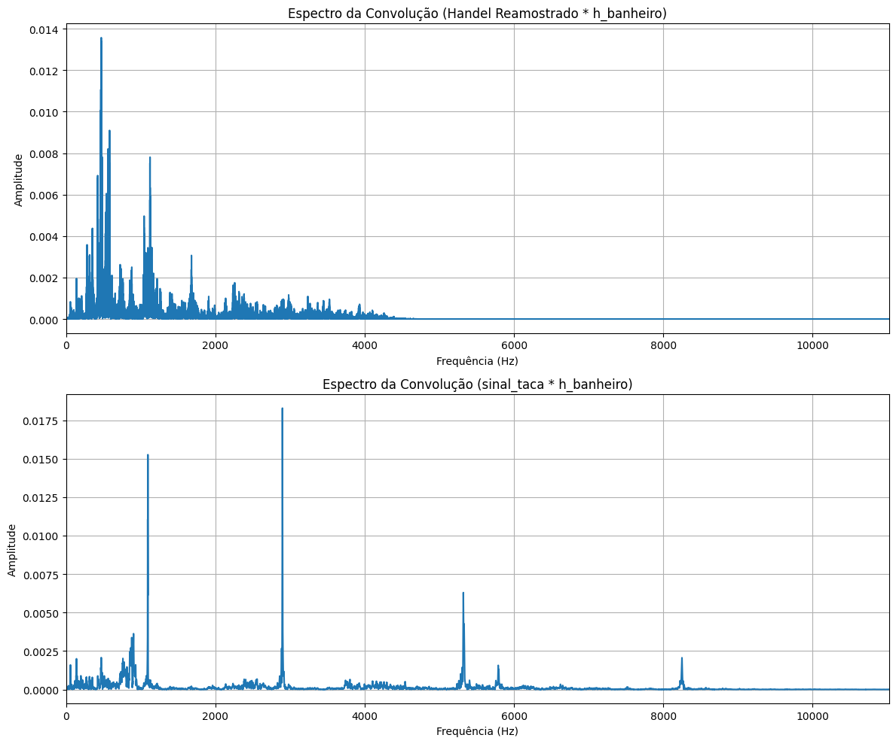
</p>

---


---
