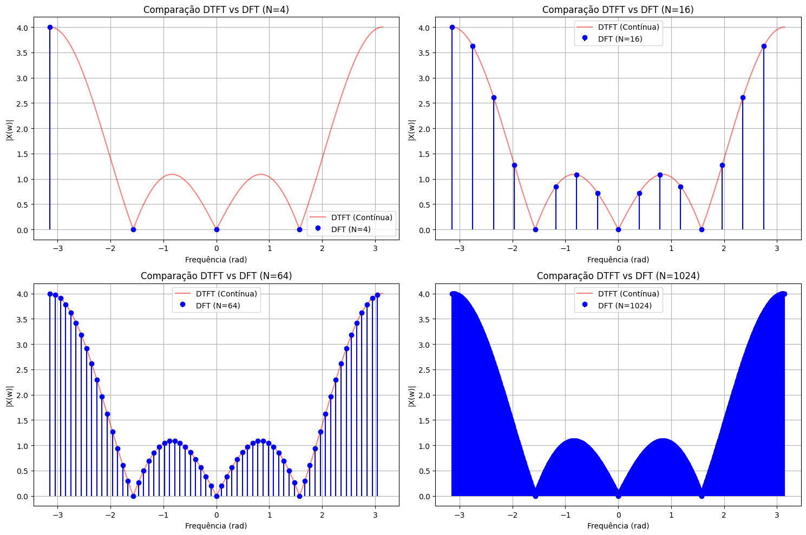
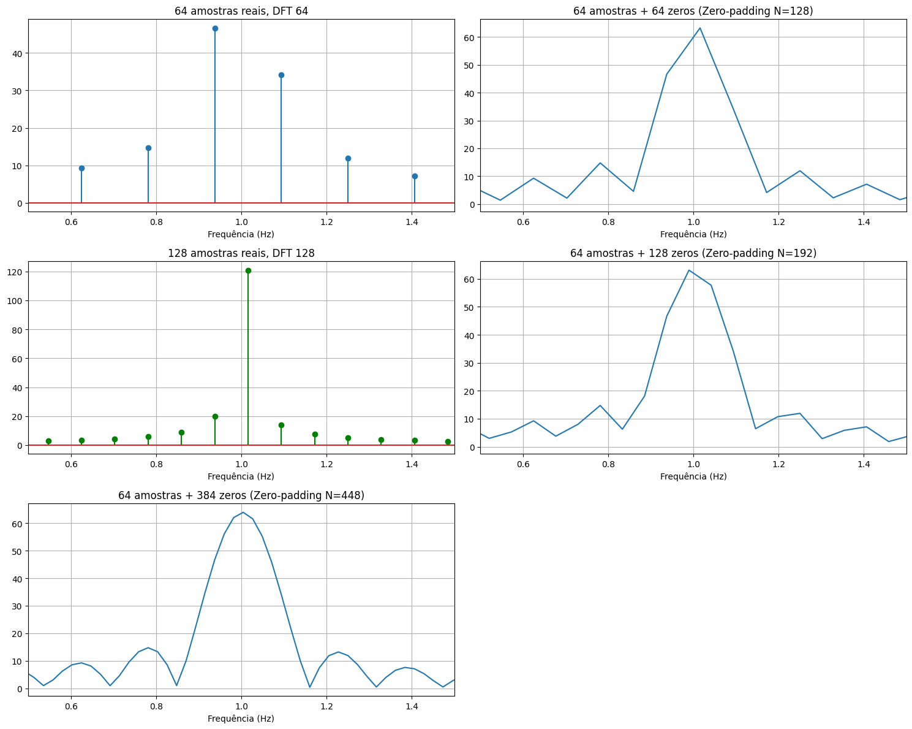
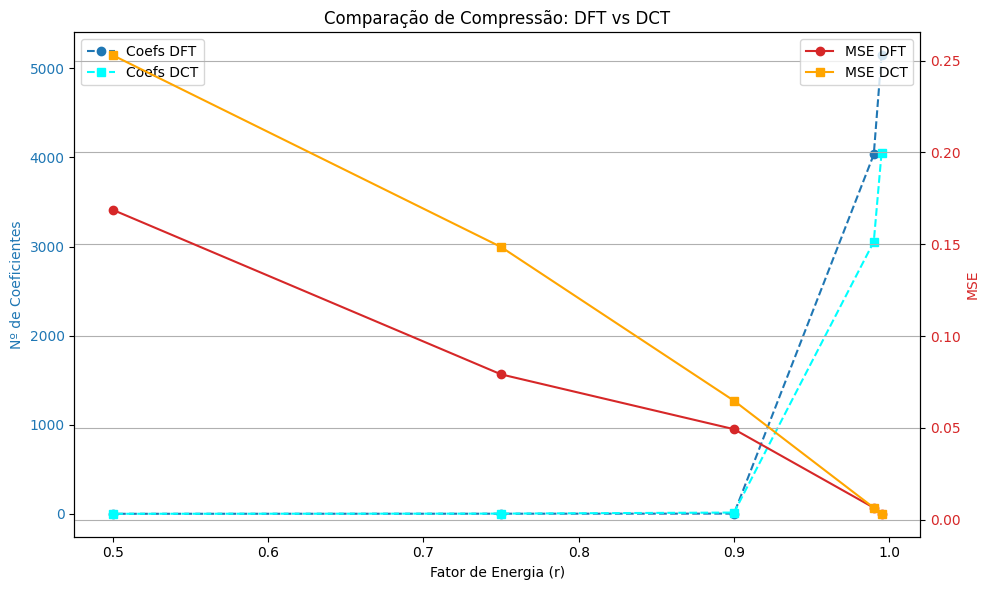
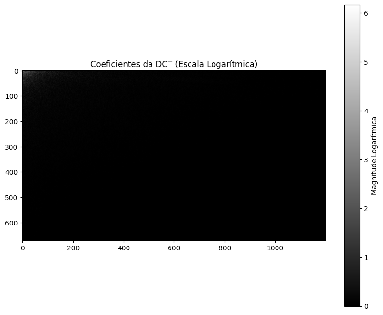

<p align="center">
  
</p>

<p align="center">

</p>

# PROSIN I — Processamento de Sinais I

- **Professor:** Rafael da Silva Chaves
- **Instituição:** Centro Federal de Educação Tecnológica Celso Suckow da Fonseca- CEFET/RJ
- **Dupla:** Lucas de Farias dos Santos e Luís Felipe Chaves de Oliveira
- **Semestre:** 2026.1

# Prática 4 — DCT E DFT

# Questão 1

# Comparação entre DTFT e DFT com Diferentes Valores de N

# Importação das Bibliotecas

```python
import numpy as np
import matplotlib.pyplot as plt
```

## Explicação

As bibliotecas utilizadas foram:

- `numpy` → operações matemáticas e FFT;
- `matplotlib` → geração dos gráficos.

---

# Definição do Sinal

```python
x = np.array([1, -1, 1, -1])
```

## Explicação

O sinal discreto utilizado foi:

:contentReference[oaicite:0]{index=0}

Este sinal possui:

- comprimento igual a 4;
- alternância entre valores positivos e negativos;
- forte componente em alta frequência.

---

# Função da DTFT

```python
def dtft(x, w):
    n = np.arange(len(x))
    return np.array([
        np.sum(
            x * np.exp(-1j * omega * n)
        )
        for omega in w
    ])
```

## Explicação

A função implementa numericamente a:

```text
Transformada Discreta de Fourier no Tempo (DTFT)
```

---

# Modelo Matemático da DTFT

:contentReference[oaicite:1]{index=1}

## Explicação

A DTFT produz:

- um espectro contínuo;
- definido para qualquer frequência angular:

```text
ω ∈ [-π, π]
```

---

# Valores de N

```python
N_values = [4, 16, 64, 1024]
```

## Explicação

Foram utilizados diferentes tamanhos de DFT para analisar:

- o efeito do zero-padding;
- a resolução espectral;
- a aproximação da DTFT pela DFT.

---

# Eixo Contínuo da DTFT

```python
w_cont = np.linspace(-np.pi, np.pi, 1000)
```

## Explicação

O eixo contínuo permite calcular a DTFT para:

```text
1000 pontos igualmente espaçados
```

entre:

```text
-π e π
```

---

# Cálculo da DTFT

```python
X_dtft = dtft(x, w_cont)
```

## Explicação

A DTFT é calculada sobre o eixo contínuo de frequências.

---

# Criação da Figura

```python
plt.figure(figsize=(15, 10))
```

## Explicação

Define o tamanho da figura que conterá:

- quatro comparações entre DTFT e DFT.

---

# Loop dos Valores de N

```python
for i, N in enumerate(N_values):
```

## Explicação

O laço percorre todos os tamanhos de DFT definidos.

---

# Cálculo da DFT

```python
X_dft = np.fft.fft(x, N)
```

## Explicação

A função:

```python
fft()
```

calcula a DFT do sinal.

Quando:

```text
N > comprimento do sinal
```

ocorre:

```text
zero-padding
```

automaticamente.

---

# Modelo Matemático da DFT

:contentReference[oaicite:2]{index=2}

## Explicação

A DFT produz:

- amostras discretas do espectro;
- espaçadas uniformemente no domínio da frequência.

---

# Centralização do Espectro

```python
X_dft_shifted = np.fft.fftshift(X_dft)
```

## Explicação

A função:

```python
fftshift()
```

move:

```text
ω = 0
```

para o centro do gráfico.

---

# Frequências da DFT

```python
freq_dft = np.linspace(
    -np.pi,
    np.pi,
    N,
    endpoint=False
)
```

## Explicação

Cria o eixo discreto das frequências da DFT.

---

# Plotagem da DTFT

```python
plt.plot(
    w_cont,
    np.abs(X_dtft),
    'r-'
)
```

## Explicação

O gráfico vermelho representa:

- a DTFT contínua;
- considerada referência teórica.

---

# Plotagem da DFT

```python
plt.stem(
    freq_dft,
    np.abs(X_dft_shifted)
)
```

## Explicação

Os pontos azuis representam:

- as amostras espectrais da DFT.

---

# Configuração dos Títulos

```python
plt.title(
    f'Comparação DTFT vs DFT (N={N})'
)
```

## Explicação

Cada gráfico mostra:

- um valor diferente de N.

---

# Configuração dos Eixos

```python
plt.xlabel('Frequência (rad)')
plt.ylabel('|X(w)|')
```

## Explicação

Os eixos representam:

- frequência angular;
- magnitude espectral.

---

# Grade e Legenda

```python
plt.grid(True)
plt.legend()
```

## Explicação

Facilitam:

- leitura;
- comparação visual.

---

# Organização Final

```python
plt.tight_layout()
plt.show()
```

## Explicação

Ajusta automaticamente o espaçamento dos gráficos e exibe o resultado.

---

# Interpretação dos Resultados

Observa-se que:

- para valores pequenos de N, a DFT possui poucas amostras espectrais;
- conforme N aumenta, a DFT aproxima melhor a DTFT;
- o zero-padding aumenta a densidade espectral;
- a forma do espectro torna-se mais detalhada.

---

# Efeito do Zero-Padding

O zero-padding:

- não adiciona informação nova;
- apenas melhora a visualização do espectro;
- aumenta a resolução aparente da DFT.

---

# Resultado dos Gráficos

## Comparação entre DTFT e DFT

<p align="center">
  
</p>

---

# Questão 2

# Efeito do Zero-Padding e Resolução Espectral na DFT

# Importação das Bibliotecas

```python
import numpy as np
import matplotlib.pyplot as plt
```

## Explicação

As bibliotecas utilizadas foram:

- `numpy` → operações matemáticas e FFT;
- `matplotlib` → geração dos gráficos.

---

# Frequência de Amostragem

```python
fs = 10
```

## Explicação

A frequência de amostragem utilizada foi:

:contentReference[oaicite:0]{index=0}

---

# Frequências das Senoides

```python
f1, f2 = 1.0, 1.01
```

## Explicação

O sinal possui duas componentes senoidais muito próximas:

:contentReference[oaicite:1]{index=1}

Isso torna a separação espectral mais difícil.

---

# Função Geradora do Sinal

```python
def get_signal(N_samples):
    t = np.arange(N_samples) / fs
    return np.sin(2 * np.pi * f1 * t) + \
           np.sin(2 * np.pi * f2 * t)
```

## Explicação

A função gera um sinal composto pela soma de duas senoides.

---

# Modelo Matemático do Sinal

:contentReference[oaicite:2]{index=2}

## Explicação

O sinal contém:

- duas frequências extremamente próximas;
- o que permite avaliar a resolução da DFT.

---

# Geração dos Sinais

```python
x64 = get_signal(64)
x128_real = get_signal(128)
```

## Explicação

Foram gerados:

- um sinal com 64 amostras;
- um sinal com 128 amostras reais.

---

# Casos Analisados

Foram considerados cinco casos:

---

## Caso (a)

```python
64 amostras reais
DFT de tamanho 64
```

---

## Caso (b)

```python
64 amostras + 64 zeros
DFT de tamanho 128
```

---

## Caso (c)

```python
128 amostras reais
DFT de tamanho 128
```

---

## Caso (d)

```python
64 amostras + 128 zeros
DFT de tamanho 192
```

---

## Caso (e)

```python
64 amostras + 384 zeros
DFT de tamanho 448
```

---

# Criação da Figura

```python
plt.figure(figsize=(15, 12))
```

## Explicação

Define o tamanho da figura que conterá todos os espectros.

---

# Cálculo da FFT

```python
X_a = np.fft.fft(x64, 64)
```

## Explicação

A função:

```python
fft()
```

calcula a DFT do sinal.

Quando:

```text
N > número de amostras
```

o restante é preenchido automaticamente com zeros.

---

# Modelo Matemático da DFT

:contentReference[oaicite:3]{index=3}

## Explicação

A DFT fornece:

- amostras discretas do espectro;
- espaçadas igualmente em frequência.

---

# Frequências da FFT

```python
freq_a = np.fft.fftfreq(64, 1/fs)
```

## Explicação

A função:

```python
fftfreq()
```

gera os valores de frequência correspondentes aos bins da FFT.

---

# Plotagem dos Espectros

```python
plt.stem(...)
plt.plot(...)
```

## Explicação

Foram utilizados:

- `stem()` para espectros discretos;
- `plot()` para melhor visualização em casos com muito zero-padding.

---

# Zoom na Região de Interesse

```python
plt.xlim(0.5, 1.5)
```

## Explicação

O zoom é aplicado na faixa onde estão as senoides:

```text
1.0 Hz e 1.01 Hz
```

---

# Configuração dos Eixos

```python
plt.xlabel('Frequência (Hz)')
```

## Explicação

O eixo horizontal representa:

- frequência em Hertz.

---

# Organização Final

```python
plt.tight_layout()
plt.show()
```

## Explicação

Organiza automaticamente os gráficos e exibe o resultado final.

---

# Resolução Espectral

A resolução espectral depende principalmente de:

:contentReference[oaicite:4]{index=4}

## Explicação

Onde:

- maiores valores de:

```text
N
```

produzem:

- menor separação entre bins;
- melhor capacidade de distinguir frequências próximas.

---

# Comparação dos Casos

## Caso (a)

Baixa resolução espectral.

---

## Caso (b)

Espectro mais suave devido ao zero-padding.

---

## Caso (c)

Melhor resolução real devido ao aumento das amostras reais.

---

## Caso (d)

Maior interpolação espectral.

---

## Caso (e)

Visualização ainda mais detalhada do espectro.
---

# Resultado dos Gráficos

## Comparação dos Espectros

<p align="center">
  
</p>

---

# Questão 3

# Compressão de Sinais Utilizando DFT e DCT

---

# Importação das Bibliotecas

```python
import numpy as np
import matplotlib.pyplot as plt
from scipy.fft import fft, ifft, dct, idct
from scipy.io import wavfile
```

## Explicação

As bibliotecas utilizadas foram:

- `numpy` → operações numéricas;
- `matplotlib` → geração dos gráficos;
- `scipy.fft` → DFT, IDFT, DCT e IDCT;
- `wavfile` → leitura de arquivos de áudio.

---

# Geração do Sinal de Áudio

```python
fs = 8192

t = np.linspace(0, 1, fs)

signal = (
    np.sin(2*np.pi*440*t)
    + 0.5*np.sin(2*np.pi*880*t)
    + 0.2*np.random.randn(len(t))
)
```

## Explicação

Foi criado um sinal composto por:

- senoide de 440 Hz;
- senoide de 880 Hz;
- ruído branco gaussiano.

---

# Frequência de Amostragem

```python
fs = 8192
```

## Explicação

A frequência de amostragem utilizada foi:

```python
8192 Hz
```

---

# Vetor de Tempo

```python
t = np.linspace(0, 1, fs)
```

## Explicação

O vetor de tempo possui:

- duração de 1 segundo;
- `8192` amostras.

---

# Componentes Senoidais

```python
np.sin(2*np.pi*440*t)
```

e

```python
np.sin(2*np.pi*880*t)
```

## Explicação

As senoides representam componentes harmônicas do sinal.

---

# Adição de Ruído

```python
0.2*np.random.randn(len(t))
```

## Explicação

Foi adicionado ruído branco gaussiano para tornar o sinal mais realista.

---

# Função de Compressão

```python
def compress_signal(x, transform_type='dft', ratio=0.995):
```

## Explicação

A função realiza:

- transformação do sinal;
- seleção dos coeficientes mais energéticos;
- reconstrução do sinal;
- cálculo do erro.

---

# Aplicação da Transformada

## Caso DFT

```python
X = fft(x)
```

---

## Caso DCT

```python
X = dct(x, norm='ortho')
```

---

# Energia dos Coeficientes

## DFT

```python
energy = np.abs(X)**2
```

---

## DCT

```python
energy = X**2
```

## Explicação

A energia de cada coeficiente é utilizada para determinar:

- quais componentes serão mantidas;
- quais componentes serão descartadas.

---

# Ordenação das Energias

```python
idx = np.argsort(energy)[::-1]
```

## Explicação

Os coeficientes são organizados:

- do maior para o menor valor de energia.

---

# Energia Acumulada

```python
cum_energy = np.cumsum(energy[idx]) / np.sum(energy)
```

## Explicação

Calcula a porcentagem acumulada da energia total do sinal.

---

# Seleção dos Coeficientes

```python
n_coeffs = np.where(cum_energy >= ratio)[0][0] + 1
```

## Explicação

Define quantos coeficientes são necessários para preservar:

```python
ratio
```

da energia total.

---

# Remoção dos Coeficientes Menores

```python
X_compressed[threshold_idx] = 0
```

## Explicação

Os coeficientes de baixa energia são zerados.

---

# Reconstrução do Sinal

## DFT

```python
x_rec = np.real(ifft(X_compressed))
```

---

## DCT

```python
x_rec = idct(X_compressed, norm='ortho')
```

## Explicação

O sinal é reconstruído utilizando:

- IDFT;
- IDCT.

---

# Erro Médio Quadrático (MSE)

```python
mse = np.mean((x - x_rec)**2)
```

## Explicação

O MSE mede:

- a diferença entre o sinal original e o reconstruído.

Valores menores indicam:

- melhor reconstrução.

---

# Fatores de Energia Testados

```python
r_values = [0.995, 0.99, 0.90, 0.75, 0.50]
```

## Explicação

Os experimentos foram realizados preservando:

- 99.5%;
- 99%;
- 90%;
- 75%;
- 50% da energia.

---

# Execução da Compressão

```python
for r in r_values:
```

## Explicação

A compressão foi realizada para:

- DFT;
- DCT;

em diferentes taxas de preservação de energia.

---

# Armazenamento dos Resultados

```python
results_dft.append((n_dft, mse_dft))
results_dct.append((n_dct, mse_dct))
```

## Explicação

Foram armazenados:

- número de coeficientes;
- erro médio quadrático.

---

# Criação da Figura

```python
fig, ax1 = plt.subplots(figsize=(10, 6))
```

## Explicação

A figura apresenta:

- comparação entre DFT e DCT.

---

# Eixo dos Coeficientes

```python
ax1.set_ylabel('Nº de Coeficientes')
```

## Explicação

Mostra quantos coeficientes foram necessários para atingir cada nível de energia.

---

# Plotagem dos Coeficientes

## DFT

```python
ax1.plot(
    r_values,
    [res[0] for res in results_dft],
    'o--'
)
```

---

## DCT

```python
ax1.plot(
    r_values,
    [res[0] for res in results_dct],
    's--'
)
```

---

# Eixo do MSE

```python
ax2.set_ylabel('MSE')
```

## Explicação

Mostra o erro introduzido pela compressão.

---

# Plotagem do MSE

## DFT

```python
ax2.plot(
    r_values,
    [res[1] for res in results_dft],
    'o-'
)
```

---

## DCT

```python
ax2.plot(
    r_values,
    [res[1] for res in results_dct],
    's-'
)
```

---

# Organização Final

```python
plt.tight_layout()
```

## Explicação

Evita sobreposição entre:

- gráficos;
- títulos;
- legendas.

---

# Exibição Final

```python
plt.show()
```

## Explicação

Exibe os gráficos comparativos.

---

# Interpretação dos Resultados

A análise permite observar:

- eficiência da compactação;
- capacidade de preservação da energia;
- erro de reconstrução.

---

# Comparação entre DFT e DCT

## DFT

A DFT:

- representa o sinal no domínio da frequência complexa;
- geralmente necessita mais coeficientes.

---

## DCT

A DCT:

- concentra melhor a energia;
- necessita menos coeficientes;
- apresenta maior eficiência em compressão.

---

# Resultado Esperado

Os gráficos devem mostrar que:

- a DCT utiliza menos coeficientes;
- a DCT mantém menor MSE;
- o erro aumenta conforme menos energia é preservada.

---

# Resultado dos Gráficos

## Comparação DFT vs DCT

<p align="center">
  
</p>

---

# Prática 4 — Questão 4

# Importação das Bibliotecas

```python
import cv2
import numpy as np
import matplotlib.pyplot as plt
```

## Explicação

As bibliotecas utilizadas foram:

- `cv2` → processamento de imagens;
- `numpy` → operações numéricas;
- `matplotlib` → exibição gráfica.

---

# Definição do Caminho da Imagem

```python
image_path = '/content/sosias.jpg'
```

## Explicação

Define o caminho do arquivo da imagem utilizada no experimento.

---

# Leitura da Imagem

```python
img_color = cv2.imread(image_path)
```

## Explicação

A função:

```python
cv2.imread()
```

realiza o carregamento da imagem em formato colorido.

---

# Verificação do Carregamento

```python
if img_color is None:
```

## Explicação

Verifica se a imagem foi carregada corretamente.

Caso contrário:

- uma mensagem de erro é exibida.

---

# Conversão de BGR para RGB

```python
img_rgb = cv2.cvtColor(
    img_color,
    cv2.COLOR_BGR2RGB
)
```

## Explicação

O OpenCV utiliza:

```python
BGR
```

enquanto o matplotlib utiliza:

```python
RGB
```

Por isso é necessária a conversão.

---

# Exibição da Imagem Original

```python
plt.imshow(img_rgb)
```

## Explicação

Mostra a imagem original colorida.

---

# Remoção dos Eixos

```python
plt.axis('off')
```

## Explicação

Remove os eixos para melhorar a visualização da imagem.

---

# Conversão para Tons de Cinza

```python
img_gray = cv2.cvtColor(
    img_color,
    cv2.COLOR_BGR2GRAY
)
```

## Explicação

A imagem é convertida para:

```python
grayscale
```

pois a DCT será aplicada em uma única componente de intensidade.

---

# Exibição da Imagem em Tons de Cinza

```python
plt.imshow(
    img_gray,
    cmap='gray'
)
```

## Explicação

Mostra a imagem em escala de cinza.

---

# Conversão para Float

```python
img_float = np.float32(img_gray) / 255.0
```

## Explicação

A imagem é:

- convertida para `float32`;
- normalizada entre `0` e `1`.

A DCT do OpenCV trabalha melhor com dados em ponto flutuante.

---

# Aplicação da DCT 2D

```python
dct_coefficients = cv2.dct(img_float)
```

## Explicação

A função:

```python
cv2.dct()
```

aplica a:

```python
Transformada Discreta do Cosseno bidimensional
```

na imagem.

---

# Modelo Matemático da DCT 2D

A DCT bidimensional pode ser representada por:

:contentReference[oaicite:0]{index=0}

---

# Interpretação da DCT

A DCT separa a imagem em:

- componentes de baixa frequência;
- componentes de alta frequência.

---

# Baixas Frequências

As componentes de baixa frequência:

- concentram a maior parte da energia;
- representam formas gerais da imagem;
- aparecem próximas ao canto superior esquerdo.

---

# Altas Frequências

As componentes de alta frequência representam:

- detalhes finos;
- bordas;
- ruídos;
- texturas.

---

# Visualização dos Coeficientes

```python
plt.imshow(
    np.log(np.abs(dct_coefficients) + 1),
    cmap='gray'
)
```

## Explicação

Foi utilizada:

```python
escala logarítmica
```

para melhorar a visualização dos coeficientes.

---

# Uso do Logaritmo

```python
np.log(...)
```

## Explicação

Os coeficientes da DCT possuem grande variação de magnitude.

O logaritmo:

- reduz a faixa dinâmica;
- facilita a visualização espectral.

---

# Evitando Logaritmo de Zero

```python
+1
```

## Explicação

O valor `1` é somado para evitar:

```python
log(0)
```

---

# Barra de Cores

```python
plt.colorbar(label='Magnitude Logarítmica')
```

## Explicação

A barra lateral representa:

- intensidade dos coeficientes DCT.

---

# Reconstrução da Imagem

```python
reconstructed_img = cv2.idct(dct_coefficients)
```

## Explicação

A IDCT permite reconstruir a imagem original a partir dos coeficientes.

---

# Modelo Matemático da IDCT

A reconstrução pode ser representada por:

:contentReference[oaicite:1]{index=1}

---

# Interpretação dos Resultados

A análise dos coeficientes DCT permite observar:

- concentração energética;
- predominância das baixas frequências;
- eficiência da DCT em compressão.

---

# Relação com Compressão JPEG

A DCT é amplamente utilizada em:

```python
JPEG
```

pois grande parte da energia da imagem fica concentrada em poucos coeficientes.

---


# Resultado dos Gráficos

## Imagem Original

<p align="center">
  
</p>

---

## Imagem em Tons de Cinza

<p align="center">
  
</p>

---

## Coeficientes da DCT

<p align="center">
  
</p>

---

# Questão 5

# Compressão de Imagens RGB com DCT Bidimensional em Blocos

# Importação das Bibliotecas

```python
import numpy as np
from PIL import Image
import matplotlib.pyplot as plt
from scipy.fftpack import dctn, idctn
```

## Explicação

As bibliotecas utilizadas foram:

- `numpy` → operações matriciais;
- `PIL` → leitura e manipulação de imagens;
- `matplotlib` → exibição gráfica;
- `scipy.fftpack` → cálculo da DCT e IDCT multidimensional.

---

# Definição da Transformada DCT 2D

```python
def dct2d(block):
    return dctn(block, axes=(0,1), norm='ortho')
```

## Explicação

A função aplica a:

```python
Transformada Discreta do Cosseno bidimensional
```

sobre cada bloco da imagem.

A opção:

```python
norm='ortho'
```

garante normalização ortogonal.

---

# Modelo Matemático da DCT 2D

A DCT bidimensional pode ser representada por:

\[
C(u,v)=\alpha(u)\alpha(v)
\sum_{x=0}^{N-1}
\sum_{y=0}^{N-1}
f(x,y)
\cos\left[\frac{(2x+1)u\pi}{2N}\right]
\cos\left[\frac{(2y+1)v\pi}{2N}\right]
\]

---

# Definição da IDCT 2D

```python
def idct2d(coefficients):
    return idctn(coefficients, axes=(0,1), norm='ortho')
```

## Explicação

Aplica a transformada inversa para reconstrução espacial do bloco.

---

# Compressão de um Bloco

```python
def compress_block(block, r_percentage):
```

## Explicação

Essa função realiza:

- transformação DCT;
- ordenação por magnitude;
- seleção dos maiores coeficientes;
- anulação dos demais;
- reconstrução via IDCT.

---

# Ordenação dos Coeficientes

```python
sorted_indices = np.argsort(
    np.abs(flat_coefficients)
)[::-1]
```

## Explicação

Os coeficientes são organizados em ordem decrescente de magnitude.

Os maiores coeficientes carregam:

- maior energia;
- maior informação visual relevante.

---

# Definição da Taxa de Retenção

```python
num_coeffs_to_keep =
int(len(flat_coefficients)*r_percentage)
```

## Explicação

Define quantos coeficientes serão mantidos.

Exemplo:

- `0.95` → mantém 95%;
- `0.50` → mantém 50%.

---

# Aplicação da Máscara

```python
compressed_flat_coeffs =
np.zeros_like(flat_coefficients)
```

## Explicação

Inicialmente todos os coeficientes são zerados.

Depois apenas os maiores são preservados.

Isso produz compressão espectral.

---

# Reconstrução do Bloco

```python
compressed_block =
idct2d(filtered_dct_coefficients)
```

## Explicação

Converte o bloco filtrado de volta ao domínio espacial.

---

# Processamento por Canal RGB

```python
def process_image_channel(
    channel,
    L,
    r_percentage
)
```

## Explicação

Cada canal:

- vermelho;
- verde;
- azul

é processado separadamente.

---

# Preenchimento da Imagem

```python
np.pad(...)
```

## Explicação

Se a imagem não for múltipla de `L`, são adicionados pixels extras.

Isso permite dividir exatamente em blocos:

```python
L × L
```

---

# Cálculo do EQM

```python
avg_mse = total_mse / num_pixels
```

## Explicação

O erro quadrático médio mede a diferença entre:

- imagem original;
- imagem reconstruída.

Quanto menor o EQM:

- melhor a fidelidade visual.

---

# Compressão RGB Completa

```python
def compress_rgb_image(...)
```

## Explicação

Executa compressão independente para:

- canal R;
- canal G;
- canal B.

Depois recompõe a imagem colorida.

---

# Definição dos Parâmetros

```python
L_values = [8,64]
r_percentages = [0.95,0.50]
```

## Explicação

Foram testadas diferentes configurações.

## Tamanho do bloco

- `L=8` → compressão local refinada;
- `L=64` → compressão global.

## Retenção espectral

- `95%` → baixa perda;
- `50%` → alta compressão.

---

# Execução dos Testes

```python
for L in L_values:
    for r_percent in r_percentages:
```

## Explicação

Executa todas as combinações possíveis.

Total:

- 4 cenários experimentais.

---

# Cálculo da Taxa Real de Retenção

```python
coeff_retention_ratio =
avg_non_zero_coeffs /
total_possible_coeffs_per_channel
```

## Explicação

Mede a porcentagem real de coeficientes preservados.

---

# Exibição da Imagem Original

```python
plt.imshow(original_image_pil)
```

## Explicação

Mostra a referência visual para comparação.

---

# Exibição das Imagens Comprimidas

```python
plt.subplots(2,2)
```

## Explicação

Organiza os resultados em grade comparativa.

Cada gráfico apresenta:

- tamanho do bloco;
- taxa de retenção;
- EQM médio;
- porcentagem de coeficientes mantidos.

---

# Relação com Compressão JPEG

O método utilizado é semelhante ao padrão:

```python
JPEG
```

pois utiliza:

- DCT por blocos;
- descarte de altas frequências;
- reconstrução aproximada.

---

# Resultado dos Gráficos

<p align="center">
  
</p>

---
