<p align="center">
  
</p>

<h1 align="center">PROSIN</h1>

<p align="center">
  
</p>

# PROSIN — Processamento de Sinais


- **Professor:** Rafael da Silva Chaves
- **Instituição:** Centro Federal de Educação Tecnológica Celso Suckow da Fonseca- CEFET/RJ
- **Dupla:** Lucas de Farias dos Santos e Luís Felipe Chaves de Oliveira
- **Semestre:** 2026.1

# Prática 5 — Transformadas de  e Wavelets  
---

# Questão 1

# Importação das Bibliotecas

```python
import numpy as np
import matplotlib.pyplot as plt
from scipy.linalg import hadamard
```

## Explicação

As bibliotecas utilizadas foram:

- `numpy` → operações matemáticas e vetoriais;
- `matplotlib.pyplot` → geração de gráficos;
- `scipy.linalg.hadamard` → geração da matriz de Hadamard.

---

# Definição dos Parâmetros

```python
N = 8
```

## Explicação

O parâmetro `N` define:

- comprimento das mensagens;
- tamanho da matriz de Hadamard;
- tamanho dos códigos ortogonais.

Neste caso:

```python
N = 8
```
---

# a) Inicialização da Semente Aleatória

```python
np.random.seed(42)
```

## Explicação

A função:

```python
np.random.seed()
```

garante reprodutibilidade dos resultados aleatórios.

---

# Função para Cálculo do Espectro

```python
def get_spectrum(signal):

    spec = np.abs(np.fft.fft(signal))

    return np.fft.fftshift(spec)
```

## Explicação

A função:

```python
np.fft.fft()
```

calcula a FFT do sinal.

A magnitude do espectro é obtida utilizando:

```python
np.abs()
```

Já:

```python
np.fft.fftshift()
```

centraliza o espectro em torno da frequência zero.

---

# Geração do Vetor de Frequências

```python
freqs = np.fft.fftshift(
    np.fft.fftfreq(N)
)
```

## Explicação

O vetor `freqs` representa as frequências normalizadas utilizadas na plotagem do espectro.

---

# Geração das Mensagens Originais

```python
m1 = np.random.choice([-1, 1], size=N)

m2 = np.random.choice([-1, 1], size=N)

m3 = np.random.choice([-1, 1], size=N)
```

## Explicação

As mensagens são compostas por valores binários bipolares:

:contentReference[oaicite:0]{index=0}

Cada vetor representa os dados transmitidos por um usuário.

---

# Exibição das Mensagens

```python
print("m1:", m1)

print("m2:", m2)

print("m3:", m3)
```

# Geração da Matriz de Hadamard

```python
H = hadamard(N)
```

## Explicação

A matriz de Hadamard é composta por valores:

:contentReference[oaicite:1]{index=1}

e possui a propriedade de ortogonalidade entre suas linhas.

---

# Seleção dos Códigos Ortogonais

```python
c1 = H[1, :]

c2 = H[2, :]

c3 = H[3, :]
```

## Explicação

Cada linha da matriz representa um código ortogonal diferente.

Os códigos:

- `c1`
- `c2`
- `c3`

serão utilizados por usuários distintos no sistema CDMA.

---

# Conceito de Ortogonalidade

Dois códigos são ortogonais quando:

:contentReference[oaicite:2]{index=2}

para:

```python
i ≠ j
```

# Codificação dos Sinais

## Espalhamento Espectral

```python
s1 = m1 * c1

s2 = m2 * c2

s3 = m3 * c3
```

## Explicação

Cada mensagem é multiplicada pelo seu respectivo código de Hadamard.

Esse processo realiza o espalhamento espectral (*spread spectrum*).

---

# Conceito Matemático

O sinal codificado é dado por:

:contentReference[oaicite:3]{index=3}

Onde:

- \(m[n]\) → mensagem original;
- \(c[n]\) → código de Hadamard;
- \(s[n]\) → sinal espalhado.

---

# Organização dos Sinais

```python
signals_orig = [m1, m2, m3]

signals_coded = [s1, s2, s3]
```

## Explicação

As listas armazenam:

- sinais originais;
- sinais codificados.

---

# Plotagem dos Espectros

```python
fig, axes = plt.subplots(
    3,
    2,
    figsize=(12, 12)
)
```

# Plotagem dos Espectros Originais

```python
axes[i, 0].stem(
    freqs,
    get_spectrum(signals_orig[i]),
    linefmt='b-',
    markerfmt='bo'
)
```

# Plotagem dos Espectros Codificados

```python
axes[i, 1].stem(
    freqs,
    get_spectrum(signals_coded[i]),
    linefmt='g-',
    markerfmt='go'
)
```

---

# Plotagem dos Sinais

```python
fig, axes = plt.subplots(
    3,
    3,
    figsize=(15, 10)
)
```

# Visualização dos Sinais

## Usuário 1

```python
axes[0,0].stem(range(N), m1)
axes[0,1].stem(range(N), c1)
axes[0,2].stem(range(N), s1)
```

---

## Usuário 2

```python
axes[1,0].stem(range(N), m2)
axes[1,1].stem(range(N), c2)
axes[1,2].stem(range(N), s2)
```

---

## Usuário 3

```python
axes[2,0].stem(range(N), m3)
axes[2,1].stem(range(N), c3)
axes[2,2].stem(range(N), s3)
```

## Explicação

Cada linha representa um usuário diferente do sistema CDMA.

---

# Ajustes dos Gráficos

```python
for ax in axes.flatten():

    ax.set_ylim([-1.5, 1.5])

    ax.grid(True)
```


# Resultado dos Gráficos

## Espectros dos Sinais

<p align="center">
  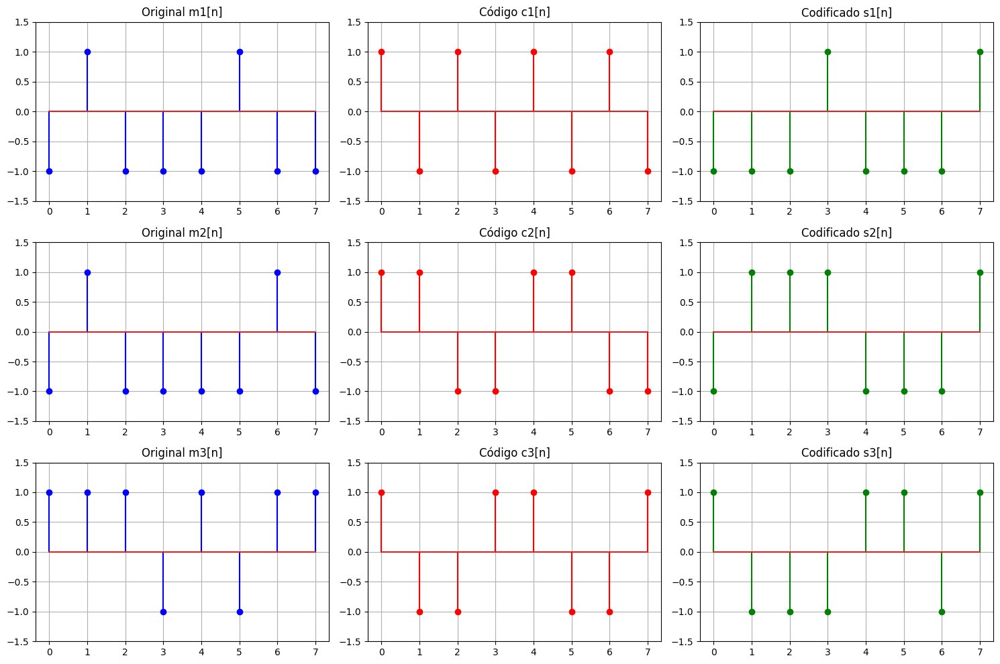
</p>

---

## Mensagens, Códigos e Sinais Codificados

<p align="center">
  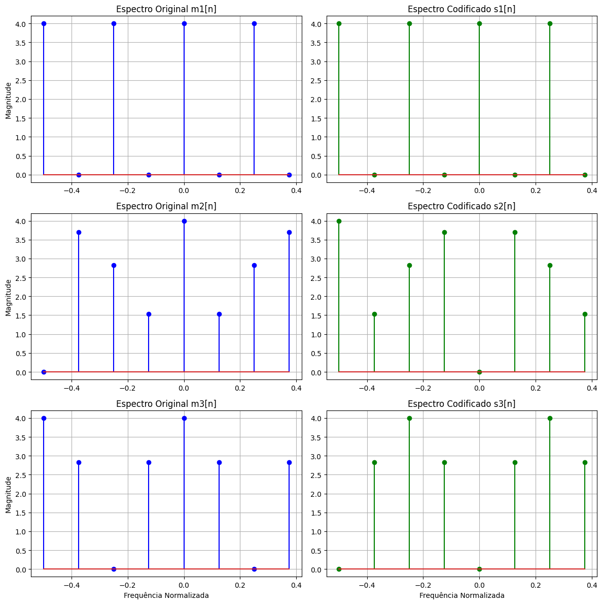
</p>

---

# b) Adição de Ruído AWGN ao Sistema CDMA

# Importação das Bibliotecas

```python
import numpy as np
import matplotlib.pyplot as plt
```

## Explicação

As bibliotecas utilizadas foram:

- `numpy` → operações matemáticas;
- `matplotlib.pyplot` → geração de gráficos.

---

# Definição das Variâncias do Ruído

```python
sigmas_sq = [1e-3, 1e-2, 1e-1, 1]
```

## Explicação

Foram utilizados diferentes níveis de potência de ruído:

- \(10^{-3}\)
- \(10^{-2}\)
- \(10^{-1}\)
- \(1\)

A variância controla a intensidade do ruído AWGN.

---

# Sinal Composto

```python
x_total = s1 + s2 + s3
```

## Explicação

O sinal transmitido total é formado pela soma dos sinais codificados dos usuários:

:contentReference[oaicite:0]{index=0}

Esse processo representa a multiplexação CDMA.

---

# Criação da Figura

```python
fig, axes = plt.subplots(
    len(sigmas_sq),
    2,
    figsize=(14, 16)
)
```

## Explicação

A figura contém:

- gráficos do sinal no tempo;
- gráficos do espectro;

para cada nível de ruído.

---

# Laço de Simulação

```python
for i, sigma2 in enumerate(sigmas_sq):
```

## Explicação

O código percorre cada valor de variância definido anteriormente.

---

# Geração do Ruído AWGN

```python
noise = np.random.normal(
    0,
    np.sqrt(sigma2),
    N
)
```

## Explicação

O ruído branco gaussiano é gerado com:

- média igual a zero;
- desvio padrão:

:contentReference[oaicite:1]{index=1}

---

# Conceito do Ruído AWGN

O sinal recebido pode ser representado por:

:contentReference[oaicite:2]{index=2}

Onde:

- \(x[n]\) → sinal transmitido;
- \(w[n]\) → ruído AWGN;
- \(y[n]\) → sinal recebido.

---

# Sinal Recebido

```python
y_n = x_total + noise
```

## Explicação

O ruído é somado ao sinal transmitido para simular um canal de comunicação real.

---

# Plotagem do Sinal no Tempo

```python
axes[i, 0].step(
    range(N),
    y_n,
    where='post',
    color='brown'
)
```

## Explicação

O gráfico apresenta o sinal recebido no domínio do tempo.

A função:

```python
step()
```

é utilizada para representar sinais discretos.

---

# Configuração do Gráfico Temporal

```python
axes[i, 0].set_title(
    f'Sinal Recebido y[n] (σ² = {sigma2})'
)

axes[i, 0].set_ylabel('Amplitude')

axes[i, 0].grid(True)
```

# Cálculo do Espectro

```python
y_spec = np.abs(np.fft.fft(y_n))
```

## Explicação

A FFT é aplicada ao sinal recebido para análise espectral.

A magnitude do espectro é obtida utilizando:

```python
np.abs()
```

---

# Centralização do Espectro

```python
y_spec_shifted = np.fft.fftshift(y_spec)
```

## Explicação

A função:

```python
fftshift()
```

reposiciona a frequência zero no centro do espectro.

---

# Plotagem do Espectro

```python
axes[i, 1].stem(
    freqs,
    y_spec_shifted,
    linefmt='r-',
    markerfmt='ro'
)
```

## Explicação

O gráfico apresenta o espectro do sinal recebido para cada nível de ruído.

---

# Configuração do Espectro

```python
axes[i, 1].set_title(
    f'Espectro de y[n] (σ² = {sigma2})'
)

axes[i, 1].grid(True)
```

## Explicação

O espectro permite visualizar o aumento da energia espalhada devido ao ruído.

---

# Configuração dos Eixos

```python
axes[-1, 0].set_xlabel('n (Amostras)')

axes[-1, 1].set_xlabel('Frequência Normalizada')
```

# Ajuste Final da Figura

```python
plt.tight_layout()

plt.show()
```

## Explicação

O comando:

```python
tight_layout()
```

organiza automaticamente os gráficos na janela.

---


# Resultado dos Gráficos

## Sinais Recebidos e Espectros

<p align="center">
  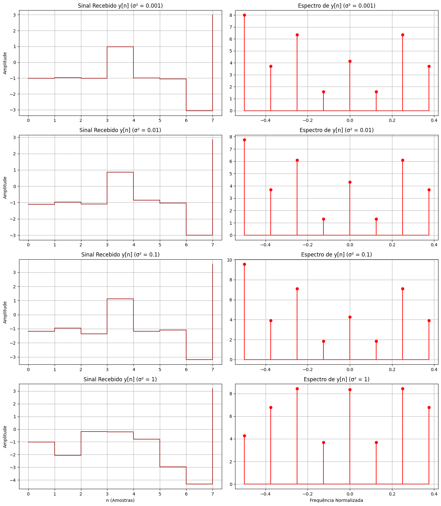
</p>

---

# d) Probabilidade de Erro de Bit (BER) em Sistema CDMA

# Importação das Bibliotecas

```python
import numpy as np
import matplotlib.pyplot as plt
```

## Explicação

As bibliotecas utilizadas foram:

- `numpy` → operações matemáticas e vetoriais;
- `matplotlib.pyplot` → geração de gráficos.

---

# Reutilização dos Códigos de Hadamard

```python
codes = [c1, c2, c3]
```

## Explicação

Os códigos ortogonais gerados anteriormente são armazenados em uma lista para facilitar o processamento dos usuários.

---

# Número de Usuários

```python
num_users = len(codes)
```

## Explicação

O número total de usuários é definido automaticamente pela quantidade de códigos disponíveis.

---

# Variâncias do Ruído

```python
sigmas_sq = [1e-3, 1e-2, 1e-1, 1]
```

## Explicação

Foram utilizados diferentes níveis de ruído AWGN:

- \(10^{-3}\)
- \(10^{-2}\)
- \(10^{-1}\)
- \(1\)

A variância controla a potência do ruído.

---

# Número de Ensaios de Monte Carlo

```python
num_trials = 10000
```

## Explicação

A simulação utiliza:

```python
10000
```

ensaios independentes para estimar a BER com maior precisão estatística.

---

# Inicialização da Matriz de BER

```python
error_probabilities = np.zeros(
    (num_users, len(sigmas_sq))
)
```

## Explicação

A matriz armazena as probabilidades de erro de cada usuário para cada valor de variância.

---

# Laço das Variâncias

```python
for s_idx, sigma2 in enumerate(sigmas_sq):
```

## Explicação

O sistema é testado para cada nível de ruído definido anteriormente.

---

# Inicialização dos Erros

```python
total_errors_per_user = np.zeros(num_users)
```

## Explicação

O vetor contabiliza a quantidade total de erros de cada usuário.

---

# Simulação Monte Carlo

```python
for trial in range(num_trials):
```

## Explicação

Cada iteração representa uma transmissão independente do sistema CDMA.

---

# Geração dos Bits dos Usuários

```python
m_bits = np.random.choice(
    [-1, 1],
    size=num_users
)
```

## Explicação

Cada usuário transmite um único bit bipolar:

:contentReference[oaicite:0]{index=0}

---

# Espalhamento dos Bits

```python
s_spread_signals.append(
    m_bits[u_idx] * codes[u_idx]
)
```

## Explicação

Cada bit é multiplicado pelo código de Hadamard correspondente.

---

# Conceito Matemático do Espalhamento

O sinal transmitido é dado por:

:contentReference[oaicite:1]{index=1}

Onde:

- \(m[n]\) → bit transmitido;
- \(c[n]\) → código ortogonal;
- \(s[n]\) → sinal espalhado.

---

# Soma dos Usuários

```python
x_total = np.sum(
    s_spread_signals,
    axis=0
)
```

## Explicação

Os sinais espalhados de todos os usuários são somados no mesmo canal.

---

# Geração do Ruído AWGN

```python
noise = np.random.normal(
    0,
    np.sqrt(sigma2),
    N
)
```

## Explicação

O ruído branco gaussiano possui:

- média zero;
- variância:

:contentReference[oaicite:2]{index=2}

---

# Sinal Recebido

```python
y_n = x_total + noise
```

## Explicação

O sinal recebido é modelado por:

:contentReference[oaicite:3]{index=3}

Onde:

- \(x[n]\) → sinal transmitido;
- \(w[n]\) → ruído;
- \(y[n]\) → sinal recebido.

---

# Desespalhamento do Sinal

```python
recovered_bit_estimate =
(1/N) * np.dot(
    codes[u_idx],
    y_n
)
```

## Explicação

O receptor correlaciona o sinal recebido com o código do usuário desejado.

---

# Conceito do Correlator CDMA

A recuperação do bit é dada por:

:contentReference[oaicite:4]{index=4}

Graças à ortogonalidade dos códigos, os demais usuários são cancelados.

---

# Decisão do Bit

```python
recovered_message_bit =
np.sign(recovered_bit_estimate)
```

## Explicação

A decisão é feita utilizando limiar zero:

- positivo → bit +1;
- negativo → bit -1.

---

# Contagem de Erros

```python
if recovered_message_bit != m_bits[u_idx]:

    total_errors_per_user[u_idx] += 1
```

## Explicação

O erro é contabilizado quando o bit recuperado difere do bit transmitido.

---

# Cálculo da BER

```python
error_probabilities[u_idx, s_idx] =
total_errors_per_user[u_idx] / num_trials
```

## Explicação

A BER é calculada por:

:contentReference[oaicite:5]{index=5}

---

# Exibição das Probabilidades de Erro

```python
print(
    f'Usuário {u_idx+1}:'
)
```

## Explicação

Os resultados são exibidos para cada usuário e para cada valor de variância.

---

# Plotagem da BER

```python
plt.figure(figsize=(10, 6))
```

## Explicação

A figura é criada para exibir a curva BER × variância do ruído.

---

# Plotagem das Curvas

```python
plt.semilogy(
    error_probabilities[u_idx, :],
    marker='o',
    label=f'Usuário {u_idx+1}'
)
```

## Explicação

O gráfico utiliza escala logarítmica no eixo Y.

A função:

```python
semilogy()
```

é adequada para análise de BER.

---

# Configuração do Gráfico

```python
plt.title(
    'Probabilidade de Erro de Bit (BER)'
)

plt.xlabel(
    'Variância do Ruído'
)

plt.ylabel(
    'BER'
)
```

## Explicação

O gráfico apresenta:

- BER dos usuários;
- comportamento em diferentes níveis de ruído.

---

# Grade do Gráfico

```python
plt.grid(
    True,
    which="both",
    ls="--"
)
```

## Explicação

A grade facilita a visualização em escala logarítmica.

---

# Configuração dos Ticks

```python
plt.xticks(
    range(len(sigmas_sq)),
    [str(s) for s in sigmas_sq]
)
```

## Explicação

Os valores do eixo X são configurados para exibir as variâncias utilizadas.

---

# Configuração do Eixo Y

```python
y_ticks = [
    1e-4,
    1e-3,
    1e-2,
    1e-1,
    0.5,
    1e0
]
```

## Explicação

Os ticks do eixo Y são ajustados manualmente para melhor visualização da BER.

---

# Resultado do Gráfico

<p align="center">
  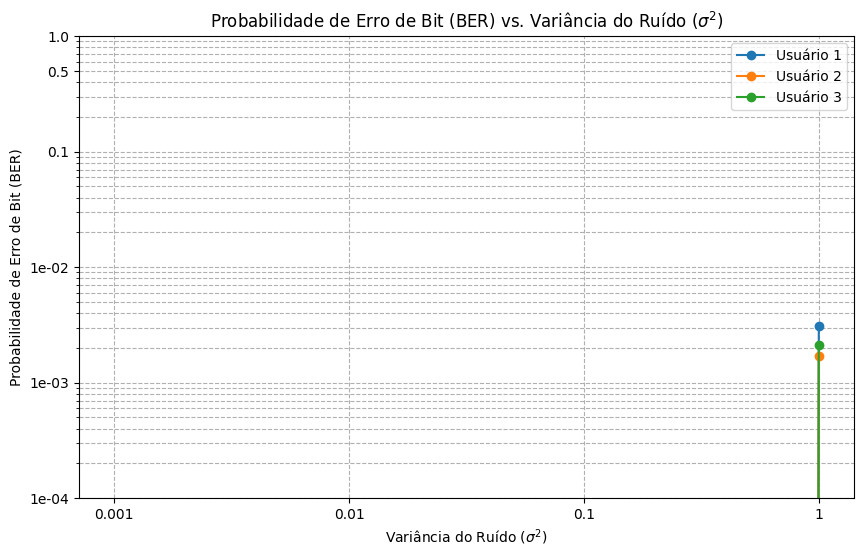
</p>

# f) BER em Função da Distorção dos Códigos

Nesta etapa, foi analisada a relação entre:

- variância da distorção dos códigos;
- perda de ortogonalidade;
- probabilidade de erro de bit (BER).

O objetivo é verificar como a degradação dos códigos de Hadamard afeta o desempenho do sistema CDMA.

---

# Importação das Bibliotecas

```python
import numpy as np
import matplotlib.pyplot as plt
from scipy.linalg import hadamard
```

## Explicação

As bibliotecas utilizadas foram:

- `numpy` → operações matemáticas;
- `matplotlib.pyplot` → geração de gráficos;
- `hadamard` → geração da matriz de Hadamard.

---

# Definição do Comprimento dos Códigos

```python
N = 8
```

## Explicação

O comprimento dos códigos ortogonais é igual a:

```python
8
```

---

# Definição da Semente Aleatória

```python
np.random.seed(42)
```

## Explicação

A semente garante repetibilidade dos resultados obtidos.

---

# Geração das Mensagens

```python
m1 = np.random.choice([-1, 1], size=N)

m2 = np.random.choice([-1, 1], size=N)

m3 = np.random.choice([-1, 1], size=N)
```

## Explicação

Cada usuário transmite uma sequência binária bipolar.

---

# Modelo das Mensagens

:contentReference[oaicite:0]{index=0}

---

# Geração da Matriz de Hadamard

```python
H = hadamard(N)
```

## Explicação

A matriz de Hadamard gera códigos ortogonais utilizados no espalhamento espectral.

---

# Seleção dos Códigos

```python
c1 = H[1, :]
c2 = H[2, :]
c3 = H[3, :]
```

## Explicação

Cada usuário recebe um código ortogonal diferente.

---

# Codificação das Mensagens

```python
s1 = m1 * c1

s2 = m2 * c2

s3 = m3 * c3
```

## Explicação

Cada mensagem é espalhada pelo respectivo código.

---

# Modelo Matemático do Espalhamento

:contentReference[oaicite:1]{index=1}

---

# Variâncias da Distorção

```python
sigma_code_sq_values = [
    0.001,
    0.005,
    0.01,
    0.05,
    0.1,
    0.2,
    0.5,
    1.0
]
```

## Explicação

Foram utilizados diferentes níveis de distorção nos códigos de Hadamard.

Quanto maior o valor de:

:contentReference[oaicite:2]{index=2}

maior será a degradação da ortogonalidade.

---

# Sinal Recebido

```python
y_n = s1 + s2 + s3
```

## Explicação

O sinal recebido é formado pela soma dos sinais espalhados.

---

# Modelo do Sinal Recebido

:contentReference[oaicite:3]{index=3}

---

# Dicionário das Mensagens

```python
original_messages = {
    'm1': m1,
    'm2': m2,
    'm3': m3
}
```

## Explicação

As mensagens originais são armazenadas para comparação posterior.

---

# Índices dos Usuários

```python
original_code_indices = {
    'm1': 1,
    'm2': 2,
    'm3': 3
}
```

## Explicação

Cada usuário é associado a uma linha da matriz de Hadamard.

---

# Quantidade de Bits

```python
bits_per_message = N
```

## Explicação

Cada mensagem possui:

```python
8 bits
```

---

# Vetor da BER

```python
ber_values = []
```

## Explicação

O vetor armazena os valores de BER calculados para cada variância.

---

# Número de Simulações

```python
num_runs = 100
```

## Explicação

O sistema é simulado diversas vezes para obter resultados médios mais confiáveis.

---

# Loop das Variâncias

```python
for sigma_code_sq in sigma_code_sq_values:
```

## Explicação

O sistema é testado para diferentes níveis de distorção dos códigos.

---

# Inicialização dos Erros

```python
total_errors_for_sigma = 0

total_bits_for_sigma = 0
```

## Explicação

As variáveis acumulam:

- quantidade total de erros;
- quantidade total de bits transmitidos.

---

# Geração da Matriz de Distorção

```python
W_matrix = np.random.normal(
    0,
    np.sqrt(sigma_code_sq),
    H.shape
)
```

## Explicação

A matriz \(W\) representa perturbações aleatórias adicionadas aos códigos.

---

# Modelo do Código Distorcido

:contentReference[oaicite:4]{index=4}

---

# Criação da Matriz Distorcida

```python
H_hat = H + W_matrix
```

## Explicação

A matriz utilizada pelo receptor passa a conter erros.

---

# Seleção do Código Distorcido

```python
c_hat_j = H_hat[user_idx, :]
```

## Explicação

O receptor utiliza um código imperfeito para recuperar a mensagem.

---

# Recuperação da Mensagem

```python
m_hat_j_raw = c_hat_j * y_n
```

## Explicação

O desespalhamento é realizado multiplicando o sinal recebido pelo código distorcido.

---

# Modelo do Desespalhamento

:contentReference[oaicite:5]{index=5}

---

# Decisão Binária

```python
m_hat_j_binary = np.sign(m_hat_j_raw)
```

## Explicação

O receptor decide:

- +1 → bit positivo;
- -1 → bit negativo.

---

# Contagem de Erros

```python
error_count = np.sum(
    original_m != m_hat_j_binary
)
```

## Explicação

São contabilizadas as diferenças entre:

- mensagem original;
- mensagem recuperada.

---

# Acumulação dos Erros

```python
total_errors_for_sigma += error_count
```

## Explicação

O número total de erros é acumulado ao longo das simulações.

---

# Acumulação dos Bits

```python
total_bits_for_sigma += bits_per_message
```

## Explicação

A quantidade total de bits transmitidos também é acumulada.

---

# Cálculo da BER

```python
average_ber =
total_errors_for_sigma /
total_bits_for_sigma
```

## Explicação

A BER é calculada por:

:contentReference[oaicite:6]{index=6}

---

# Armazenamento da BER

```python
ber_values.append(average_ber)
```

## Explicação

Os valores calculados são armazenados para posterior plotagem.

---

# Exibição dos Resultados

```python
print(
    f"σ²_código = {sigma_code_sq:.4f},
    BER = {average_ber:.6f}"
)
```

## Explicação

O código exibe:

- variância da distorção;
- BER correspondente.

---

# Criação do Gráfico

```python
fig_ber = plt.figure(figsize=(10, 6))
```

## Explicação

A figura será utilizada para exibir a curva BER × distorção.

---

# Plotagem da BER

```python
plt.semilogy(
    sigma_code_sq_values,
    ber_values,
    'o-',
    color='blue'
)
```

## Explicação

A função:

```python
semilogy()
```

utiliza escala logarítmica no eixo Y.

---

# Configuração do Título

```python
plt.title(
    'Probabilidade de Erro (BER)
    vs. σ² da Distorção do Código'
)
```

## Explicação

O gráfico apresenta o impacto da distorção dos códigos na BER.

---

# Configuração dos Eixos

```python
plt.xlabel(
    'Variância da Distorção'
)

plt.ylabel(
    'BER'
)
```

## Explicação

Os eixos representam:

- variância da distorção;
- probabilidade de erro.

---

# Configuração da Grade

```python
plt.grid(
    True,
    which="both",
    ls="-"
)
```

## Explicação

A grade auxilia a visualização em escala logarítmica.

---

# Configuração dos Ticks

```python
plt.xticks(
    sigma_code_sq_values,
    [f'{s:.3f}' for s in sigma_code_sq_values],
    rotation=45
)
```

## Explicação

Os valores do eixo X são configurados manualmente.

---

# Resultado do Gráfico

## BER × Distorção do Código

<p align="center">
  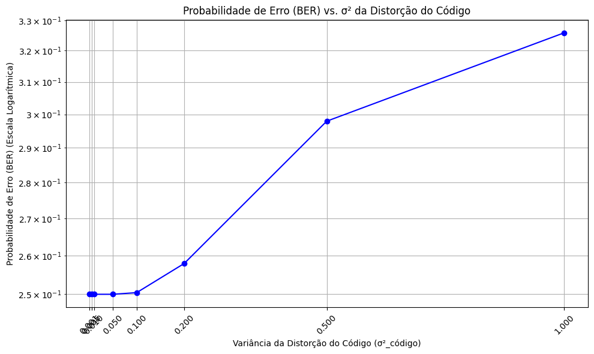
</p>

---

# Questão 3

# a) Geração de um Sinal Não-Estacionário

# Importação das Bibliotecas

```python
import numpy as np
import matplotlib.pyplot as plt
```

## Explicação

As bibliotecas utilizadas foram:

- `numpy` → cálculos numéricos;
- `matplotlib.pyplot` → geração dos gráficos.

---

# Definição do Comprimento do Sinal

```python
N = 2000
```

## Explicação

O sinal possui:

```python
2000 amostras
```

---

# Vetor de Tempo

```python
t = np.arange(N + 1)
```

## Explicação

O vetor `t` representa os instantes de tempo discretos do sinal.

---

# Inicialização do Sinal

```python
x = np.zeros_like(
    t,
    dtype=np.float64
)
```

## Explicação

Inicialmente o sinal é preenchido apenas com zeros.

Posteriormente serão adicionadas:

- senoides;
- componentes transitórias.

---

# Definição das Regiões das Senoides

```python
pos_sin = np.array([
    0,
    600,
    1080,
    1380,
    1680,
    2000
])
```

## Explicação

O vetor define os intervalos onde cada senoide será inserida.

Cada trecho do sinal terá uma frequência diferente.

---

# Definição dos Períodos

```python
T_sin = np.array([
    100,
    40,
    20,
    10,
    5
])
```

## Explicação

Os períodos das senoides são:

- 100;
- 40;
- 20;
- 10;
- 5 amostras.

Quanto menor o período:

- maior a frequência da senoide.

---

# Geração das Senoides

```python
for i in range(5):
```

## Explicação

O laço percorre os cinco segmentos do sinal.

---

# Definição dos Limites do Segmento

```python
m, n = pos_sin[i], pos_sin[i+1]
```

## Explicação

Os valores:

- `m` → início do segmento;
- `n` → fim do segmento.

---

# Vetor de Tempo Local

```python
t_segment =
np.arange(1, n - m + 1)
```

## Explicação

Cada senoide possui um vetor de tempo próprio.

---

# Geração da Senoide

```python
x[m:n] =
np.sin(
    2*np.pi*t_segment/T_sin[i]
)
```

## Explicação

A senoide é inserida no trecho correspondente do sinal.

---

# Modelo Matemático

:contentReference[oaicite:0]{index=0}

---

# Definição das Amplitudes dos Transientes

```python
amp_imp = np.array([
    3,
    -2,
    2,
    2.5,
    -2.5
])
```

## Explicação

Cada transiente possui uma amplitude diferente.

Os sinais negativos representam pulsos invertidos.

---

# Definição das Posições dos Transientes

```python
pos_imp = np.array([
    200,
    372,
    1324,
    1343,
    1802
])
```

## Explicação

Esses valores definem onde os eventos transitórios ocorrem.

---

# Definição dos Períodos dos Transientes

```python
T_imp = np.array([
    5,
    25,
    5,
    5,
    5
])
```

## Explicação

Os transientes possuem curta duração.

---

# Geração dos Transientes

```python
for i in range(5):
```

## Explicação

O laço percorre todos os eventos transitórios.

---

# Definição da Posição Inicial

```python
m = pos_imp[i]
```

## Explicação

Define o ponto onde o transiente será inserido.

---

# Cálculo do Offset

```python
offset = int(T_imp[i] / 2)
```

## Explicação

O offset define metade da duração do pulso.

---

# Definição do Limite Final

```python
n = m + offset
```

## Explicação

Define o final da região do transiente.

---

# Vetor de Tempo Local do Transiente

```python
t_segment =
np.arange(1, n - m + 2)
```

## Explicação

Cria os instantes de tempo do pulso transitório.

---

# Inserção do Transiente

```python
x[m:n+1] +=
amp_imp[i] *
(
    np.sin(
        2*np.pi*t_segment/T_imp[i]
    )
)**2
```

## Explicação

Os transientes são adicionados ao sinal principal.

Foi utilizada uma senoide ao quadrado para criar pulsos localizados.

---

# Modelo Matemático do Transiente

:contentReference[oaicite:1]{index=1}

---

# Efeito dos Transientes

Os transientes geram:

- perturbações localizadas;
- mudanças abruptas no sinal;
- eventos temporários.

---

# Criação da Figura

```python
plt.figure(figsize=(12, 5))
```

## Explicação

Define o tamanho da figura do gráfico.

---

# Plotagem do Sinal

```python
plt.plot(t, x)
```

## Explicação

O sinal completo é exibido no domínio do tempo.

---

# Configuração do Título

```python
plt.title(
    'Sinal Não-Estacionário'
)
```

# Configuração dos Eixos

```python
plt.xlabel('t')

plt.ylabel('x(t)')
```

## Explicação

Os eixos representam:

- tempo discreto;
- amplitude do sinal.

---

# Configuração da Grade

```python
plt.grid(True)
```

## Explicação

A grade auxilia na visualização das mudanças do sinal.

---

# Exibição do Gráfico

```python
plt.show()
```

## Explicação

Exibe o sinal final gerado.

---

# Resultado do Gráfico

## Sinal Não-Estacionário Gerado

<p align="center">
  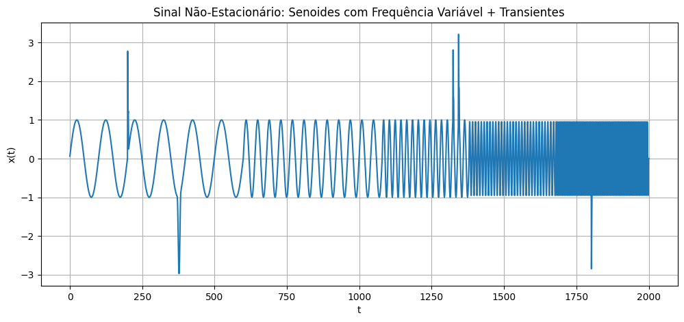
</p>

---

# b) Decomposição Wavelet do Sinal Não-Estacionário

Nesta etapa foi realizada a decomposição wavelet do sinal gerado anteriormente utilizando:

- wavelet biortogonal bior4.4;
- decomposição multinível;
- análise em diferentes escalas.

O objetivo é analisar:

- componentes lentas;
- componentes rápidas;
- transientes;
- mudanças de frequência no tempo.

---

# Importação da Biblioteca PyWavelets

```python
try:
    import pywt
except ImportError:
    !pip install PyWavelets
    import pywt
```

## Explicação

O código verifica se a biblioteca:

```python
PyWavelets
```

está instalada.

Caso não esteja:

- ela é instalada automaticamente.

---

# Importação da Biblioteca

```python
import pywt
```

## Explicação

A biblioteca:

```python
pywt
```

é utilizada para:

- transformadas wavelet;
- decomposição multinível;
- reconstrução de sinais.

---

# Definição da Wavelet

```python
wavelet = pywt.Wavelet('bior4.4')
```

## Explicação

Foi utilizada a wavelet:

```python
bior4.4
```

que pertence à família:

- biorthogonal wavelets.

---

# Características da Wavelet Biortogonal

A wavelet bior4.4 possui:

- boa reconstrução;
- filtros simétricos;
- boa representação de transientes;
- baixa distorção de fase.

---

# Estrutura da Decomposição Wavelet

A transformada wavelet divide o sinal em:

- aproximações;
- detalhes.

---

# Modelo Matemático da Decomposição

:contentReference[oaicite:0]{index=0}

---

# Coeficientes dos Filtros de Análise

```python
print(
    f"Filtro Passa-Baixa (Lo_D):
    {wavelet.dec_lo}"
)

print(
    f"Filtro Passa-Alta (Hi_D):
    {wavelet.dec_hi}"
)
```

## Explicação

Os filtros de análise são utilizados durante a decomposição do sinal.

---

# Filtro Passa-Baixa

```python
Lo_D
```

## Explicação

O filtro passa-baixa extrai:

- componentes lentas;
- tendências gerais;
- aproximações do sinal.

---

# Filtro Passa-Alta

```python
Hi_D
```

## Explicação

O filtro passa-alta extrai:

- detalhes rápidos;
- transientes;
- mudanças bruscas.

---

# Coeficientes dos Filtros de Síntese

```python
print(
    f"Filtro Passa-Baixa (Lo_R):
    {wavelet.rec_lo}"
)

print(
    f"Filtro Passa-Alta (Hi_R):
    {wavelet.rec_hi}"
)
```

## Explicação

Os filtros de síntese são utilizados na reconstrução do sinal original.

---

# Reconstrução do Sinal

A reconstrução combina:

- aproximações;
- detalhes.

---

# Modelo Matemático da Reconstrução

:contentReference[oaicite:1]{index=1}

---

# Decomposição Multinível

```python
coeffs = pywt.wavedec(
    x,
    'bior4.4',
    level=4
)
```

## Explicação

O sinal é decomposto em:

```python
4 níveis
```

de resolução.

---

# Funcionamento da Decomposição

Em cada nível:

- o sinal passa por filtros;
- ocorre subamostragem;
- são obtidos coeficientes de detalhe.

---

# Componentes Obtidas

A decomposição produz:

- aproximação final;
- detalhes dos níveis 1 a 4.

---

# Estrutura dos Coeficientes

```python
coeffs[0]
```

→ aproximação final.

```python
coeffs[1]
```

→ detalhe nível 4.

```python
coeffs[2]
```

→ detalhe nível 3.

```python
coeffs[3]
```

→ detalhe nível 2.

```python
coeffs[4]
```

→ detalhe nível 1.

---

# Criação da Figura

```python
plt.figure(figsize=(12, 10))
```

## Explicação

Define o tamanho da figura utilizada para visualização.

---

# Plotagem do Sinal Original

```python
plt.subplot(5, 1, 1)

plt.plot(x)

plt.title(
    'Sinal Original x(t)'
)
```

## Explicação

O primeiro gráfico apresenta o sinal original antes da decomposição.

---

# Plotagem dos Detalhes

```python
for i in range(1, 5):
```

## Explicação

O laço percorre os quatro níveis de detalhe.

---

# Criação dos Subplots

```python
plt.subplot(5, 1, i+1)
```

## Explicação

Cada nível de detalhe é exibido em um gráfico separado.

---

# Plotagem dos Coeficientes

```python
plt.plot(coeffs[i])
```

## Explicação

Os coeficientes wavelet representam informações específicas do sinal.

---

# Configuração do Título

```python
plt.title(
    f'Coeficientes de Detalhe - Nível {5-i}'
)
```

## Explicação

Cada gráfico identifica o nível correspondente da decomposição.

---

# Organização da Figura

```python
plt.tight_layout()
```

## Explicação

Evita sobreposição entre os gráficos.

---

# Exibição Final

```python
plt.show()
```

## Explicação

Exibe os resultados da decomposição wavelet.

---

# Interpretação dos Resultados

Os níveis de detalhe representam:

- frequências altas;
- frequências médias;
- transientes;
- mudanças locais do sinal.

---

# Comportamento dos Níveis

## Níveis Altos

Capturam:

- componentes lentas;
- tendências globais.

## Níveis Baixos

Capturam:

- transientes rápidos;
- mudanças bruscas;
- oscilações rápidas.

---

# Resultado do Gráfico

## Decomposição Wavelet do Sinal

<p align="center">
  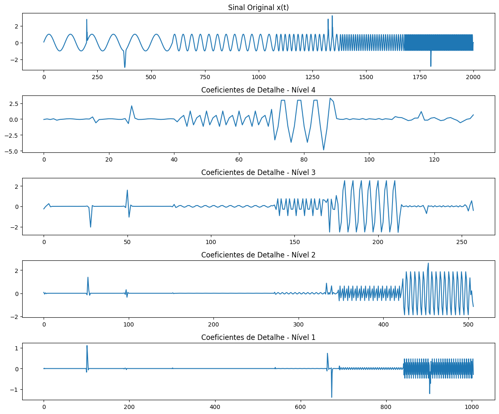
</p>

---

# c) Decomposição Wavelet em 5 Níveis

# Importação da Biblioteca

```python
import pywt
```

## Explicação

A biblioteca:

```python
PyWavelets
```

é utilizada para:

- transformadas wavelet;
- decomposição multinível;
- análise multirresolução.

---

# Decomposição em 5 Níveis

```python
coeffs_5 = pywt.wavedec(
    x,
    'bior4.4',
    level=5
)
```

## Explicação

A função:

```python
wavedec()
```

realiza a decomposição wavelet discreta do sinal.

---

# Wavelet Utilizada

Foi utilizada a wavelet:

```python
bior4.4
```

---

# Características da bior4.4

A wavelet biortogonal possui:

- simetria;
- baixa distorção de fase;
- boa reconstrução;
- eficiência na análise de transientes.

---

# Estrutura dos Coeficientes

```python
[cA5, cD5, cD4, cD3, cD2, cD1]
```

## Explicação

A decomposição retorna:

- `cA5` → aproximação do nível 5;
- `cD5` → detalhe nível 5;
- `cD4` → detalhe nível 4;
- `cD3` → detalhe nível 3;
- `cD2` → detalhe nível 2;
- `cD1` → detalhe nível 1.

---

# Modelo Matemático da Decomposição

:contentReference[oaicite:0]{index=0}

---

# Extração da Aproximação

```python
ca5 = coeffs_5[0]
```

## Explicação

Os coeficientes:

```python
cA5
```

representam:

- baixas frequências;
- tendência global do sinal;
- componentes lentas.

---

# Extração dos Detalhes

```python
details = coeffs_5[1:]
```

## Explicação

Os coeficientes de detalhe representam:

- altas frequências;
- transientes;
- mudanças rápidas.

---

# Criação da Figura

```python
plt.figure(figsize=(14, 12))
```

## Explicação

Define o tamanho da figura utilizada para visualização.

---

# Plotagem da Aproximação

```python
plt.subplot(6, 1, 1)
```

## Explicação

O primeiro gráfico apresenta os coeficientes de aproximação.

---

# Exibição da Aproximação

```python
plt.plot(
    ca5,
    color='black'
)
```

## Explicação

O gráfico mostra as componentes de baixa frequência do sinal.

---

# Configuração do Título

```python
plt.title(
    'Coeficientes de Aproximação (cA5)'
)
```

## Explicação

A aproximação representa a tendência global do sinal.

---

# Configuração da Grade

```python
plt.grid(True)
```

## Explicação

A grade facilita a visualização das oscilações.

---

# Loop dos Detalhes

```python
for i, cd in enumerate(details):
```

## Explicação

O laço percorre todos os níveis de detalhe.

---

# Definição do Nível

```python
level = 5 - i
```

## Explicação

O código identifica automaticamente o nível correspondente.

---

# Criação dos Subplots

```python
plt.subplot(6, 1, i + 2)
```

## Explicação

Cada subfaixa é exibida em um gráfico separado.

---

# Plotagem dos Detalhes

```python
plt.plot(
    cd,
    color='C'+str(i+1)
)
```

## Explicação

Cada nível é exibido com uma cor diferente.

---

# Configuração do Título

```python
plt.title(
    f'Subfaixa de Detalhe cD{level}'
)
```

## Explicação

Cada gráfico representa uma banda específica de frequência.

---

# Significado das Subfaixas

## cD1

Representa:

- componentes de frequência mais alta;
- transientes rápidos;
- mudanças abruptas.

---

## cD2 e cD3

Representam:

- frequências intermediárias;
- oscilações moderadas.

---

## cD4 e cD5

Representam:

- frequências mais baixas;
- componentes lentas.

---

# Aproximação cA5

A aproximação final contém:

- comportamento global do sinal;
- componentes de baixa frequência;
- tendência geral.

---

# Organização da Figura

```python
plt.tight_layout()
```

## Explicação

Evita sobreposição entre gráficos e títulos.

---

# Exibição Final

```python
plt.show()
```

## Explicação

Exibe todos os coeficientes wavelet obtidos.

---

# Interpretação dos Resultados

A decomposição wavelet permite:

- separar frequências;
- localizar transientes no tempo;
- analisar mudanças locais;
- estudar sinais não-estacionários.

---

# Resultado do Gráfico

## Aproximação e Subfaixas Wavelet

<p align="center">
  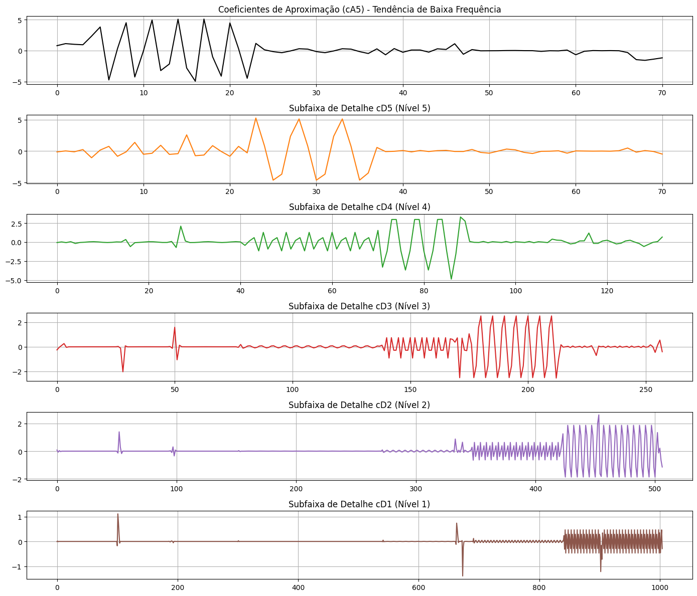
</p>

---

# Questão 4

# a) Análise Temporal e Espectral do Sinal `leleccum.mat`

# Importação das Bibliotecas

```python
import scipy.io
import numpy as np
import matplotlib.pyplot as plt
```

## Explicação

As bibliotecas utilizadas foram:

- `scipy.io` → leitura de arquivos `.mat`;
- `numpy` → operações numéricas e FFT;
- `matplotlib` → geração dos gráficos.

---

# Carregamento do Arquivo `.mat`

```python
mat_data = scipy.io.loadmat('/content/leleccum.mat')
```

## Explicação

A função:

```python
loadmat()
```

carrega arquivos MATLAB `.mat` para o Python.

O conteúdo do arquivo é armazenado em:

```python
mat_data
```

---

# Extração do Sinal

```python
signal_leleccum = mat_data['leleccum'].flatten()
```

## Explicação

O vetor:

```python
leleccum
```

é extraído do arquivo MATLAB.

A função:

```python
flatten()
```

transforma a matriz em um vetor unidimensional.

---

# Comprimento do Sinal

```python
N_lele = len(signal_leleccum)
```

## Explicação

Define o número total de amostras do sinal.

---

# Frequência de Amostragem

```python
fs = 1.0
```

## Explicação

Foi utilizada frequência unitária para:

- normalização do eixo de frequência;
- análise espectral relativa.

Assim, o espectro é exibido em frequência normalizada.

---

# Cálculo da FFT

```python
fft_vals = np.fft.fft(signal_leleccum)
```

## Explicação

A função:

```python
fft()
```

calcula a Transformada Discreta de Fourier do sinal.

---

# Modelo Matemático da FFT

:contentReference[oaicite:0]{index=0}

---

# Magnitude do Espectro

```python
fft_mag = np.abs(np.fft.fftshift(fft_vals))
```

## Explicação

Foram utilizadas duas operações:

### `np.abs()`

Calcula:

- magnitude das componentes espectrais.

---

### `fftshift()`

Move:

- frequência zero para o centro do gráfico.

Isso facilita a visualização do espectro.

---

# Frequências do Espectro

```python
freqs_lele = np.fft.fftshift(
    np.fft.fftfreq(N_lele, d=1/fs)
)
```

## Explicação

A função:

```python
fftfreq()
```

gera o eixo de frequências correspondente à FFT.

---

# Organização da Figura

```python
plt.figure(figsize=(12, 10))
```

## Explicação

Define o tamanho da figura contendo:

- gráfico temporal;
- gráfico espectral.

---

# Gráfico no Domínio do Tempo

```python
plt.subplot(2, 1, 1)
```

## Explicação

Cria o primeiro gráfico da figura.

---

# Plotagem do Sinal

```python
plt.plot(signal_leleccum, color='navy')
```

## Explicação

Exibe o sinal no domínio do tempo.

---

# Configuração do Título

```python
plt.title(
    'Sinal Original (leleccum.mat) no Tempo'
)
```

## Explicação

Identifica o gráfico temporal do sinal carregado.

---

# Configuração dos Eixos

```python
plt.xlabel('Amostras')
plt.ylabel('Amplitude')
```

## Explicação

Os eixos representam:

- número de amostras;
- amplitude do sinal.

---

# Grade do Gráfico

```python
plt.grid(True)
```

## Explicação

Facilita a visualização das oscilações do sinal.

---

# Gráfico do Espectro

```python
plt.subplot(2, 1, 2)
```

## Explicação

Cria o segundo gráfico da figura.

---

# Plotagem do Espectro

```python
plt.plot(freqs_lele, fft_mag, color='darkred')
```

## Explicação

Mostra a magnitude espectral do sinal.

---

# Configuração do Título

```python
plt.title(
    'Espectro de Magnitude do Sinal'
)
```

## Explicação

Identifica o gráfico espectral obtido pela FFT.

---

# Configuração dos Eixos

```python
plt.xlabel('Frequência Normalizada')
plt.ylabel('Magnitude')
```

## Explicação

Os eixos representam:

- frequência normalizada;
- magnitude das componentes espectrais.

---

# Organização Final

```python
plt.tight_layout()
```

## Explicação

Evita sobreposição entre gráficos e títulos.

---

# Exibição Final

```python
plt.show()
```

## Explicação

Exibe os gráficos gerados.

---

# Interpretação dos Resultados

O gráfico temporal permite observar:

- variações de amplitude;
- comportamento do sinal ao longo do tempo;
- possíveis transientes.

---

# Interpretação Espectral

O espectro permite identificar:

- frequências dominantes;
- distribuição de energia;
- componentes harmônicas.

---

# Resultado dos Gráficos

## Domínio do Tempo e Espectro

<p align="center">
  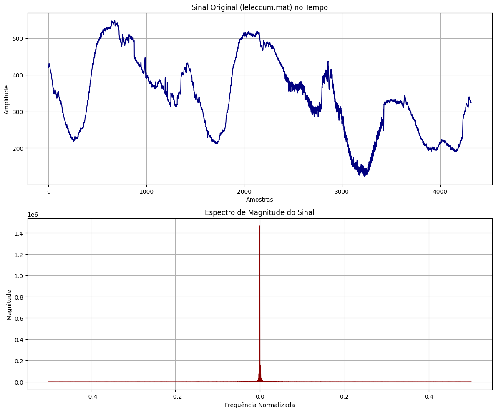
</p>

---

# b) Remoção de Ruído (Denoising) com Wavelets

Nesta etapa foi realizado o processo de:

- decomposição wavelet;
- estimação do ruído;
- aplicação de thresholding;
- reconstrução do sinal filtrado.

O objetivo é reduzir o ruído presente no sinal:

```python
signal_leleccum
```

preservando as principais características do sinal original.

---

# Wavelet Utilizada

```python
wavelet_name = 'db4'
```

## Explicação

Foi utilizada a wavelet:

```python
Daubechies 4 (db4)
```

---

# Características da Wavelet db4

A wavelet db4 possui:

- boa compactação de energia;
- boa localização temporal;
- eficiência para remoção de ruído;
- suavização eficiente do sinal.

---

# Definição do Nível de Decomposição

```python
level = 5
```

## Explicação

O sinal foi decomposto em:

- cinco níveis wavelet.

Isso permite separar:

- baixas frequências;
- altas frequências;
- componentes de ruído.

---

# Decomposição Wavelet

```python
coeffs_noise = pywt.wavedec(
    signal_leleccum,
    wavelet_name,
    level=level
)
```

## Explicação

A função:

```python
wavedec()
```

realiza a decomposição wavelet discreta do sinal.

---

# Estrutura dos Coeficientes

A decomposição gera:

```python
[cA5, cD5, cD4, cD3, cD2, cD1]
```

Onde:

- `cA5` → aproximação;
- `cDk` → detalhes.

---

# Modelo Matemático da Decomposição

:contentReference[oaicite:0]{index=0}

---

# Estimativa do Ruído

```python
sigma_est = np.median(
    np.abs(coeffs_noise[-1])
) / 0.6745
```

## Explicação

O ruído é estimado utilizando:

- MAD (Median Absolute Deviation).

Foi utilizado:

```python
cD1
```

pois os coeficientes de alta frequência geralmente concentram mais ruído.

---

# Modelo da Estimativa MAD

:contentReference[oaicite:1]{index=1}

---

# Cálculo do Threshold

```python
thresh = sigma_est * np.sqrt(
    2 * np.log(len(signal_leleccum))
)
```

## Explicação

Foi utilizado o método:

```python
VisuShrink
```

para definir o limiar de remoção do ruído.

---

# Modelo do Threshold

:contentReference[oaicite:2]{index=2}

---

# Inicialização dos Novos Coeficientes

```python
new_coeffs = [coeffs_noise[0]]
```

## Explicação

Os coeficientes de aproximação:

```python
cA5
```

foram preservados.

Isso mantém:

- tendência global;
- componentes principais do sinal.

---

# Soft Thresholding

```python
for i in range(1, len(coeffs_noise)):
```

## Explicação

O laço percorre todos os coeficientes de detalhe.

---

# Aplicação do Threshold

```python
pywt.threshold(
    coeffs_noise[i],
    value=thresh,
    mode='soft'
)
```

## Explicação

Foi aplicado:

```python
soft thresholding
```

---

# Funcionamento do Soft Thresholding

O método:

- reduz coeficientes pequenos;
- preserva coeficientes importantes;
- suaviza o sinal;
- reduz o ruído.

---

# Modelo do Soft Thresholding

:contentReference[oaicite:3]{index=3}

---

# Reconstrução do Sinal

```python
signal_denoised = pywt.waverec(
    new_coeffs,
    wavelet_name
)
```

## Explicação

A função:

```python
waverec()
```

reconstrói o sinal utilizando:

- coeficientes filtrados;
- transformada wavelet inversa.

---

# Comparação Visual

```python
plt.figure(figsize=(12, 8))
```

## Explicação

Cria a figura utilizada para comparar:

- sinal original;
- sinal filtrado.

---

# Plotagem do Sinal Original

```python
plt.plot(
    signal_leleccum,
    color='lightgray',
    label='Original Ruidoso',
    alpha=0.5
)
```

## Explicação

O sinal original é exibido em cinza claro.

A transparência facilita a comparação visual.

---

# Plotagem do Sinal Filtrado

```python
plt.plot(
    signal_denoised,
    color='blue',
    label='Sinal Filtrado (Denoised)',
    linewidth=1.5
)
```

## Explicação

O sinal filtrado é exibido em azul.

---

# Configuração do Título

```python
plt.title(
    'Denoising com Wavelet'
)
```

## Explicação

O gráfico mostra a comparação entre:

- sinal ruidoso;
- sinal filtrado.

---

# Legenda

```python
plt.legend()
```

## Explicação

Identifica cada sinal exibido no gráfico.

---

# Grade do Gráfico

```python
plt.grid(True)
```

## Explicação

Facilita a visualização das oscilações do sinal.

---

# Exibição Final

```python
plt.show()
```

## Explicação

Exibe o resultado do processo de denoising.

---

# Interpretação dos Resultados

Após o thresholding:

- componentes de ruído são reduzidas;
- oscilações indesejadas diminuem;
- características principais são preservadas.

---

# Resultado do Denoising

## Comparação entre Sinal Original e Filtrado

<p align="center">
  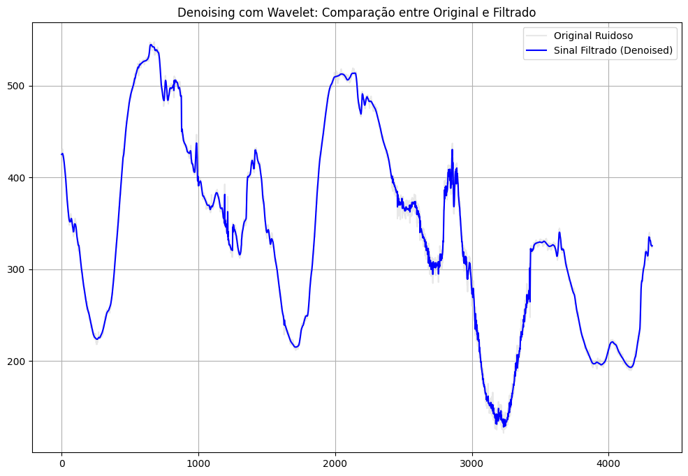
</p>

---

# d) Visualização das Subfaixas Wavelet do Sinal `leleccum`

# Importação das Bibliotecas

```python
import pywt
import numpy as np
import matplotlib.pyplot as plt
```

## Explicação

As bibliotecas utilizadas foram:

- `pywt` → transformadas wavelet;
- `numpy` → operações numéricas;
- `matplotlib` → geração de gráficos.

---

# Decomposição Wavelet de 5 Níveis

```python
coeffs_lele_5 = pywt.wavedec(
    signal_leleccum,
    'db4',
    level=5
)
```

## Explicação

A função:

```python
wavedec()
```

realiza a decomposição wavelet discreta do sinal utilizando:

```python
db4
```

com:

```python
5 níveis
```

de decomposição.

---

# Estrutura dos Coeficientes

A decomposição retorna:

```python
[cA5, cD5, cD4, cD3, cD2, cD1]
```

Onde:

- `cA5` → aproximação final;
- `cD5` → detalhes do nível 5;
- `cD4` → detalhes do nível 4;
- `cD3` → detalhes do nível 3;
- `cD2` → detalhes do nível 2;
- `cD1` → detalhes do nível 1.

---

# Separação dos Coeficientes

```python
ca5_lele = coeffs_lele_5[0]
details_lele = coeffs_lele_5[1:]
```

## Explicação

Os coeficientes foram separados em:

- aproximação final;
- coeficientes de detalhe.

---

# Aproximação `cA5`

A componente:

```python
cA5
```

representa:

- tendência global do sinal;
- componentes lentas;
- baixas frequências.

---

# Detalhes `cD`

As componentes:

```python
cD1 até cD5
```

representam:

- detalhes locais;
- variações rápidas;
- componentes de alta frequência;
- transientes do sinal.

---

# Criação da Figura

```python
plt.figure(figsize=(14, 12))
```

## Explicação

Define o tamanho da figura utilizada na visualização das subfaixas wavelet.

---

# Plotagem da Aproximação

```python
plt.subplot(6, 1, 1)
```

## Explicação

O primeiro gráfico apresenta:

```python
cA5
```

---

# Vetor de Tempo Normalizado

```python
t_norm = np.linspace(0, 1, len(ca5_lele))
```

## Explicação

Foi criado um eixo temporal normalizado entre:

```python
0 e 1
```

para facilitar a visualização dos coeficientes.

---

# Plotagem da Aproximação

```python
plt.plot(t_norm, ca5_lele, color='black')
```

## Explicação

Exibe os coeficientes de aproximação em preto.

---

# Título da Aproximação

```python
plt.title(
    'Aproximação Final (cA5) - Escala Normalizada'
)
```

## Explicação

Identifica a componente de baixa frequência do sinal.

---

# Grid da Aproximação

```python
plt.grid(True)
```

## Explicação

Adiciona grade ao gráfico para facilitar análise visual.

---

# Loop das Componentes de Detalhe

```python
for i, cd in enumerate(details_lele):
```

## Explicação

O laço percorre todos os coeficientes de detalhe.

---

# Determinação do Nível

```python
level = 5 - i
```

## Explicação

Define automaticamente o nível correspondente:

- cD5;
- cD4;
- cD3;
- cD2;
- cD1.

---

# Criação dos Subplots

```python
plt.subplot(6, 1, i + 2)
```

## Explicação

Cada subfaixa de detalhe é exibida em um gráfico separado.

---

# Tempo Normalizado dos Detalhes

```python
t_norm_d = np.linspace(0, 1, len(cd))
```

## Explicação

Cria um eixo temporal normalizado para cada nível de detalhe.

---

# Plotagem dos Detalhes

```python
plt.plot(
    t_norm_d,
    cd,
    color='C'+str(i+1)
)
```

## Explicação

Exibe os coeficientes de detalhe utilizando cores diferentes para cada nível.

---

# Título das Subfaixas

```python
plt.title(
    f'Detalhes de Nível {level} (cD{level}) - Escala Normalizada'
)
```

## Explicação

Identifica cada banda de frequência correspondente.

---

# Label do Eixo Y

```python
plt.ylabel('Amplitude')
```

## Explicação

Define o eixo vertical como amplitude dos coeficientes wavelet.

---

# Configuração da Grade

```python
plt.grid(True)
```

## Explicação

Adiciona grade para facilitar análise visual.

---

# Label do Eixo X

```python
plt.xlabel('Tempo Normalizado [0, 1]')
```

## Explicação

O eixo horizontal representa o tempo normalizado.

---

# Organização da Figura

```python
plt.tight_layout()
```

## Explicação

Evita sobreposição entre gráficos e títulos.

---

# Exibição Final

```python
plt.show()
```

## Explicação

Exibe todos os gráficos gerados.

---

# Interpretação dos Resultados

A decomposição wavelet permite observar:

- componentes lentas do sinal;
- componentes rápidas;
- transientes;
- distribuição em bandas de frequência.

---

# Interpretação da Aproximação

A componente:

```python
cA5
```

apresenta:

- tendência global do sinal;
- suavização;
- comportamento de baixa frequência.

---

# Interpretação dos Detalhes

Os coeficientes:

```python
cD1 até cD5
```

mostram:

- oscilações rápidas;
- variações locais;
- transientes;
- componentes de frequência mais elevada.

---

# Relação entre os Níveis

- níveis baixos → maiores frequências;
- níveis altos → menores frequências.

---

# Resultado dos Gráficos

## Subfaixas Wavelet do Sinal `leleccum`

<p align="center">
  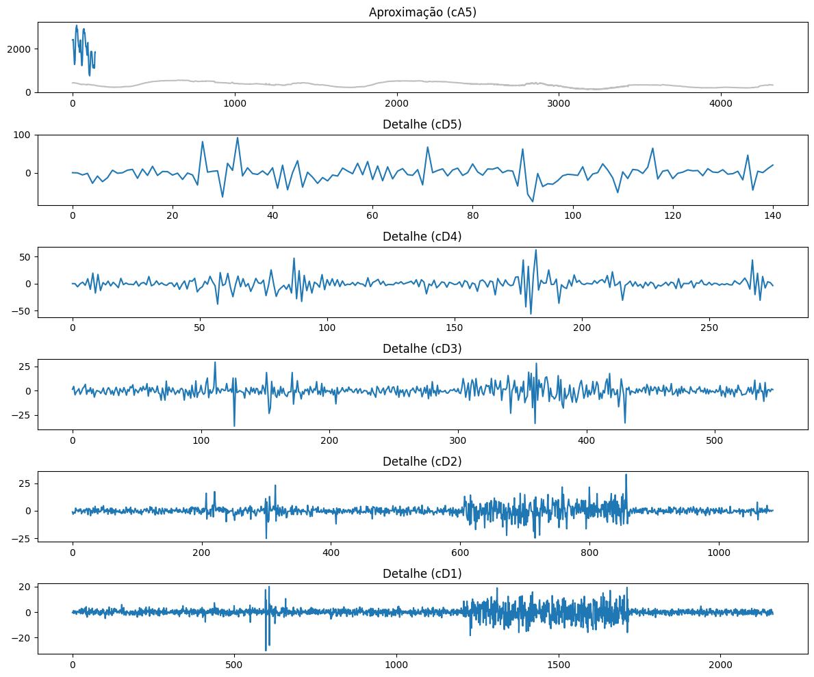
</p>

---

# Resultado Final

Ao executar o código, obtém-se:

- análise multirresolução do sinal;
- decomposição wavelet em subfaixas;
- separação entre aproximações e detalhes;
- visualização das bandas de frequência do sinal.

---

# Prática 5 — Questão 4(e)

# Comparação entre Denoising via Wavelet e DFT

Nesta etapa foi realizada:

- filtragem do sinal utilizando DFT;
- reconstrução via IDFT;
- comparação com o método wavelet;
- análise dos resíduos de ruído.

O objetivo é comparar dois métodos de remoção de ruído:

- Transformada de Fourier (DFT);
- Transformada Wavelet.

---

# Importação das Bibliotecas

```python
import numpy as np
import matplotlib.pyplot as plt
```

## Explicação

As bibliotecas utilizadas foram:

- `numpy` → operações numéricas e FFT;
- `matplotlib` → geração dos gráficos.

---

# Função de Denoising via DFT

```python
def denoise_dft(signal, threshold_percent=0.1):
```

## Explicação

A função:

```python
denoise_dft()
```

realiza a remoção de ruído utilizando:

- Transformada Discreta de Fourier;
- filtragem espectral;
- reconstrução via transformada inversa.

---

# Cálculo da DFT

```python
fft_coeffs = np.fft.fft(signal)
```

## Explicação

A função:

```python
fft()
```

calcula os coeficientes espectrais do sinal no domínio da frequência.

---

# Magnitude do Espectro

```python
magnitudes = np.abs(fft_coeffs)
```

## Explicação

Calcula a magnitude de cada componente espectral da DFT.

---

# Definição do Limiar

```python
limit = threshold_percent * np.max(magnitudes)
```

## Explicação

O limiar é definido como:

```python
X%
```

da magnitude máxima do espectro.

---

# Modelo Matemático do Threshold

O limiar aplicado é:

\[
T = \alpha \cdot \max(|X[k]|)
\]

Onde:

- \(T\) → limiar;
- \(\alpha\) → percentual definido;
- \(X[k]\) → coeficientes da DFT.

---

# Cópia dos Coeficientes

```python
fft_filtered = fft_coeffs.copy()
```

## Explicação

Cria uma cópia dos coeficientes para aplicar a filtragem.

---

# Aplicação do Threshold

```python
fft_filtered[magnitudes < limit] = 0
```

## Explicação

Todos os coeficientes cuja magnitude seja inferior ao limiar são anulados.

---

# Interpretação do Threshold

Essa etapa remove:

- componentes de baixa energia;
- pequenas oscilações;
- parte do ruído presente no sinal.

---

# Reconstrução via IDFT

```python
reconstructed = np.fft.ifft(fft_filtered)
```

## Explicação

A função:

```python
ifft()
```

reconstrói o sinal filtrado no domínio do tempo.

---

# Parte Real do Sinal

```python
return np.real(reconstructed)
```

## Explicação

Como pequenas partes imaginárias podem surgir devido a erros numéricos, utiliza-se apenas a parte real do sinal reconstruído.

---

# Aplicação do Método DFT

```python
signal_dft = denoise_dft(
    signal_leleccum,
    threshold_percent=0.05
)
```

## Explicação

O sinal:

```python
signal_leleccum
```

é filtrado utilizando um limiar de:

```python
5%
```

da magnitude máxima do espectro.

---

# Método Wavelet

O sinal:

```python
signal_denoised
```

foi obtido anteriormente utilizando:

- wavelet db4;
- thresholding VisuShrink;
- soft-thresholding.

---

# Comparação Visual

```python
plt.figure(figsize=(15, 10))
```

## Explicação

Cria a figura utilizada para comparar:

- sinal original;
- filtragem wavelet;
- filtragem DFT;
- resíduos.

---

# Primeiro Subplot — Wavelet

```python
plt.subplot(3, 1, 1)
```

## Explicação

O primeiro gráfico apresenta o resultado da filtragem wavelet.

---

# Plotagem do Sinal Original

```python
plt.plot(
    signal_leleccum,
    color='lightgray',
    alpha=0.5
)
```

## Explicação

O sinal ruidoso original é exibido em cinza.

---

# Plotagem do Sinal Wavelet

```python
plt.plot(
    signal_denoised,
    color='blue'
)
```

## Explicação

Exibe o sinal filtrado utilizando wavelets.

---

# Título do Método Wavelet

```python
plt.title(
    'Denoising via Wavelet (Preservação de Transientes)'
)
```

## Explicação

Indica que o método wavelet preserva melhor transientes e detalhes locais.

---

# Segundo Subplot — DFT

```python
plt.subplot(3, 1, 2)
```

## Explicação

O segundo gráfico apresenta a filtragem via Fourier.

---

# Plotagem do Sinal Filtrado por DFT

```python
plt.plot(
    signal_dft,
    color='red'
)
```

## Explicação

Mostra o sinal reconstruído após filtragem espectral.

---

# Título do Método DFT

```python
plt.title(
    'Denoising via DFT (Filtro de Magnitude)'
)
```

## Explicação

Indica que a filtragem ocorre diretamente no domínio da frequência.

---

# Terceiro Subplot — Resíduos

```python
plt.subplot(3, 1, 3)
```

## Explicação

O terceiro gráfico compara os resíduos removidos pelos dois métodos.

---

# Resíduo Wavelet

```python
signal_leleccum - signal_denoised
```

## Explicação

Representa a diferença entre:

- sinal original;
- sinal filtrado wavelet.

---

# Resíduo DFT

```python
signal_leleccum - signal_dft
```

## Explicação

Representa a diferença entre:

- sinal original;
- sinal filtrado via Fourier.

---

# Interpretação dos Resíduos

Os resíduos representam:

- ruído removido;
- componentes descartadas durante a filtragem.

---

# Organização da Figura

```python
plt.tight_layout()
```

## Explicação

Evita sobreposição entre gráficos e títulos.

---

# Exibição Final

```python
plt.show()
```

## Explicação

Exibe os resultados da comparação entre os métodos.

---

# Comparação entre Wavelet e DFT

## Método Wavelet

A filtragem wavelet apresenta:

- melhor localização temporal;
- preservação de transientes;
- preservação de detalhes locais;
- melhor desempenho em sinais não-estacionários.

---

## Método DFT

A filtragem via Fourier apresenta:

- análise global do espectro;
- boa remoção de componentes periódicas;
- menor capacidade de localizar eventos no tempo.

---

# Diferença Fundamental

## DFT

A DFT trabalha apenas no domínio da frequência.

---

## Wavelet

A wavelet trabalha simultaneamente em:

- tempo;
- frequência.

---


# Resultado dos Gráficos

## Comparação entre Denoising Wavelet e DFT

<p align="center">
  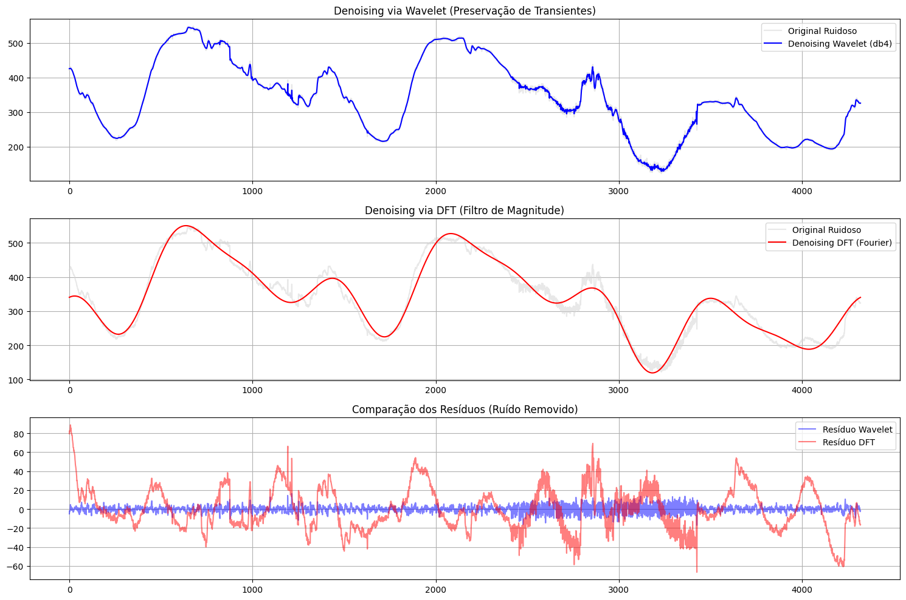
</p>

---

