<p align="center">
  
</p>

# PROSIN I — Processamento de Sinais I


- **Professor:** Rafael da Silva Chaves
- **Instituição:** Centro Federal de Educação Tecnológica Celso Suckow da Fonseca - CEFET/RJ
- **Dupla:** Lucas de Farias dos Santos e Luís Felipe Chaves de Oliveira
- **Semestre:** 2026.1

# Prática 6 — Projeto de Filtros IIR.
---

# Questão 1(a) Filtro Passa-Baixas  de 2ª Ordem

# Importação das Bibliotecas

```python
import numpy as np
import matplotlib.pyplot as plt
from scipy import signal
```

## Explicação

As bibliotecas utilizadas foram:

- `numpy` → cálculos numéricos;
- `matplotlib` → geração dos gráficos;
- `scipy.signal` → projeto e análise dos filtros digitais.

---

# Definição da Frequência de Corte

```python
fc_lp = 1000
```

## Explicação

Foi especificada uma frequência de corte de:

```text
fc = 1000 Hz
```

# Conversão para Frequência Normalizada

```python
wn_lp = fc_lp / (fs / 2)
```

## Explicação

A função:

```python
signal.butter()
```

utiliza frequência normalizada. A normalização é feita em relação à frequência de Nyquist:

```math
f_N=\frac{f_s}{2}
```

Logo:

```math
W_n=\frac{f_c}{f_N}
```

---

# Projeto do Filtro Butterworth

```python
b_lp, a_lp = signal.butter(
    2,
    wn_lp,
    btype='low'
)
```

## Explicação

Foi projetado um filtro:

- Butterworth;
- passa-baixas;
- ordem 2.

---

# Coeficientes da Função de Transferência

```python
print(b_lp)
print(a_lp)
```

## Explicação

Os vetores retornados representam:

Numerador:

```math
B(z)=b_0+b_1z^{-1}+b_2z^{-2}
```

Denominador:

```math
A(z)=1+a_1z^{-1}+a_2z^{-2}
```

---

# Resposta em Frequência

```python
w_lp, h_lp = signal.freqz(
    b_lp,
    a_lp
)
```

## Explicação

A função:

```python
freqz()
```

calcula a resposta em frequência do filtro.

O resultado fornece:

```math
H(e^{j\omega})
```

para diversos valores de frequência.

---

# Resposta de Magnitude

```python
20*np.log10(abs(h_lp))
```

## Explicação

A magnitude é convertida para dB:

```math
|H(f)|_{dB}
=
20\log_{10}|H(f)|
```

# Resposta de Fase

```python
np.unwrap(np.angle(h_lp))
```

A função:

```python
unwrap()
```

remove descontinuidades de ±π.

---

# Diagrama Polo-Zero

```python
plot_pole_zero(
    b_lp,
    a_lp,
    ...
)
```

# Cálculo dos Coeficientes do Denominador

```python
m1 = a_lp[1]
m2 = a_lp[2]
```

## Explicação

Os coeficientes do denominador são utilizados para representar o filtro na forma:

```math
H(z)=
\frac{K(z+1)^2}
     {z^2+m_1z+m_2}
```

---

# Cálculo do Fator de Normalização

```python
K =
\frac{1+m_1+m_2}{4}
```

## Explicação

O fator de normalização garante:

```math
H(1)=1
```

ganho unitário em frequência zero.

---

# Verificação da Normalização

```python
np.allclose(...)
```

## Explicação

Foi verificado se os coeficientes calculados já satisfazem:

```math
B(z)=K(z+1)^2
```

# Influência do Raio dos Polos

Foram analisados diferentes valores:

```python
r = [0.5, 0.7, 0.9, 0.99]
```

# Construção do Filtro com Raio r Variável

```python
a1 = -2r\cos(\theta_0)
a2 = r^2
```

## Explicação

Os polos possuem a forma:

```math
p=r e^{\pm j\theta_0}
```

onde:

- `r` determina a distância ao centro;
- `θ₀` determina a frequência característica.

---

# Frequência Angular

```python
theta_0=
2\pi\frac{f_c}{f_s}
```

## Explicação

A frequência angular define a localização angular dos polos no círculo unitário.

---

# Resultado dos Gráficos

## Resposta em Frequência do Filtro:

<p align="center">
  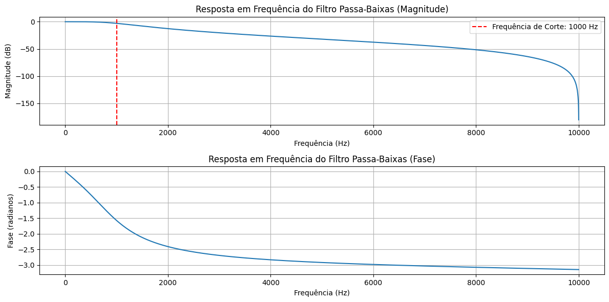
</p>

---

## Influência do Raio dos Polos:

<p align="center">
  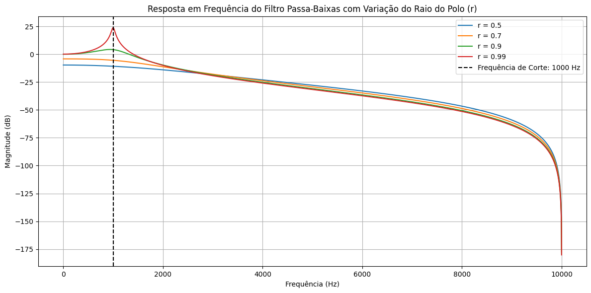
</p>

---

# Questão 1(b) Filtro Passa-Altas Butterworth de 2ª Ordem

---

# Importação das Bibliotecas

```python
import numpy as np
import matplotlib.pyplot as plt
from scipy import signal
```

## Explicação

As bibliotecas utilizadas foram:

- `numpy` → operações matemáticas;
- `matplotlib` → geração dos gráficos;
- `scipy.signal` → projeto e análise dos filtros digitais.

---

# Definição da Frequência de Corte

```python
fc_hp = 2000
```

## Explicação

Foi especificada uma frequência de corte igual a:

```text
fc = 2000 Hz
```
---

# Conversão para Frequência Normalizada

```python
wn_hp = fc_hp / (fs / 2)
```

## Explicação

A função Butterworth utiliza frequência normalizada em relação à frequência de Nyquist:

```math
f_N=\frac{f_s}{2}
```

Portanto:

```math
W_n=\frac{f_c}{f_N}
```

---

# Projeto do Filtro Passa-Altas

```python
b_hp, a_hp = signal.butter(
    2,
    wn_hp,
    btype='high'
)
```

## Explicação

Foi projetado um filtro:

- passa-altas de ordem 2.;
  
---

# Coeficientes da Função de Transferência

```python
print(b_hp)
print(a_hp)
```

## Explicação

Os coeficientes obtidos representam a função de transferência digital:

```math
H(z)=
\frac{b_0+b_1z^{-1}+b_2z^{-2}}
     {1+a_1z^{-1}+a_2z^{-2}}
```

---

# Cálculo da Resposta em Frequência

```python
w_hp, h_hp = signal.freqz(
    b_hp,
    a_hp
)
```

## Explicação

A função:

```python
freqz()
```

calcula a resposta em frequência do filtro:

```math
H(e^{j\omega})
```

---

# Resposta de Magnitude

```python
20*np.log10(abs(h_hp))
```

## Explicação

A magnitude é representada em decibéis:

```math
|H(f)|_{dB}
=
20\log_{10}|H(f)|
```

---

# Resposta de Fase

```python
np.unwrap(np.angle(h_hp))
```

---
A função:

```python
unwrap()
```

remove saltos artificiais de ±π.

---

# Diagrama Polo-Zero

```python
plot_pole_zero(
    b_hp,
    a_hp,
    ...
)
```

---

# Estrutura dos Zeros do Filtro Passa-Altas

Em filtros passa-altas  digitais, os zeros ficam próximos de:

```math
z=1
```

---

## Significado

A frequência:

```math
\omega = 0
```

corresponde à componente DC.

Ao posicionar zeros próximos de:

```math
z=1
```

o filtro rejeita componentes de baixa frequência.

---

# Frequência Angular de Referência

```python
theta_0_hp =
2*np.pi*fc_hp/fs
```

## Explicação

A frequência angular determina a posição angular dos polos:

```math
p=re^{\pm j\theta_0}
```

---

# Variação do Raio dos Polos

Foram avaliados os valores:

```python
r = [0.5, 0.7, 0.9, 0.99]
```

---

# Coeficientes do Biquad Passa-Altas

```python
b0_hp = (1 + cos(theta_0))/2
b1_hp = -(1 + cos(theta_0))
b2_hp = (1 + cos(theta_0))/2
```

## Explicação

Esses coeficientes posicionam zeros em baixas frequências, produzindo comportamento passa-altas.

---

# Coeficientes dos Polos

```python
a1_hp = -2*r*cos(theta_0)
a2_hp = r²
```

## Explicação

Os polos permanecem em:

```math
p=re^{\pm j\theta_0}
```

onde:

- `r` controla a seletividade;
- `θ₀` controla a frequência característica.

---

# Resposta em Frequência para Diferentes Valores de r

```python
signal.freqz(...)
```

## Explicação

Foi calculada a resposta em frequência para cada valor de:

```math
r
```

permitindo comparar o efeito da posição dos polos.

---

# Resultado dos Gráficos

## Resposta em Frequência do Filtro Passa-Altas

<p align="center">
  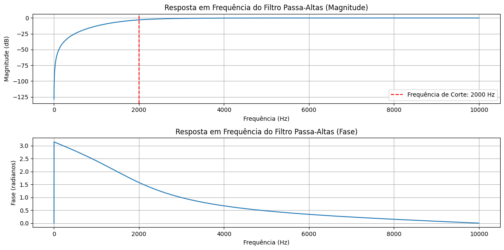
</p>

---

## Influência do Raio dos Polos

<p align="center">
  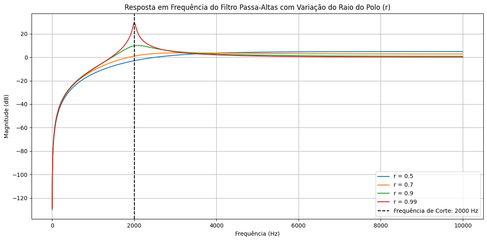
</p>

---

# Questão 1(c): Filtro Passa-faixas

---

# Importação das Bibliotecas

```python
import numpy as np
import matplotlib.pyplot as plt
from scipy import signal
```

## Explicação

As bibliotecas utilizadas foram:

- `numpy` → operações matemáticas;
- `matplotlib` → geração dos gráficos;
- `scipy.signal` → projeto e análise de filtros digitais.

---

# Definição dos Parâmetros

```python
fs = 20000
fc = 7000
```

## Explicação

Onde:

- `fs` é a frequência de amostragem;
- `fc` é a frequência central.

Neste caso:

```text
fs = 20 kHz
fc = 7 kHz
```

---

# Conversão para Frequência Digital

```python
theta_c = 2*np.pi*fc/fs
```

## Explicação

A frequência central deve ser convertida para radianos por amostra:

\[
\theta_c=\frac{2\pi f_c}{f_s}
\]

onde:

- \(f_c\) é a frequência central;
- \(f_s\) é a frequência de amostragem.

---

# Definição do Raio dos Polos

```python
r_default = 0.95
```

---

# Cálculo dos Coeficientes do Denominador

```python
m1 = -2*r_default*np.cos(theta_c)
m2 = r_default**2
```

---

# Definição dos Zeros

```python
b = [1, 0, -1]
```

## Explicação

O numerador corresponde ao polinômio:

\[
z^2 - 1
\]

que cria zeros responsáveis pela rejeição de frequência.

---

# Função de Transferência

A estrutura geral do filtro é:

\[
H(z)=K\frac{z^2-1}{z^2+m_1z+m_2}
\]

onde:

- \(K\) é o ganho de normalização;
- \(m_1\) e \(m_2\) determinam a posição dos polos.

---

# Cálculo do Ganho de Normalização

```python
omega, h = signal.freqz(b, a, worN=[theta_c])
gain_at_fc = np.abs(h[0])
K = 1/gain_at_fc
```

## Explicação

O fator:

```python
K
```

é calculado para ajustar o ganho do filtro.

Após o cálculo:

```python
b_scaled = [K*val for val in b]
```

---

# Coeficientes Obtidos

```python
print(...)
```

## Explicação

São exibidos:

- valor de \(r\);
- coeficientes \(m_1\) e \(m_2\);
- fator de ganho \(K\);
- coeficientes finais do numerador;
- coeficientes finais do denominador.

---

# Resposta em Frequência

```python
w, H = signal.freqz(b_scaled, a, worN=8192)
```

## Explicação

A função:

```python
freqz()
```

calcula a resposta em frequência do filtro.

---

# Resposta de Magnitude

```python
20*np.log10(abs(H))
```

## Explicação

A magnitude é representada em decibéis.

---

# Resposta de Fase

```python
np.angle(H)
```

## Explicação

Mostra a variação de fase ao longo da frequência.

---

# Frequência Central

```python
axs[0].axvline(fc)
```

## Explicação

Uma linha vertical é utilizada para destacar a frequência:

```text
7000 Hz
```

que corresponde ao centro da rejeição.

---

# Diagrama de Polos e Zeros

```python
zeros = np.roots(b_scaled)
poles = np.roots(a)
```

---

# Plotagem do Círculo Unitário

```python
unit_circle = plt.Circle(...)
```

---

# Zeros

```python
ax.plot(...,'o')
```

---

# Polos

```python
ax.plot(...,'x')
```

## Explicação

Os polos aparecem como X e os zeros como O

---

# Influência do Parâmetro r

Foram avaliados os valores:

```python
r_values = [0.5, 0.85, 0.95, 0.99]
```

---

# Recalculo dos Coeficientes

Para cada valor de:

```python
r
```

são recalculados:

```python
m1
m2
K
```

e posteriormente a resposta em frequência.

---

# Comparação das Respostas

```python
plt.plot(...)
```

---

# Questão 1(d) : Filtro Notch 

---

# Importação das Bibliotecas

```python
import numpy as np
import matplotlib.pyplot as plt
from scipy import signal
```

## Explicação

As bibliotecas utilizadas foram:

- `numpy` → cálculos numéricos;
- `matplotlib` → geração de gráficos;
- `scipy.signal` → projeto e análise de filtros digitais.

---

# Definição dos Parâmetros

```python
fs_notch = 20000
fc_notch = 3000
```

## Explicação

Foram definidos:

- frequência de amostragem:

```python
fs = 20000 Hz
```

- frequência central do filtro Notch:

```python
fc = 3000 Hz
```

A frequência de 3000 Hz será atenuada pelo filtro.

---

# Conversão para Frequência Digital

```python
theta_c_notch = 2*np.pi*fc_notch/fs_notch
```

## Explicação

A frequência central deve ser convertida para radianos por amostra:

\[
\theta_c=\frac{2\pi f_c}{f_s}
\]

onde:

- \(f_c\) é a frequência de rejeição;
- \(f_s\) é a frequência de amostragem.

---

# Definição do Raio dos Polos

```python
r_notch = 0.95
```

## Explicação

O parâmetro:

```python
r
```

controla a largura da banda rejeitada.

---

# Cálculo dos Coeficientes do Numerador

```python
b_notch = [1, -2*np.cos(theta_c_notch), 1]
```

## Explicação

O numerador gera dois zeros sobre o círculo unitário:

\[
B(z)=z^2-2\cos(\theta_c)z+1
\]

Esses zeros anulam a frequência desejada.

---

# Cálculo dos Coeficientes do Denominador

```python
a_notch = [
    1,
    -2*r_notch*np.cos(theta_c_notch),
    r_notch**2
]
```

## Explicação

O denominador posiciona polos próximos aos zeros:

\[
A(z)=z^2-2r\cos(\theta_c)z+r^2
\]

Os polos aumentam a seletividade da rejeição.

---

# Fator de Normalização

```python
K_notch
```

## Explicação

Foi calculado um fator de ganho para garantir:

\[
H(1)=1
\]

ou seja, ganho unitário em DC.

O fator utilizado foi:

\[
K=
\frac{1-2r\cos(\theta_c)+r^2}
     {2-2\cos(\theta_c)}
\]

---

# Função de Transferência

Após a normalização, o filtro pode ser representado por:

\[
H(z)=
K\,
\frac
{z^2-2\cos(\theta_c)z+1}
{z^2-2r\cos(\theta_c)z+r^2}
\]

---

# Resposta em Frequência

```python
w_notch, H_notch = signal.freqz(
    b_notch_scaled,
    a_notch,
    worN=8192
)
```

## Explicação

A função:

```python
freqz()
```

calcula a resposta em frequência do filtro.

---

# Gráfico da Magnitude

```python
20*np.log10(abs(H_notch))
```

## Explicação

A magnitude é apresentada em dB.

Observa-se uma forte atenuação em:

```python
3000 Hz
```

---

# Gráfico da Fase

```python
np.angle(H_notch)
```

---

# Diagrama de Polos e Zeros

```python
zeros_notch = np.roots(b_notch_scaled)
poles_notch = np.roots(a_notch)
```
---

# Resultado dos Gráficos

## Resposta em Frequência do Filtro Notch

<p align="center">
  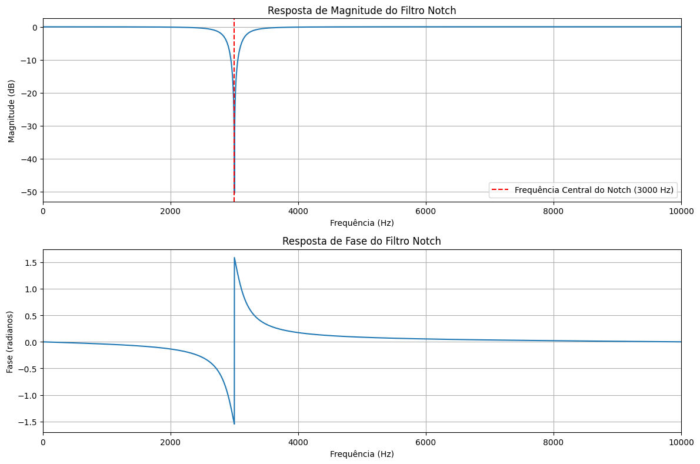
</p>

---

## Diagrama de Polos e Zeros

<p align="center">
  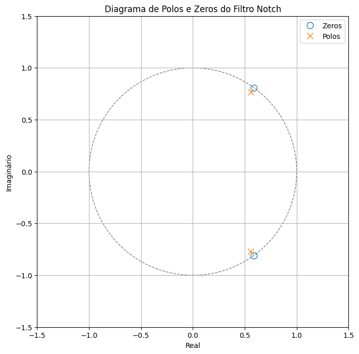
</p>

---

## Influência do Parâmetro r

<p align="center">
  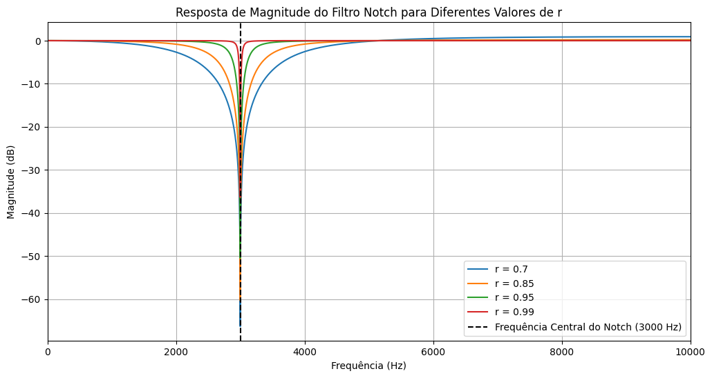
</p>

---

---

# Prática 6 —

#  Questão 2: Filtro Passa-Faixas em Cascata

O objetivo é obter um filtro passa-faixas com banda útil compreendida entre:

- 6000 Hz;
- 8000 Hz.

---

# Importação das Bibliotecas

```python
import numpy as np
import matplotlib.pyplot as plt
from scipy import signal
```

## Explicação

As bibliotecas utilizadas foram:

- `numpy` → operações matemáticas;
- `matplotlib` → geração de gráficos;
- `scipy.signal` → projeto e análise de filtros digitais.

---

# Definição dos Parâmetros

```python
fs = 20000
fc1 = 6000
fc2 = 8000
```

## Explicação

Foram definidas:

- frequência de amostragem:

```python
fs = 20000 Hz
```

- frequência de corte inferior:

```python
fc1 = 6000 Hz
```

- frequência de corte superior:

```python
fc2 = 8000 Hz
```

---

# Estrutura do Filtro

O filtro passa-faixas é obtido pela cascata de:

```text
Passa-Altas → Passa-Baixas
```

onde:

```text
HPF(fc1 = 6000 Hz)
```

remove componentes abaixo de 6000 Hz

e

```text
LPF(fc2 = 8000 Hz)
```

remove componentes acima de 8000 Hz.

---

# Projeto do Filtro Passa-Altas

```python
b_hp, a_hp = signal.butter(
    2,
    fc1,
    btype='highpass',
    fs=fs,
    output='ba'
)
```

## Explicação

Foi utilizado um filtro:

```python
Butterworth de 2ª ordem
```

com frequência de corte:

```python
6000 Hz
```

---

# Projeto do Filtro Passa-Baixas

```python
b_lp, a_lp = signal.butter(
    2,
    fc2,
    btype='lowpass',
    fs=fs,
    output='ba'
)
```

## Explicação

Foi projetado um segundo filtro Butterworth de:

```python
2ª ordem
```

com frequência de corte:

```python
8000 Hz
```

---

# Coeficientes dos Filtros

Os coeficientes retornados são:

```python
b_hp , a_hp
```

para o filtro passa-altas

e

```python
b_lp , a_lp
```

para o filtro passa-baixas.

Esses coeficientes representam a função de transferência digital:

```math
H(z)=\frac{B(z)}{A(z)}
```

---

# Formação da Cascata

```python
b_cascata = np.convolve(b_hp, b_lp)
a_cascata = np.convolve(a_hp, a_lp)
```

## Explicação

A cascata de filtros equivale à multiplicação das funções de transferência:

```math
H_{PF}(z)=H_{HP}(z)\cdot H_{LP}(z)
```

Como multiplicação no domínio Z corresponde à convolução dos coeficientes:

```python
np.convolve()
```

é utilizada para obter os coeficientes finais.

---

# Função de Transferência Resultante

O filtro resultante possui:

```python
ordem = 4
```

pois é formado por:

```text
2ª ordem + 2ª ordem
```

---

# Resposta em Frequência

```python
w_cascata, H_cascata = signal.freqz(
    b_cascata,
    a_cascata,
    worN=8192
)
```

## Explicação

A função:

```python
freqz()
```

calcula a resposta em frequência do filtro digital.

---

# Gráfico de Magnitude

```python
20*np.log10(abs(H_cascata))
```

## Explicação

A magnitude é convertida para:

```text
decibéis (dB)
```
---

# Frequências de Corte

As linhas verticais indicam:

```python
fc1 = 6000 Hz
```

e

```python
fc2 = 8000 Hz
```

delimitando a faixa de frequências transmitidas pelo filtro.

---

# Gráfico de Fase

```python
np.angle(H_cascata)
```
---

# Diagrama de Polos e Zeros

Os polos e zeros são obtidos por:

```python
zeros_cascata = np.roots(b_cascata)
poles_cascata = np.roots(a_cascata)
```

---

# Zeros

```python
np.roots(b_cascata)
```

---

# Polos

```python
np.roots(a_cascata)
```
Graficamente são representados por:

```text
×
```

---

# Círculo Unitário

```python
plt.Circle((0,0),1)
```

## Explicação

O círculo unitário é utilizado para verificar a estabilidade.

---

# Resultado dos Gráficos

## Resposta em Frequência do Filtro Passa-Faixas em Cascata

<p align="center">
  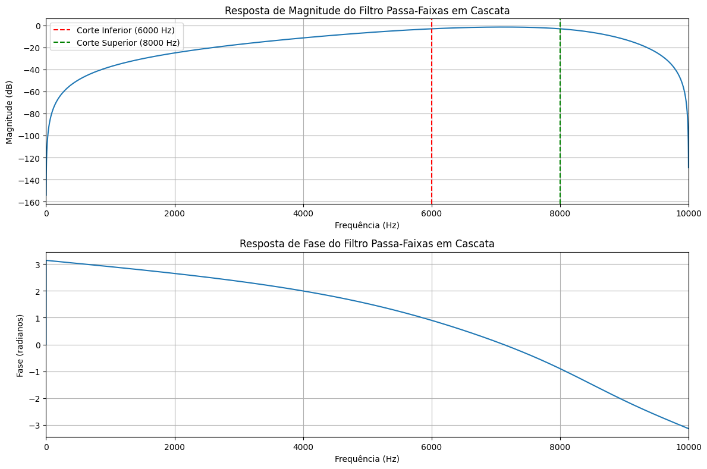
</p>

---

## Diagrama de Polos e Zeros

<p align="center">
  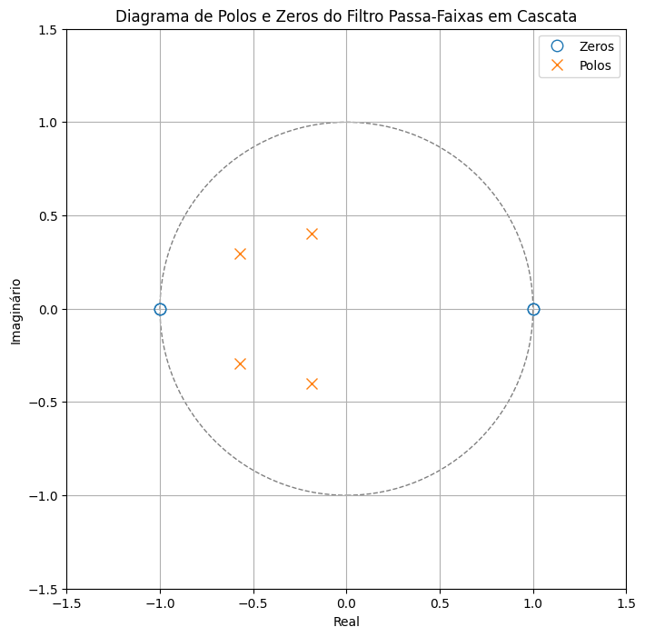
</p>

---

# Questão 3: Filtro Rejeita-Faixas em Paralelo

O objetivo é obter um filtro rejeita-faixas capaz de atenuar as frequências compreendidas entre:

- 1000 Hz;
- 4000 Hz.

---

# Importação das Bibliotecas

```python
import numpy as np
import matplotlib.pyplot as plt
from scipy import signal
```

## Explicação

As bibliotecas utilizadas foram:

- `numpy` → operações matemáticas;
- `matplotlib` → geração dos gráficos;
- `scipy.signal` → projeto e análise de filtros digitais.

---

# Definição dos Parâmetros

```python
fs_br = 20000
fc1_br = 1000
fc2_br = 4000
```

## Explicação

Foram definidas:

- frequência de amostragem:

```python
fs = 20000 Hz
```

- frequência limite inferior da banda rejeitada:

```python
fc1_br = 1000 Hz
```

- frequência limite superior da banda rejeitada:

```python
fc2_br = 4000 Hz
```

---

# Estrutura do Filtro

O filtro rejeita-faixas foi construído pela associação em paralelo de:

```text
Passa-Baixas + Passa-Altas
```

onde:

```text
LPF(fc = 1000 Hz)
```

permite a passagem das baixas frequências

e

```text
HPF(fc = 4000 Hz)
```

permite a passagem das altas frequências.

A região intermediária é rejeitada.

---

# Projeto do Filtro Passa-Baixas

```python
b_lpf_br, a_lpf_br = signal.butter(
    order_br,
    fc1_br,
    btype='lowpass',
    fs=fs_br,
    output='ba'
)
```

## Explicação

Foi utilizado um filtro Butterworth de segunda ordem com frequência de corte igual a:

```python
1000 Hz
```

---

# Projeto do Filtro Passa-Altas

```python
b_hpf_br, a_hpf_br = signal.butter(
    order_br,
    fc2_br,
    btype='highpass',
    fs=fs_br,
    output='ba'
)
```

## Explicação

Foi utilizado um filtro Butterworth de segunda ordem com frequência de corte igual a:

```python
4000 Hz
```

---

# Coeficientes dos Filtros

Os coeficientes obtidos são:

```python
b_lpf_br , a_lpf_br
```

para o passa-baixas

e

```python
b_hpf_br , a_hpf_br
```

para o passa-altas.

Esses coeficientes definem as funções de transferência digitais dos filtros.

---

# Associação em Paralelo

Diferentemente da cascata utilizada na Questão 2, nesta etapa os filtros são ligados em paralelo.

A estrutura pode ser representada por:

```text
             ┌─ LPF ─┐
Entrada ─────┤       + ──── Saída
             └─ HPF ─┘
```

A saída total é dada pela soma das saídas dos dois filtros.

---

# Denominador Equivalente

```python
a_parallel_br = np.convolve(
    a_lpf_br,
    a_hpf_br
)
```

## Explicação

O denominador equivalente é obtido pelo produto dos denominadores dos filtros individuais.

---

# Numerador Equivalente

```python
num1 = np.convolve(
    b_lpf_br,
    a_hpf_br
)

num2 = np.convolve(
    b_hpf_br,
    a_lpf_br
)
```

## Explicação

Como os filtros estão em paralelo, as funções de transferência são somadas:

```math
H(z)=H_{LPF}(z)+H_{HPF}(z)
```

Após colocar as frações sob um denominador comum, obtém-se:

```math
H(z)=
\frac{
B_{LPF}(z)A_{HPF}(z)
+
B_{HPF}(z)A_{LPF}(z)
}
{
A_{LPF}(z)A_{HPF}(z)
}
```

---

# Soma dos Polinômios

```python
b_parallel_br
```

## Explicação

O numerador final é obtido pela soma dos produtos cruzados dos coeficientes.

Essa operação produz a função de transferência equivalente do filtro rejeita-faixas.

---

# Resposta em Frequência

```python
w_parallel_br, H_parallel_br =
signal.freqz(
    b_parallel_br,
    a_parallel_br,
    worN=8192
)
```

## Explicação

A função:

```python
freqz()
```

calcula a resposta em frequência do filtro digital.

---

# Gráfico de Magnitude

```python
20*np.log10(abs(H_parallel_br))
```

## Explicação

A magnitude é convertida para dB.

A região entre:

```python
1000 Hz
```

e

```python
4000 Hz
```

apresenta forte redução de ganho.

---

# Gráfico de Fase

```python
np.angle(H_parallel_br)
```

---

# Frequências de Rejeição

As linhas verticais destacam:

```python
fc1_br = 1000 Hz
```

e

```python
fc2_br = 4000 Hz
```

delimitando a faixa rejeitada pelo sistema.

---

# Diagrama de Polos e Zeros

Os polos e zeros são obtidos por:

```python
zeros_parallel_br =
np.roots(b_parallel_br)

poles_parallel_br =
np.roots(a_parallel_br)
```

---

# Zeros

```python
np.roots(b_parallel_br)
```

---

# Polos

```python
np.roots(a_parallel_br)
```

---

# Círculo Unitário

```python
plt.Circle((0,0),1)
```

---


# Resultado dos Gráficos

## Resposta em Frequência do Filtro Rejeita-Faixas

<p align="center">
  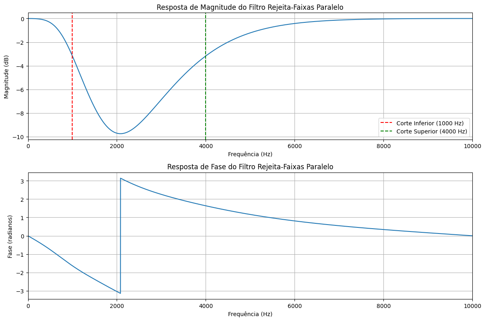
</p>

---

## Diagrama de Polos e Zeros

<p align="center">
  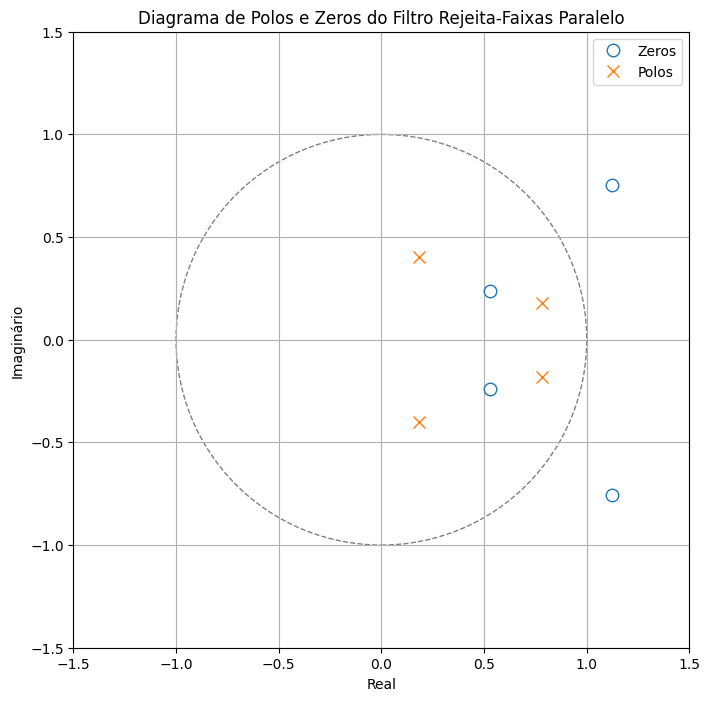
</p>

---

# 

# Questão 4(a): Quantização dos Coeficientes dos Filtros Digitais

---

# Importação das Bibliotecas

```python
import numpy as np
import matplotlib.pyplot as plt
from scipy import signal
```

## Explicação

As bibliotecas utilizadas foram:

- `numpy` → operações numéricas;
- `matplotlib` → geração de gráficos;
- `scipy.signal` → análise de filtros digitais.

---

# Função de Quantização

```python
def quantize_coefficients_simple(coefficients, bits):
```

## Explicação

Foi implementada uma função responsável por quantizar os coeficientes dos filtros utilizando uma representação de precisão limitada.

---

# Verificação de Vetor Vazio

```python
if not coefficients.size:
    return coefficients
```

## Explicação

Caso o vetor esteja vazio, ele é retornado sem alterações.

---

# Determinação da Faixa Dinâmica

```python
max_abs_coeff = np.max(np.abs(coefficients))
```

## Explicação

Calcula o maior valor absoluto presente entre os coeficientes.

Esse valor será utilizado para definir a faixa de quantização.

---

# Tratamento para Coeficientes Nulos

```python
if max_abs_coeff == 0:
    return np.zeros_like(coefficients)
```

## Explicação

Se todos os coeficientes forem iguais a zero, o vetor quantizado também será composto apenas por zeros.

---

# Número de Níveis de Quantização

```python
num_levels = 2**bits
```

## Explicação

O número de níveis disponíveis depende da quantidade de bits utilizada.

Exemplos:

| Bits | Níveis |
|--------|--------|
| 2 | 4 |
| 4 | 16 |
| 8 | 256 |
| 16 | 65536 |
| 32 | 4294967296 |

---

# Passo de Quantização

```python
quantization_step = (2 * max_abs_coeff) / num_levels
```

## Explicação

Calcula a distância entre dois níveis consecutivos de quantização.

---

# Quantização dos Coeficientes

```python
quantized_coeffs =
np.round(coefficients / quantization_step)
* quantization_step
```

## Explicação

Cada coeficiente é:

1. dividido pelo passo;
2. arredondado para o nível mais próximo;
3. convertido novamente para o valor correspondente.

---

# Quantização do Filtro Passa-Faixas em Cascata

Os coeficientes utilizados foram obtidos na Questão 2:

```python
b_cascata
a_cascata
```

---

# Resoluções Testadas

```python
bits_to_test = [2, 4, 8, 16, 32]
```

## Explicação

Foram analisadas cinco precisões diferentes:

- 2 bits;
- 4 bits;
- 8 bits;
- 16 bits;
- 32 bits.

---

# Quantização dos Coeficientes

```python
b_cascata_q =
quantize_coefficients_simple(
    b_cascata,
    bits
)

a_cascata_q =
quantize_coefficients_simple(
    a_cascata,
    bits
)
```

## Explicação

Os coeficientes do numerador e do denominador são quantizados para cada quantidade de bits.

---

# Cálculo da Resposta em Frequência

```python
w_q, H_q =
signal.freqz(
    b_cascata_q,
    a_cascata_q,
    worN=8192
)
```

## Explicação

A função:

```python
freqz()
```

calcula a resposta em frequência do filtro quantizado.

---

# Comparação com o Filtro Original

```python
axs[0].plot(...)
axs[1].plot(...)
```

## Explicação

A resposta em frequência do filtro quantizado é comparada com a resposta em frequência do filtro original.

---

# Cálculo dos Polos e Zeros

```python
zeros_q = np.roots(b_cascata_q)
poles_q = np.roots(a_cascata_q)
```

## Explicação

Obtém-se a localização dos:

- polos;
- zeros;

após a quantização.

---

# Diagrama de Polos e Zeros

```python
ax.plot(...)
```

---

# Quantização do Filtro Rejeita-Faixas em Paralelo

Os coeficientes utilizados foram obtidos na Questão 3:

```python
b_parallel_br
a_parallel_br
```

---

# Quantização dos Coeficientes

```python
b_parallel_br_q =
quantize_coefficients_simple(
    b_parallel_br,
    bits
)

a_parallel_br_q =
quantize_coefficients_simple(
    a_parallel_br,
    bits
)
```

## Explicação

Os coeficientes do filtro rejeita-faixas também são quantizados para diferentes resoluções.

---

# Resposta em Frequência

```python
signal.freqz(
    b_parallel_br_q,
    a_parallel_br_q
)
```

## Explicação

A resposta do filtro quantizado é comparada com a resposta do filtro original.

---

# Polos e Zeros Quantizados

```python
np.roots(...)
```

## Explicação

São calculadas as novas posições dos polos e zeros após a quantização.

---

# Comparação Visual

Nos diagramas gerados:

- azul → filtro original;
- vermelho → filtro quantizado.

---

---

# Questão 4: Quantização dos Coeficientes em Cada Bloco dos Filtros

O objetivo é verificar se a quantização realizada em cada bloco separadamente produz menor degradação quando comparada à quantização do filtro completo realizada na Questão 4(a).

---

# Estratégia Utilizada

Na Questão 4(a), a quantização foi aplicada diretamente sobre os coeficientes finais dos filtros:

```python
b_cascata
a_cascata
```

e

```python
b_parallel_br
a_parallel_br
```

Nesta etapa, a quantização é realizada antes da combinação dos blocos.

---

# Quantização do Filtro Passa-Faixas em Cascata

O filtro passa-faixas foi construído a partir de:

```python
HPF + LPF
```

onde:

- HPF → filtro passa-altas;
- LPF → filtro passa-baixas.

---

# Resoluções Testadas

```python
bits_to_test = [2, 4, 8, 16, 32]
```

## Explicação

Foram analisadas cinco precisões diferentes:

- 2 bits;
- 4 bits;
- 8 bits;
- 16 bits;
- 32 bits.

---

# Quantização dos Blocos Individuais

```python
b_hp_q = quantize_coefficients_simple(b_hp, bits)
a_hp_q = quantize_coefficients_simple(a_hp, bits)

b_lp_q = quantize_coefficients_simple(b_lp, bits)
a_lp_q = quantize_coefficients_simple(a_lp, bits)
```

## Explicação

Cada bloco é quantizado separadamente antes da montagem do filtro completo.

---

# Reconstrução da Cascata

```python
b_cascata_blocks_q =
np.convolve(
    b_hp_q,
    b_lp_q
)

a_cascata_blocks_q =
np.convolve(
    a_hp_q,
    a_lp_q
)
```

## Explicação

Após a quantização dos blocos:

- os numeradores são convolvidos;
- os denominadores são convolvidos;

reconstruindo o filtro passa-faixas.

---

# Cálculo da Resposta em Frequência

```python
w_q_blocks, H_q_blocks =
signal.freqz(
    b_cascata_blocks_q,
    a_cascata_blocks_q,
    worN=8192
)
```

## Explicação

Calcula-se a resposta em frequência do filtro reconstruído após a quantização.

---

# Comparação com o Filtro Original

```python
axs[0].plot(...)
axs[1].plot(...)
```

## Explicação

São comparadas:

- magnitude;
- fase.

entre o filtro original e o filtro quantizado.

---

# Cálculo dos Polos e Zeros

```python
zeros_q_blocks =
np.roots(
    b_cascata_blocks_q
)

poles_q_blocks =
np.roots(
    a_cascata_blocks_q
)
```

## Explicação

Obtêm-se os polos e zeros do filtro reconstruído após a quantização dos blocos.

---

# Diagrama de Polos e Zeros

```python
ax.plot(...)
```

## Explicação

Os polos e zeros obtidos após a quantização são comparados com os polos e zeros do filtro original.

---

---

# Quantização dos Blocos

```python
b_lpf_br_q =
quantize_coefficients_simple(
    b_lpf_br,
    bits
)

a_lpf_br_q =
quantize_coefficients_simple(
    a_lpf_br,
    bits
)

b_hpf_br_q =
quantize_coefficients_simple(
    b_hpf_br,
    bits
)

a_hpf_br_q =
quantize_coefficients_simple(
    a_hpf_br,
    bits
)
```

## Explicação

Cada bloco é quantizado separadamente antes da associação paralela.

---

# Formação do Filtro Paralelo

## Denominador

```python
a_parallel_blocks_q =
np.convolve(
    a_lpf_br_q,
    a_hpf_br_q
)
```

## Explicação

O denominador do sistema paralelo é obtido pelo produto dos denominadores individuais.

---

# Numerador

```python
num1_q =
np.convolve(
    b_lpf_br_q,
    a_hpf_br_q
)

num2_q =
np.convolve(
    b_hpf_br_q,
    a_lpf_br_q
)
```

## Explicação

Cada ramo é convertido para um denominador comum.

---

# Soma dos Ramos

```python
b_parallel_blocks_q
```

## Explicação

Os dois ramos são somados para formar o numerador final do filtro rejeita-faixas.

---

# Resposta em Frequência

```python
signal.freqz(
    b_parallel_blocks_q,
    a_parallel_blocks_q
)
```

## Explicação

A resposta em frequência do filtro quantizado é comparada com a resposta do filtro original.

---

# Polos e Zeros

```python
zeros_q_blocks
poles_q_blocks
```

## Explicação

São calculadas as novas posições dos polos e zeros após a quantização dos blocos.

---

# Comparação Visual

Nos diagramas:

- azul → filtro original;
- vermelho → filtro quantizado.

---

```python
2 bits
```

e

```python
4 bits
```

onde os erros de quantização são mais significativos.

---


# Questão 5: Preparação do Áudio e Geração dos Sinais Contaminados

O objetivo é produzir sinais degradados que serão utilizados posteriormente para avaliar o desempenho dos filtros projetados ao longo da prática.

---

# Carregamento do Arquivo de Áudio

O áudio foi carregado utilizando a biblioteca Librosa:

```python
x_t, fs_audio = librosa.load(
    file_path,
    sr=None
)
```

## Explicação

A função retorna:

```python
x_t
```

→ vetor contendo as amostras do sinal.

e

```python
fs_audio
```

→ frequência de amostragem original do arquivo.

A opção:

```python
sr=None
```

preserva a frequência de amostragem original do áudio.

---

# Definição das Interferências

Foram adicionadas duas componentes senoidais ao sinal.

## Interferência de Baixa Frequência

```python
0.05 cos(200πt)
```

Implementada como:

```python
interference_low =
0.05*np.cos(
    2*np.pi*freq_low*time
)
```

### Efeito

Introduz uma oscilação lenta no sinal de áudio.

---

## Interferência de Alta Frequência

```python
0.075 sin(4000πt)
```

Implementada como:

```python
interference_high =
0.075*np.sin(
    2*np.pi*freq_high*time
)
```

### Efeito

Introduz uma componente de frequência elevada que pode ser observada claramente no espectro.

---

# Definição do Ruído Branco

Foram avaliadas três intensidades de ruído:

```python
variances = {
    '0.01': 10**-2,
    '0.1' : 10**-1,
    '1'   : 1
}
```

Ou seja:

- σ² = 0.01
- σ² = 0.1
- σ² = 1

---

# Geração do Ruído

O ruído branco gaussiano foi gerado por:

```python
noise =
np.random.normal(
    0,
    np.sqrt(variance),
    len(x_t)
)
```

---

# Formação do Sinal Contaminado

Para cada valor de variância foi criado:

```python
y_t =
x_t +
interference_low +
interference_high +
noise
```

---

# Armazenamento dos Sinais

Os sinais contaminados foram armazenados em:

```python
y_signals
```

onde cada chave corresponde a uma variância diferente.

Exemplo:

```python
y_signals['0.01']
y_signals['0.1']
y_signals['1']
```

---

# Construção do Vetor de Tempo

Foi criado o vetor:

```python
time =
np.arange(
    len(x_t)
) / fs_audio
```

## Explicação

Esse vetor associa cada amostra ao seu instante temporal correspondente.

---

# Comparação no Domínio do Tempo

Foi selecionado um intervalo entre:

```python
1 s
```

e

```python
1.05 s
```

para comparar:

```python
x(t)
```

e

```python
y(t)
```

---

---

# Análise Espectral

Foi criada a função:

```python
plot_spectrum()
```

baseada na Transformada Rápida de Fourier:

```python
np.fft.fft()
```

---

# Objetivo da FFT

A FFT converte o sinal para o domínio da frequência:

---

# Espectro do Sinal Original

Foi calculado o espectro de:

```python
x_t
```

para servir como referência.

---

# Espectro dos Sinais Contaminados

Para cada valor de variância foi calculado o espectro de:

```python
y_t
```

permitindo comparar o efeito das diferentes intensidades de ruído.

---

# Marcação das Frequências de Interferência

Foram adicionadas linhas verticais indicando:

```python
freq_low
```

e

```python
freq_high
```

através de:

```python
axs[1].axvline(...)
```

---

# Influência da Variância do Ruído

À medida que a variância aumenta:

```python
σ² = 0.01
```

→ ruído fraco.

```python
σ² = 0.1
```

→ ruído moderado.

```python
σ² = 1
```

→ ruído intenso.

---
